# Repository map

<!-- Generated by tools/repo_map.py from the code itself. Do not edit by hand: run `python tools/repo_map.py` after changing files; tests/test_repo_map.py fails while this is out of date. -->

What every file is for and how the files connect, read straight from the code: imports, modules loaded by name, the API routes the browser calls and the background jobs those routes start. For **how the system works** step by step see [FLOWCHART.md](../FLOWCHART.md); for **why** it is built this way see [DECISIONS.md](../DECISIONS.md).

384 files · 1305 imports · 68 browser → API links · 27 job links · 43 modules loaded by name · 121 API routes · 19 job kinds

**Reading the diagrams:** `A --> B` A imports B · `A -.->|HTTP| B` A calls an API route that B serves · `A ==>|job| B` A starts a background job that B runs · `A -.->|loads| B` A loads B by name (router, job and driver registries) · `A -.->|runs| B` a script runs or installs B · rounded dashed boxes are other areas.

## Contents

1. [The whole app at a glance](#the-whole-app-at-a-glance)
2. [Browser → API routes](#browser--api-routes)
3. [API routes → jobs → engine](#api-routes--jobs--engine)
4. [Inside each area](#inside-each-area)
5. [API routes: who serves, who calls](#api-routes-who-serves-who-calls)
6. [Job kinds](#job-kinds)
7. [File index](#file-index)

## The whole app at a glance

The areas of the code and how they connect; tests, tools and styles are in the file index. The browser talks to the backend only over HTTP (`/api/...`, one WebSocket for the live scan, Server-Sent Events for the assistant).

### Backend areas

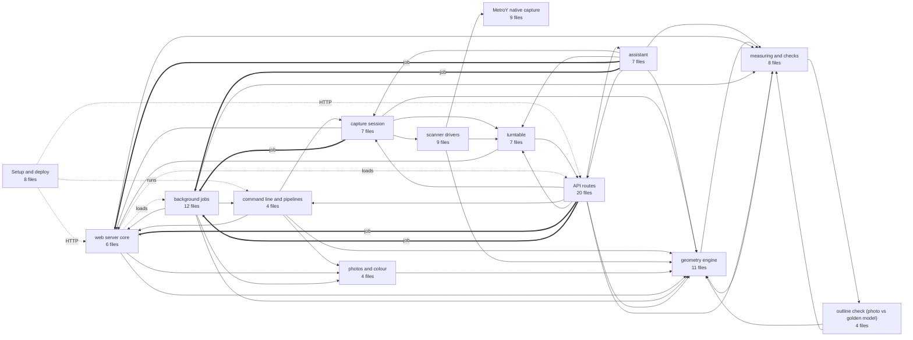
```mermaid
flowchart LR
  a_web_core["web server core<br/>6 files"]
  a_web_routes["API routes<br/>20 files"]
  a_web_jobs["background jobs<br/>12 files"]
  a_assistant["assistant<br/>7 files"]
  a_drivers["scanner drivers<br/>9 files"]
  a_metroy["MetroY native capture<br/>9 files"]
  a_turntable["turntable<br/>7 files"]
  a_capture["capture session<br/>7 files"]
  a_cli["command line and pipelines<br/>4 files"]
  a_measure["measuring and checks<br/>8 files"]
  a_outline["outline check (photo vs golden model)<br/>4 files"]
  a_photos["photos and colour<br/>4 files"]
  a_engine["geometry engine<br/>11 files"]
  a_deploy["Setup and deploy<br/>8 files"]
  a_assistant --> a_capture
  a_assistant --> a_engine
  a_assistant --> a_measure
  a_assistant --> a_turntable
  a_assistant ==>|job| a_web_core
  a_assistant ==>|job| a_web_jobs
  a_assistant --> a_web_routes
  a_capture --> a_drivers
  a_capture --> a_engine
  a_capture --> a_turntable
  a_capture --> a_web_core
  a_capture ==>|job| a_web_jobs
  a_cli --> a_capture
  a_cli --> a_engine
  a_cli --> a_photos
  a_cli --> a_web_core
  a_deploy -.->|runs| a_cli
  a_deploy -.->|HTTP| a_web_core
  a_deploy -.->|HTTP| a_web_routes
  a_drivers --> a_engine
  a_drivers --> a_metroy
  a_drivers --> a_turntable
  a_engine --> a_measure
  a_measure --> a_engine
  a_measure --> a_outline
  a_outline --> a_engine
  a_outline --> a_measure
  a_photos --> a_engine
  a_turntable --> a_web_core
  a_turntable --> a_web_routes
  a_web_core --> a_engine
  a_web_core --> a_measure
  a_web_core --> a_photos
  a_web_core -.->|loads| a_web_jobs
  a_web_core -.->|loads| a_web_routes
  a_web_jobs --> a_cli
  a_web_jobs --> a_engine
  a_web_jobs --> a_measure
  a_web_jobs --> a_photos
  a_web_jobs --> a_web_core
  a_web_routes --> a_assistant
  a_web_routes --> a_capture
  a_web_routes --> a_cli
  a_web_routes --> a_engine
  a_web_routes --> a_measure
  a_web_routes --> a_turntable
  a_web_routes ==>|job| a_web_core
  a_web_routes ==>|job| a_web_jobs
```

### Frontend areas

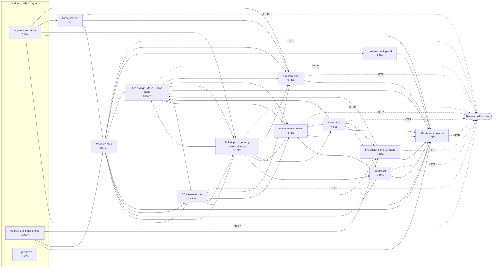
```mermaid
flowchart LR
  subgraph shared["Used by nearly every area"]
    a_fe_app["app root and store<br/>5 files"]
    a_fe_lib["helpers and small stores<br/>25 files"]
    a_fe_ui["UI primitives<br/>7 files"]
  end
  a_fe_home["home screen<br/>1 files"]
  a_fe_models["model list<br/>7 files"]
  a_fe_shell["shell (top bar, journey, panels, dialogs)<br/>13 files"]
  a_fe_capture_step["Scan step<br/>7 files"]
  a_fe_golden["golden check panel<br/>7 files"]
  a_fe_measure["Measure step<br/>15 files"]
  a_fe_steps["Clean, Align, Mesh, Export steps<br/>13 files"]
  a_fe_assistant["assistant chat<br/>9 files"]
  a_fe_capture["live capture and turntable<br/>7 files"]
  a_fe_features["colour and autopilot<br/>3 files"]
  a_fe_viewport["3D view overlays<br/>14 files"]
  a_fe_viewer["3D viewer (three.js)<br/>8 files"]
  a_backend(["Backend API routes"]):::other
  a_fe_app --> a_fe_assistant
  a_fe_app --> a_fe_home
  a_fe_app --> a_fe_shell
  a_fe_app --> a_fe_viewer
  a_fe_app --> a_fe_viewport
  a_fe_assistant -.->|HTTP| a_backend
  a_fe_assistant --> a_fe_viewer
  a_fe_capture -.->|HTTP| a_backend
  a_fe_capture --> a_fe_steps
  a_fe_capture --> a_fe_viewer
  a_fe_capture_step -.->|HTTP| a_backend
  a_fe_capture_step --> a_fe_capture
  a_fe_capture_step --> a_fe_models
  a_fe_capture_step --> a_fe_steps
  a_fe_capture_step --> a_fe_viewer
  a_fe_features -.->|HTTP| a_backend
  a_fe_features --> a_fe_capture_step
  a_fe_features --> a_fe_steps
  a_fe_features --> a_fe_viewer
  a_fe_golden --> a_fe_viewer
  a_fe_home -.->|HTTP| a_backend
  a_fe_home --> a_fe_assistant
  a_fe_home --> a_fe_measure
  a_fe_lib -.->|HTTP| a_backend
  a_fe_lib --> a_fe_capture
  a_fe_lib --> a_fe_measure
  a_fe_lib --> a_fe_viewer
  a_fe_measure -.->|HTTP| a_backend
  a_fe_measure --> a_fe_assistant
  a_fe_measure --> a_fe_golden
  a_fe_measure --> a_fe_steps
  a_fe_measure --> a_fe_viewer
  a_fe_measure --> a_fe_viewport
  a_fe_models -.->|HTTP| a_backend
  a_fe_models --> a_fe_features
  a_fe_models --> a_fe_measure
  a_fe_models --> a_fe_viewer
  a_fe_shell -.->|HTTP| a_backend
  a_fe_shell --> a_fe_assistant
  a_fe_shell --> a_fe_capture_step
  a_fe_shell --> a_fe_features
  a_fe_shell --> a_fe_measure
  a_fe_shell --> a_fe_models
  a_fe_shell --> a_fe_steps
  a_fe_steps -.->|HTTP| a_backend
  a_fe_steps --> a_fe_assistant
  a_fe_steps --> a_fe_features
  a_fe_steps --> a_fe_shell
  a_fe_steps --> a_fe_viewer
  a_fe_steps --> a_fe_viewport
  a_fe_viewer -.->|HTTP| a_backend
  a_fe_viewport -.->|HTTP| a_backend
  a_fe_viewport --> a_fe_assistant
  a_fe_viewport --> a_fe_capture
  a_fe_viewport --> a_fe_features
  a_fe_viewport --> a_fe_shell
  a_fe_viewport --> a_fe_viewer
  classDef other stroke-dasharray: 4 3
```

## Browser → API routes

Which part of the UI (and which deploy script) calls which backend module. The exact files and routes are in the [route table](#api-routes-who-serves-who-calls).

```mermaid
flowchart LR
  subgraph callers["Callers"]
    a_fe_home(["Frontend: home screen"])
    a_fe_models(["Frontend: model list"])
    a_fe_shell(["Frontend: shell (top bar, journey, panels, dialogs)"])
    a_fe_capture_step(["Frontend: Scan step"])
    a_fe_measure(["Frontend: Measure step"])
    a_fe_steps(["Frontend: Clean, Align, Mesh, Export steps"])
    a_fe_assistant(["Frontend: assistant chat"])
    a_fe_capture(["Frontend: live capture and turntable"])
    a_fe_features(["Frontend: colour and autopilot"])
    a_fe_viewport(["Frontend: 3D view overlays"])
    a_fe_viewer(["Frontend: 3D viewer (three.js)"])
    a_fe_lib(["Frontend: helpers and small stores"])
    a_deploy(["Setup and deploy"])
  end
  subgraph routes["Backend: API routes and the server core"]
    n_cloudclean_web_routes_accuracy_py["web/routes_accuracy.py"]
    n_cloudclean_web_routes_assistant_py["web/routes_assistant.py"]
    n_cloudclean_web_routes_auth_py["web/routes_auth.py"]
    n_cloudclean_web_routes_autopilot_py["web/routes_autopilot.py"]
    n_cloudclean_web_routes_capture_py["web/routes_capture.py"]
    n_cloudclean_web_routes_colour_photos_py["web/routes_colour_photos.py"]
    n_cloudclean_web_routes_compare_py["web/routes_compare.py"]
    n_cloudclean_web_routes_edit_py["web/routes_edit.py"]
    n_cloudclean_web_routes_golden_py["web/routes_golden.py"]
    n_cloudclean_web_routes_holes_py["web/routes_holes.py"]
    n_cloudclean_web_routes_markers_py["web/routes_markers.py"]
    n_cloudclean_web_routes_measure_py["web/routes_measure.py"]
    n_cloudclean_web_routes_merge_py["web/routes_merge.py"]
    n_cloudclean_web_routes_photo_fill_py["web/routes_photo_fill.py"]
    n_cloudclean_web_routes_photos3d_py["web/routes_photos3d.py"]
    n_cloudclean_web_routes_projects_py["web/routes_projects.py"]
    n_cloudclean_web_routes_system_py["web/routes_system.py"]
    n_cloudclean_web_routes_turntable_py["web/routes_turntable.py"]
    n_cloudclean_web_routes_understand_py["web/routes_understand.py"]
    n_cloudclean_web_server_py["web/server.py"]
  end
  a_deploy -.-> n_cloudclean_web_routes_assistant_py
  a_deploy -.-> n_cloudclean_web_routes_capture_py
  a_deploy -.-> n_cloudclean_web_routes_turntable_py
  a_deploy -.-> n_cloudclean_web_server_py
  a_fe_assistant -.-> n_cloudclean_web_routes_assistant_py
  a_fe_assistant -.-> n_cloudclean_web_routes_understand_py
  a_fe_assistant -.-> n_cloudclean_web_server_py
  a_fe_capture -.-> n_cloudclean_web_routes_autopilot_py
  a_fe_capture -.-> n_cloudclean_web_routes_capture_py
  a_fe_capture_step -.-> n_cloudclean_web_routes_auth_py
  a_fe_capture_step -.-> n_cloudclean_web_routes_photos3d_py
  a_fe_features -.-> n_cloudclean_web_routes_autopilot_py
  a_fe_features -.-> n_cloudclean_web_routes_colour_photos_py
  a_fe_features -.-> n_cloudclean_web_server_py
  a_fe_home -.-> n_cloudclean_web_routes_capture_py
  a_fe_home -.-> n_cloudclean_web_routes_projects_py
  a_fe_home -.-> n_cloudclean_web_routes_turntable_py
  a_fe_lib -.-> n_cloudclean_web_routes_accuracy_py
  a_fe_lib -.-> n_cloudclean_web_routes_auth_py
  a_fe_lib -.-> n_cloudclean_web_routes_autopilot_py
  a_fe_lib -.-> n_cloudclean_web_routes_edit_py
  a_fe_lib -.-> n_cloudclean_web_routes_measure_py
  a_fe_lib -.-> n_cloudclean_web_routes_photos3d_py
  a_fe_lib -.-> n_cloudclean_web_routes_projects_py
  a_fe_lib -.-> n_cloudclean_web_routes_turntable_py
  a_fe_lib -.-> n_cloudclean_web_routes_understand_py
  a_fe_lib -.-> n_cloudclean_web_server_py
  a_fe_measure -.-> n_cloudclean_web_routes_compare_py
  a_fe_measure -.-> n_cloudclean_web_routes_golden_py
  a_fe_measure -.-> n_cloudclean_web_routes_measure_py
  a_fe_measure -.-> n_cloudclean_web_routes_photo_fill_py
  a_fe_models -.-> n_cloudclean_web_routes_projects_py
  a_fe_models -.-> n_cloudclean_web_routes_understand_py
  a_fe_models -.-> n_cloudclean_web_server_py
  a_fe_shell -.-> n_cloudclean_web_routes_assistant_py
  a_fe_shell -.-> n_cloudclean_web_routes_auth_py
  a_fe_shell -.-> n_cloudclean_web_routes_system_py
  a_fe_steps -.-> n_cloudclean_web_routes_accuracy_py
  a_fe_steps -.-> n_cloudclean_web_routes_compare_py
  a_fe_steps -.-> n_cloudclean_web_routes_edit_py
  a_fe_steps -.-> n_cloudclean_web_routes_holes_py
  a_fe_steps -.-> n_cloudclean_web_routes_markers_py
  a_fe_steps -.-> n_cloudclean_web_routes_merge_py
  a_fe_steps -.-> n_cloudclean_web_server_py
  a_fe_viewer -.-> n_cloudclean_web_server_py
  a_fe_viewport -.-> n_cloudclean_web_routes_edit_py
```

## API routes → jobs → engine

Long work never runs inside a request: a route checks its input and submits a job (thick arrow), the job runs in a worker process (`web/jobs.py`) and calls the engine. Routes that answer at once (measuring, status, settings) are in the area diagrams below.

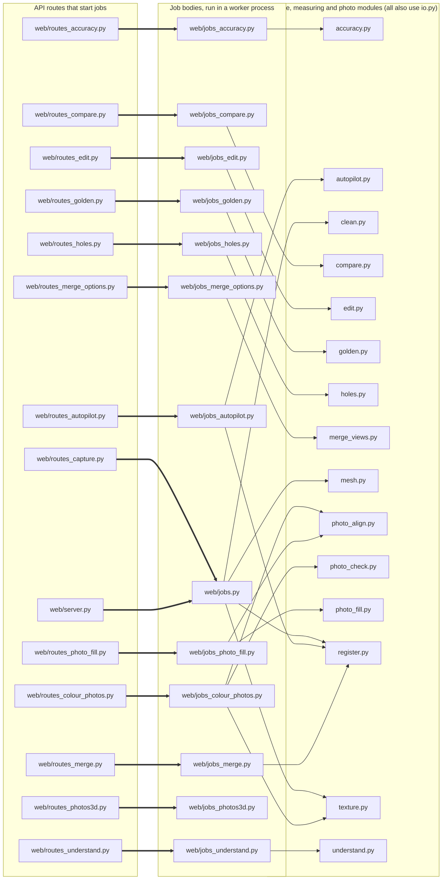
```mermaid
flowchart LR
  subgraph R["API routes that start jobs"]
    n_cloudclean_web_routes_accuracy_py["web/routes_accuracy.py"]
    n_cloudclean_web_routes_autopilot_py["web/routes_autopilot.py"]
    n_cloudclean_web_routes_capture_py["web/routes_capture.py"]
    n_cloudclean_web_routes_colour_photos_py["web/routes_colour_photos.py"]
    n_cloudclean_web_routes_compare_py["web/routes_compare.py"]
    n_cloudclean_web_routes_edit_py["web/routes_edit.py"]
    n_cloudclean_web_routes_golden_py["web/routes_golden.py"]
    n_cloudclean_web_routes_holes_py["web/routes_holes.py"]
    n_cloudclean_web_routes_merge_py["web/routes_merge.py"]
    n_cloudclean_web_routes_merge_options_py["web/routes_merge_options.py"]
    n_cloudclean_web_routes_photo_fill_py["web/routes_photo_fill.py"]
    n_cloudclean_web_routes_photos3d_py["web/routes_photos3d.py"]
    n_cloudclean_web_routes_understand_py["web/routes_understand.py"]
    n_cloudclean_web_server_py["web/server.py"]
  end
  subgraph J["Job bodies, run in a worker process"]
    n_cloudclean_web_jobs_py["web/jobs.py"]
    n_cloudclean_web_jobs_accuracy_py["web/jobs_accuracy.py"]
    n_cloudclean_web_jobs_autopilot_py["web/jobs_autopilot.py"]
    n_cloudclean_web_jobs_colour_photos_py["web/jobs_colour_photos.py"]
    n_cloudclean_web_jobs_compare_py["web/jobs_compare.py"]
    n_cloudclean_web_jobs_edit_py["web/jobs_edit.py"]
    n_cloudclean_web_jobs_golden_py["web/jobs_golden.py"]
    n_cloudclean_web_jobs_holes_py["web/jobs_holes.py"]
    n_cloudclean_web_jobs_merge_py["web/jobs_merge.py"]
    n_cloudclean_web_jobs_merge_options_py["web/jobs_merge_options.py"]
    n_cloudclean_web_jobs_photo_fill_py["web/jobs_photo_fill.py"]
    n_cloudclean_web_jobs_photos3d_py["web/jobs_photos3d.py"]
    n_cloudclean_web_jobs_understand_py["web/jobs_understand.py"]
  end
  subgraph E["Engine, measuring and photo modules (all also use io.py)"]
    n_cloudclean_accuracy_py["accuracy.py"]
    n_cloudclean_autopilot_py["autopilot.py"]
    n_cloudclean_clean_py["clean.py"]
    n_cloudclean_compare_py["compare.py"]
    n_cloudclean_edit_py["edit.py"]
    n_cloudclean_golden_py["golden.py"]
    n_cloudclean_holes_py["holes.py"]
    n_cloudclean_merge_views_py["merge_views.py"]
    n_cloudclean_mesh_py["mesh.py"]
    n_cloudclean_photo_align_py["photo_align.py"]
    n_cloudclean_photo_check_py["photo_check.py"]
    n_cloudclean_photo_fill_py["photo_fill.py"]
    n_cloudclean_register_py["register.py"]
    n_cloudclean_texture_py["texture.py"]
    n_cloudclean_understand_py["understand.py"]
  end
  n_cloudclean_web_routes_accuracy_py ==> n_cloudclean_web_jobs_accuracy_py
  n_cloudclean_web_routes_autopilot_py ==> n_cloudclean_web_jobs_autopilot_py
  n_cloudclean_web_routes_capture_py ==> n_cloudclean_web_jobs_py
  n_cloudclean_web_routes_colour_photos_py ==> n_cloudclean_web_jobs_colour_photos_py
  n_cloudclean_web_routes_compare_py ==> n_cloudclean_web_jobs_compare_py
  n_cloudclean_web_routes_edit_py ==> n_cloudclean_web_jobs_edit_py
  n_cloudclean_web_routes_golden_py ==> n_cloudclean_web_jobs_golden_py
  n_cloudclean_web_routes_holes_py ==> n_cloudclean_web_jobs_holes_py
  n_cloudclean_web_routes_merge_py ==> n_cloudclean_web_jobs_merge_py
  n_cloudclean_web_routes_merge_options_py ==> n_cloudclean_web_jobs_merge_options_py
  n_cloudclean_web_routes_photo_fill_py ==> n_cloudclean_web_jobs_photo_fill_py
  n_cloudclean_web_routes_photos3d_py ==> n_cloudclean_web_jobs_photos3d_py
  n_cloudclean_web_routes_understand_py ==> n_cloudclean_web_jobs_understand_py
  n_cloudclean_web_server_py ==> n_cloudclean_web_jobs_py
  n_cloudclean_web_jobs_py --> n_cloudclean_clean_py
  n_cloudclean_web_jobs_py --> n_cloudclean_mesh_py
  n_cloudclean_web_jobs_py --> n_cloudclean_register_py
  n_cloudclean_web_jobs_py --> n_cloudclean_texture_py
  n_cloudclean_web_jobs_accuracy_py --> n_cloudclean_accuracy_py
  n_cloudclean_web_jobs_autopilot_py --> n_cloudclean_autopilot_py
  n_cloudclean_web_jobs_autopilot_py --> n_cloudclean_register_py
  n_cloudclean_web_jobs_colour_photos_py --> n_cloudclean_photo_align_py
  n_cloudclean_web_jobs_colour_photos_py --> n_cloudclean_photo_check_py
  n_cloudclean_web_jobs_colour_photos_py --> n_cloudclean_texture_py
  n_cloudclean_web_jobs_compare_py --> n_cloudclean_compare_py
  n_cloudclean_web_jobs_edit_py --> n_cloudclean_edit_py
  n_cloudclean_web_jobs_golden_py --> n_cloudclean_golden_py
  n_cloudclean_web_jobs_holes_py --> n_cloudclean_holes_py
  n_cloudclean_web_jobs_merge_py --> n_cloudclean_register_py
  n_cloudclean_web_jobs_merge_options_py --> n_cloudclean_merge_views_py
  n_cloudclean_web_jobs_photo_fill_py --> n_cloudclean_photo_align_py
  n_cloudclean_web_jobs_photo_fill_py --> n_cloudclean_photo_fill_py
  n_cloudclean_web_jobs_understand_py --> n_cloudclean_understand_py
```

## Inside each area

### Frontend: app root and store

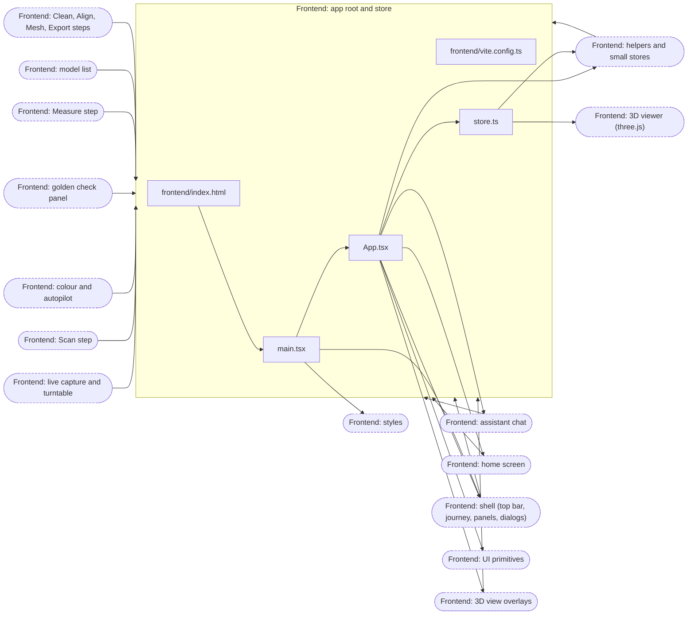
```mermaid
flowchart LR
  subgraph a_fe_app["Frontend: app root and store"]
    n_frontend_index_html["frontend/index.html"]
    n_frontend_src_App_tsx["App.tsx"]
    n_frontend_src_main_tsx["main.tsx"]
    n_frontend_src_store_ts["store.ts"]
    n_frontend_vite_config_ts["frontend/vite.config.ts"]
  end
  a_fe_assistant(["Frontend: assistant chat"]):::other
  a_fe_capture(["Frontend: live capture and turntable"]):::other
  a_fe_capture_step(["Frontend: Scan step"]):::other
  a_fe_features(["Frontend: colour and autopilot"]):::other
  a_fe_golden(["Frontend: golden check panel"]):::other
  a_fe_home(["Frontend: home screen"]):::other
  a_fe_lib(["Frontend: helpers and small stores"]):::other
  a_fe_measure(["Frontend: Measure step"]):::other
  a_fe_models(["Frontend: model list"]):::other
  a_fe_shell(["Frontend: shell (top bar, journey, panels, dialogs)"]):::other
  a_fe_steps(["Frontend: Clean, Align, Mesh, Export steps"]):::other
  a_fe_styles(["Frontend: styles"]):::other
  a_fe_ui(["Frontend: UI primitives"]):::other
  a_fe_viewer(["Frontend: 3D viewer (three.js)"]):::other
  a_fe_viewport(["Frontend: 3D view overlays"]):::other
  n_frontend_index_html --> n_frontend_src_main_tsx
  n_frontend_src_App_tsx --> a_fe_assistant
  n_frontend_src_App_tsx --> a_fe_home
  n_frontend_src_App_tsx --> a_fe_lib
  n_frontend_src_App_tsx --> a_fe_shell
  n_frontend_src_App_tsx --> a_fe_ui
  n_frontend_src_App_tsx --> a_fe_viewport
  n_frontend_src_App_tsx --> n_frontend_src_store_ts
  n_frontend_src_main_tsx --> a_fe_shell
  n_frontend_src_main_tsx --> a_fe_styles
  n_frontend_src_main_tsx --> n_frontend_src_App_tsx
  n_frontend_src_store_ts --> a_fe_lib
  n_frontend_src_store_ts --> a_fe_viewer
  a_fe_assistant --> a_fe_app
  a_fe_capture --> a_fe_app
  a_fe_capture_step --> a_fe_app
  a_fe_features --> a_fe_app
  a_fe_golden --> a_fe_app
  a_fe_home --> a_fe_app
  a_fe_lib --> a_fe_app
  a_fe_measure --> a_fe_app
  a_fe_models --> a_fe_app
  a_fe_shell --> a_fe_app
  a_fe_steps --> a_fe_app
  a_fe_viewport --> a_fe_app
  classDef other stroke-dasharray: 4 3
```

### Frontend: home screen

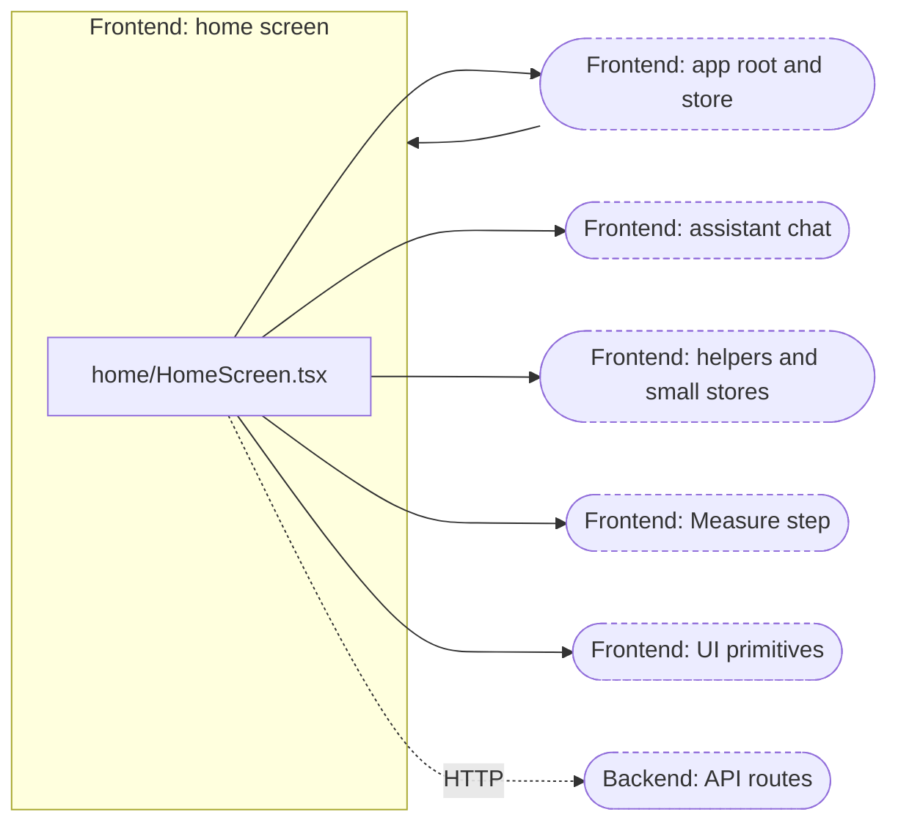
```mermaid
flowchart LR
  subgraph a_fe_home["Frontend: home screen"]
    n_frontend_src_home_HomeScreen_tsx["home/HomeScreen.tsx"]
  end
  a_fe_app(["Frontend: app root and store"]):::other
  a_fe_assistant(["Frontend: assistant chat"]):::other
  a_fe_lib(["Frontend: helpers and small stores"]):::other
  a_fe_measure(["Frontend: Measure step"]):::other
  a_fe_ui(["Frontend: UI primitives"]):::other
  a_web_routes(["Backend: API routes"]):::other
  n_frontend_src_home_HomeScreen_tsx --> a_fe_app
  n_frontend_src_home_HomeScreen_tsx --> a_fe_assistant
  n_frontend_src_home_HomeScreen_tsx --> a_fe_lib
  n_frontend_src_home_HomeScreen_tsx --> a_fe_measure
  n_frontend_src_home_HomeScreen_tsx --> a_fe_ui
  n_frontend_src_home_HomeScreen_tsx -.->|HTTP| a_web_routes
  a_fe_app --> a_fe_home
  classDef other stroke-dasharray: 4 3
```

### Frontend: model list

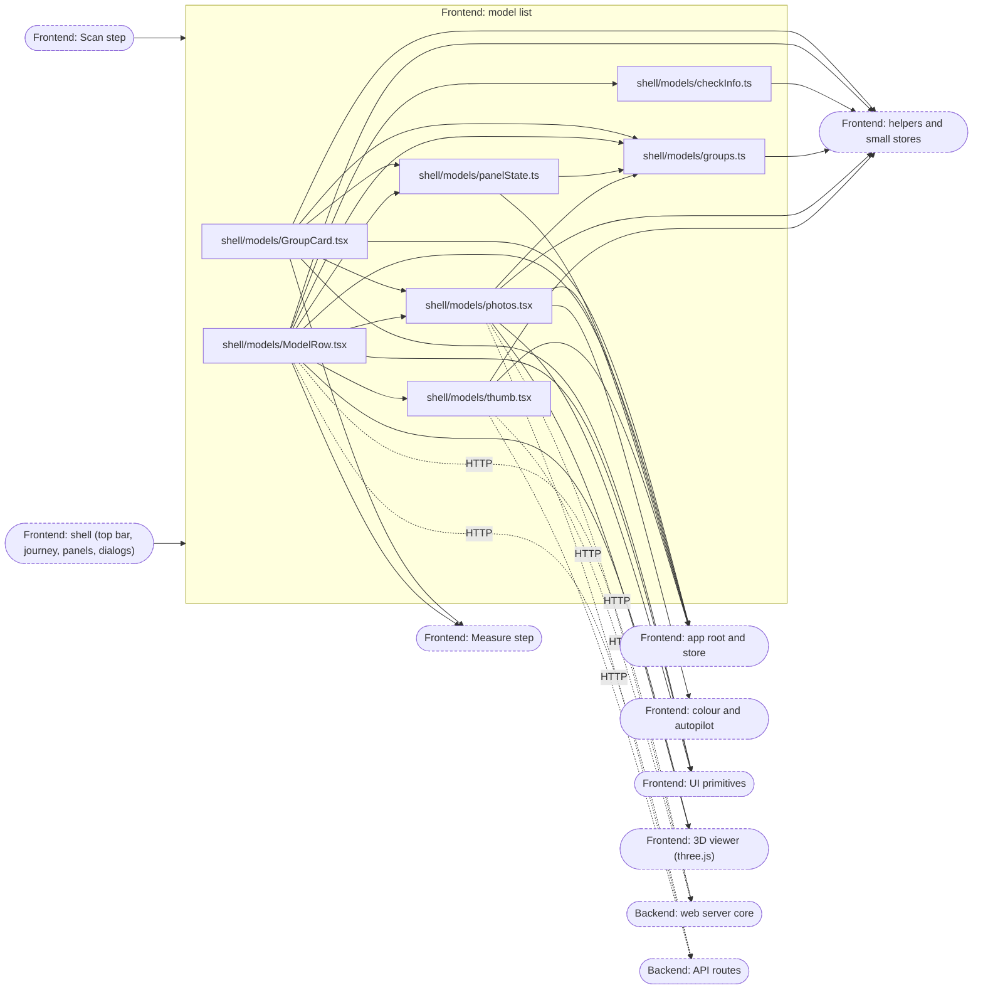
```mermaid
flowchart LR
  subgraph a_fe_models["Frontend: model list"]
    n_frontend_src_shell_models_GroupCard_tsx["shell/models/GroupCard.tsx"]
    n_frontend_src_shell_models_ModelRow_tsx["shell/models/ModelRow.tsx"]
    n_frontend_src_shell_models_checkInfo_ts["shell/models/checkInfo.ts"]
    n_frontend_src_shell_models_groups_ts["shell/models/groups.ts"]
    n_frontend_src_shell_models_panelState_ts["shell/models/panelState.ts"]
    n_frontend_src_shell_models_photos_tsx["shell/models/photos.tsx"]
    n_frontend_src_shell_models_thumb_tsx["shell/models/thumb.tsx"]
  end
  a_fe_app(["Frontend: app root and store"]):::other
  a_fe_capture_step(["Frontend: Scan step"]):::other
  a_fe_features(["Frontend: colour and autopilot"]):::other
  a_fe_lib(["Frontend: helpers and small stores"]):::other
  a_fe_measure(["Frontend: Measure step"]):::other
  a_fe_shell(["Frontend: shell (top bar, journey, panels, dialogs)"]):::other
  a_fe_ui(["Frontend: UI primitives"]):::other
  a_fe_viewer(["Frontend: 3D viewer (three.js)"]):::other
  a_web_core(["Backend: web server core"]):::other
  a_web_routes(["Backend: API routes"]):::other
  n_frontend_src_shell_models_GroupCard_tsx --> a_fe_app
  n_frontend_src_shell_models_GroupCard_tsx --> a_fe_lib
  n_frontend_src_shell_models_GroupCard_tsx --> a_fe_measure
  n_frontend_src_shell_models_GroupCard_tsx --> a_fe_ui
  n_frontend_src_shell_models_GroupCard_tsx --> n_frontend_src_shell_models_groups_ts
  n_frontend_src_shell_models_GroupCard_tsx --> n_frontend_src_shell_models_panelState_ts
  n_frontend_src_shell_models_GroupCard_tsx --> n_frontend_src_shell_models_photos_tsx
  n_frontend_src_shell_models_ModelRow_tsx --> a_fe_app
  n_frontend_src_shell_models_ModelRow_tsx --> a_fe_lib
  n_frontend_src_shell_models_ModelRow_tsx --> a_fe_measure
  n_frontend_src_shell_models_ModelRow_tsx --> a_fe_ui
  n_frontend_src_shell_models_ModelRow_tsx --> a_fe_viewer
  n_frontend_src_shell_models_ModelRow_tsx --> n_frontend_src_shell_models_checkInfo_ts
  n_frontend_src_shell_models_ModelRow_tsx --> n_frontend_src_shell_models_groups_ts
  n_frontend_src_shell_models_ModelRow_tsx --> n_frontend_src_shell_models_panelState_ts
  n_frontend_src_shell_models_ModelRow_tsx --> n_frontend_src_shell_models_photos_tsx
  n_frontend_src_shell_models_ModelRow_tsx --> n_frontend_src_shell_models_thumb_tsx
  n_frontend_src_shell_models_ModelRow_tsx -.->|HTTP| a_web_core
  n_frontend_src_shell_models_ModelRow_tsx -.->|HTTP| a_web_routes
  n_frontend_src_shell_models_checkInfo_ts --> a_fe_lib
  n_frontend_src_shell_models_groups_ts --> a_fe_lib
  n_frontend_src_shell_models_panelState_ts --> a_fe_app
  n_frontend_src_shell_models_panelState_ts --> n_frontend_src_shell_models_groups_ts
  n_frontend_src_shell_models_photos_tsx --> a_fe_app
  n_frontend_src_shell_models_photos_tsx --> a_fe_features
  n_frontend_src_shell_models_photos_tsx --> a_fe_lib
  n_frontend_src_shell_models_photos_tsx --> a_fe_ui
  n_frontend_src_shell_models_photos_tsx --> a_fe_viewer
  n_frontend_src_shell_models_photos_tsx --> n_frontend_src_shell_models_groups_ts
  n_frontend_src_shell_models_photos_tsx -.->|HTTP| a_web_core
  n_frontend_src_shell_models_photos_tsx -.->|HTTP| a_web_routes
  n_frontend_src_shell_models_thumb_tsx --> a_fe_app
  n_frontend_src_shell_models_thumb_tsx --> a_fe_lib
  n_frontend_src_shell_models_thumb_tsx -.->|HTTP| a_web_core
  n_frontend_src_shell_models_thumb_tsx -.->|HTTP| a_web_routes
  a_fe_capture_step --> a_fe_models
  a_fe_shell --> a_fe_models
  classDef other stroke-dasharray: 4 3
```

### Frontend: shell (top bar, journey, panels, dialogs)

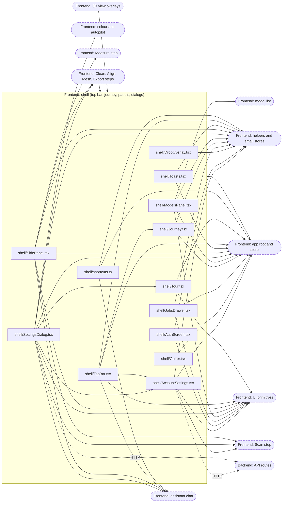
```mermaid
flowchart LR
  subgraph a_fe_shell["Frontend: shell (top bar, journey, panels, dialogs)"]
    n_frontend_src_shell_AccountSettings_tsx["shell/AccountSettings.tsx"]
    n_frontend_src_shell_AuthScreen_tsx["shell/AuthScreen.tsx"]
    n_frontend_src_shell_DropOverlay_tsx["shell/DropOverlay.tsx"]
    n_frontend_src_shell_Gutter_tsx["shell/Gutter.tsx"]
    n_frontend_src_shell_JobsDrawer_tsx["shell/JobsDrawer.tsx"]
    n_frontend_src_shell_Journey_tsx["shell/Journey.tsx"]
    n_frontend_src_shell_ModelsPanel_tsx["shell/ModelsPanel.tsx"]
    n_frontend_src_shell_SettingsDialog_tsx["shell/SettingsDialog.tsx"]
    n_frontend_src_shell_SidePanel_tsx["shell/SidePanel.tsx"]
    n_frontend_src_shell_Toasts_tsx["shell/Toasts.tsx"]
    n_frontend_src_shell_TopBar_tsx["shell/TopBar.tsx"]
    n_frontend_src_shell_Tour_tsx["shell/Tour.tsx"]
    n_frontend_src_shell_shortcuts_ts["shell/shortcuts.ts"]
  end
  a_fe_app(["Frontend: app root and store"]):::other
  a_fe_assistant(["Frontend: assistant chat"]):::other
  a_fe_capture_step(["Frontend: Scan step"]):::other
  a_fe_features(["Frontend: colour and autopilot"]):::other
  a_fe_lib(["Frontend: helpers and small stores"]):::other
  a_fe_measure(["Frontend: Measure step"]):::other
  a_fe_models(["Frontend: model list"]):::other
  a_fe_steps(["Frontend: Clean, Align, Mesh, Export steps"]):::other
  a_fe_ui(["Frontend: UI primitives"]):::other
  a_fe_viewport(["Frontend: 3D view overlays"]):::other
  a_web_routes(["Backend: API routes"]):::other
  n_frontend_src_shell_AccountSettings_tsx --> a_fe_app
  n_frontend_src_shell_AccountSettings_tsx --> a_fe_capture_step
  n_frontend_src_shell_AccountSettings_tsx --> a_fe_lib
  n_frontend_src_shell_AccountSettings_tsx --> a_fe_ui
  n_frontend_src_shell_AccountSettings_tsx -.->|HTTP| a_web_routes
  n_frontend_src_shell_AuthScreen_tsx --> a_fe_lib
  n_frontend_src_shell_AuthScreen_tsx --> a_fe_ui
  n_frontend_src_shell_DropOverlay_tsx --> a_fe_lib
  n_frontend_src_shell_Gutter_tsx --> a_fe_app
  n_frontend_src_shell_JobsDrawer_tsx --> a_fe_app
  n_frontend_src_shell_JobsDrawer_tsx --> a_fe_lib
  n_frontend_src_shell_JobsDrawer_tsx --> a_fe_ui
  n_frontend_src_shell_Journey_tsx --> a_fe_app
  n_frontend_src_shell_Journey_tsx --> a_fe_lib
  n_frontend_src_shell_ModelsPanel_tsx --> a_fe_app
  n_frontend_src_shell_ModelsPanel_tsx --> a_fe_lib
  n_frontend_src_shell_ModelsPanel_tsx --> a_fe_models
  n_frontend_src_shell_ModelsPanel_tsx --> a_fe_ui
  n_frontend_src_shell_SettingsDialog_tsx --> a_fe_app
  n_frontend_src_shell_SettingsDialog_tsx --> a_fe_assistant
  n_frontend_src_shell_SettingsDialog_tsx --> a_fe_capture_step
  n_frontend_src_shell_SettingsDialog_tsx --> a_fe_features
  n_frontend_src_shell_SettingsDialog_tsx --> a_fe_lib
  n_frontend_src_shell_SettingsDialog_tsx --> a_fe_steps
  n_frontend_src_shell_SettingsDialog_tsx --> a_fe_ui
  n_frontend_src_shell_SettingsDialog_tsx --> n_frontend_src_shell_AccountSettings_tsx
  n_frontend_src_shell_SettingsDialog_tsx --> n_frontend_src_shell_Tour_tsx
  n_frontend_src_shell_SettingsDialog_tsx -.->|HTTP| a_web_routes
  n_frontend_src_shell_SidePanel_tsx --> a_fe_app
  n_frontend_src_shell_SidePanel_tsx --> a_fe_assistant
  n_frontend_src_shell_SidePanel_tsx --> a_fe_capture_step
  n_frontend_src_shell_SidePanel_tsx --> a_fe_lib
  n_frontend_src_shell_SidePanel_tsx --> a_fe_measure
  n_frontend_src_shell_SidePanel_tsx --> a_fe_steps
  n_frontend_src_shell_SidePanel_tsx --> a_fe_ui
  n_frontend_src_shell_Toasts_tsx --> a_fe_app
  n_frontend_src_shell_Toasts_tsx --> a_fe_lib
  n_frontend_src_shell_TopBar_tsx --> a_fe_app
  n_frontend_src_shell_TopBar_tsx --> a_fe_assistant
  n_frontend_src_shell_TopBar_tsx --> a_fe_lib
  n_frontend_src_shell_TopBar_tsx --> a_fe_ui
  n_frontend_src_shell_TopBar_tsx --> n_frontend_src_shell_AccountSettings_tsx
  n_frontend_src_shell_TopBar_tsx --> n_frontend_src_shell_Journey_tsx
  n_frontend_src_shell_Tour_tsx --> a_fe_app
  n_frontend_src_shell_Tour_tsx --> a_fe_ui
  n_frontend_src_shell_shortcuts_ts --> a_fe_app
  n_frontend_src_shell_shortcuts_ts --> a_fe_assistant
  n_frontend_src_shell_shortcuts_ts --> a_fe_lib
  a_fe_app --> a_fe_shell
  a_fe_steps --> a_fe_shell
  a_fe_viewport --> a_fe_shell
  classDef other stroke-dasharray: 4 3
```

### Frontend: Scan step

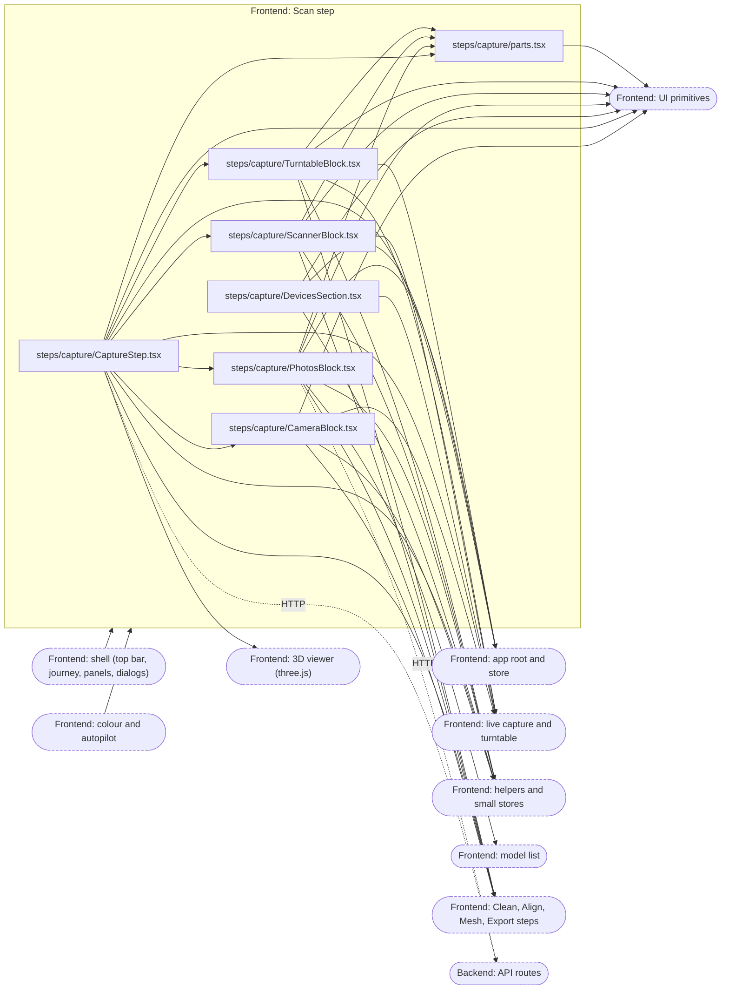
```mermaid
flowchart LR
  subgraph a_fe_capture_step["Frontend: Scan step"]
    n_frontend_src_steps_capture_CameraBlock_tsx["steps/capture/CameraBlock.tsx"]
    n_frontend_src_steps_capture_CaptureStep_tsx["steps/capture/CaptureStep.tsx"]
    n_frontend_src_steps_capture_DevicesSection_tsx["steps/capture/DevicesSection.tsx"]
    n_frontend_src_steps_capture_PhotosBlock_tsx["steps/capture/PhotosBlock.tsx"]
    n_frontend_src_steps_capture_ScannerBlock_tsx["steps/capture/ScannerBlock.tsx"]
    n_frontend_src_steps_capture_TurntableBlock_tsx["steps/capture/TurntableBlock.tsx"]
    n_frontend_src_steps_capture_parts_tsx["steps/capture/parts.tsx"]
  end
  a_fe_app(["Frontend: app root and store"]):::other
  a_fe_capture(["Frontend: live capture and turntable"]):::other
  a_fe_features(["Frontend: colour and autopilot"]):::other
  a_fe_lib(["Frontend: helpers and small stores"]):::other
  a_fe_models(["Frontend: model list"]):::other
  a_fe_shell(["Frontend: shell (top bar, journey, panels, dialogs)"]):::other
  a_fe_steps(["Frontend: Clean, Align, Mesh, Export steps"]):::other
  a_fe_ui(["Frontend: UI primitives"]):::other
  a_fe_viewer(["Frontend: 3D viewer (three.js)"]):::other
  a_web_routes(["Backend: API routes"]):::other
  n_frontend_src_steps_capture_CameraBlock_tsx --> a_fe_capture
  n_frontend_src_steps_capture_CameraBlock_tsx --> a_fe_lib
  n_frontend_src_steps_capture_CameraBlock_tsx --> a_fe_steps
  n_frontend_src_steps_capture_CameraBlock_tsx --> a_fe_ui
  n_frontend_src_steps_capture_CaptureStep_tsx --> a_fe_app
  n_frontend_src_steps_capture_CaptureStep_tsx --> a_fe_capture
  n_frontend_src_steps_capture_CaptureStep_tsx --> a_fe_lib
  n_frontend_src_steps_capture_CaptureStep_tsx --> a_fe_steps
  n_frontend_src_steps_capture_CaptureStep_tsx --> a_fe_ui
  n_frontend_src_steps_capture_CaptureStep_tsx --> a_fe_viewer
  n_frontend_src_steps_capture_CaptureStep_tsx --> n_frontend_src_steps_capture_CameraBlock_tsx
  n_frontend_src_steps_capture_CaptureStep_tsx --> n_frontend_src_steps_capture_PhotosBlock_tsx
  n_frontend_src_steps_capture_CaptureStep_tsx --> n_frontend_src_steps_capture_ScannerBlock_tsx
  n_frontend_src_steps_capture_CaptureStep_tsx --> n_frontend_src_steps_capture_TurntableBlock_tsx
  n_frontend_src_steps_capture_CaptureStep_tsx --> n_frontend_src_steps_capture_parts_tsx
  n_frontend_src_steps_capture_CaptureStep_tsx -.->|HTTP| a_web_routes
  n_frontend_src_steps_capture_DevicesSection_tsx --> a_fe_app
  n_frontend_src_steps_capture_DevicesSection_tsx --> a_fe_capture
  n_frontend_src_steps_capture_DevicesSection_tsx --> a_fe_lib
  n_frontend_src_steps_capture_DevicesSection_tsx --> a_fe_ui
  n_frontend_src_steps_capture_PhotosBlock_tsx --> a_fe_app
  n_frontend_src_steps_capture_PhotosBlock_tsx --> a_fe_lib
  n_frontend_src_steps_capture_PhotosBlock_tsx --> a_fe_models
  n_frontend_src_steps_capture_PhotosBlock_tsx --> a_fe_steps
  n_frontend_src_steps_capture_PhotosBlock_tsx --> a_fe_ui
  n_frontend_src_steps_capture_PhotosBlock_tsx --> n_frontend_src_steps_capture_parts_tsx
  n_frontend_src_steps_capture_PhotosBlock_tsx -.->|HTTP| a_web_routes
  n_frontend_src_steps_capture_ScannerBlock_tsx --> a_fe_capture
  n_frontend_src_steps_capture_ScannerBlock_tsx --> a_fe_lib
  n_frontend_src_steps_capture_ScannerBlock_tsx --> a_fe_steps
  n_frontend_src_steps_capture_ScannerBlock_tsx --> a_fe_ui
  n_frontend_src_steps_capture_ScannerBlock_tsx --> n_frontend_src_steps_capture_parts_tsx
  n_frontend_src_steps_capture_TurntableBlock_tsx --> a_fe_app
  n_frontend_src_steps_capture_TurntableBlock_tsx --> a_fe_capture
  n_frontend_src_steps_capture_TurntableBlock_tsx --> a_fe_lib
  n_frontend_src_steps_capture_TurntableBlock_tsx --> a_fe_steps
  n_frontend_src_steps_capture_TurntableBlock_tsx --> a_fe_ui
  n_frontend_src_steps_capture_TurntableBlock_tsx --> n_frontend_src_steps_capture_parts_tsx
  n_frontend_src_steps_capture_parts_tsx --> a_fe_ui
  a_fe_features --> a_fe_capture_step
  a_fe_shell --> a_fe_capture_step
  classDef other stroke-dasharray: 4 3
```

### Frontend: golden check panel

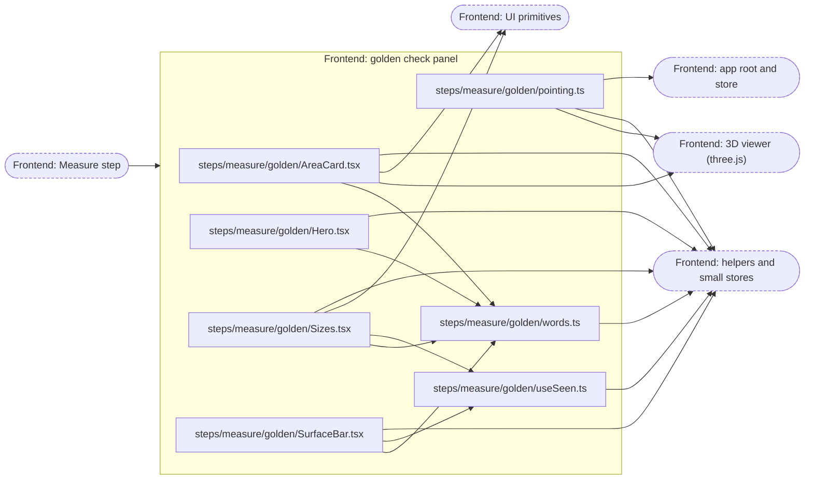
```mermaid
flowchart LR
  subgraph a_fe_golden["Frontend: golden check panel"]
    n_frontend_src_steps_measure_golden_AreaCard_tsx["steps/measure/golden/AreaCard.tsx"]
    n_frontend_src_steps_measure_golden_Hero_tsx["steps/measure/golden/Hero.tsx"]
    n_frontend_src_steps_measure_golden_Sizes_tsx["steps/measure/golden/Sizes.tsx"]
    n_frontend_src_steps_measure_golden_SurfaceBar_tsx["steps/measure/golden/SurfaceBar.tsx"]
    n_frontend_src_steps_measure_golden_pointing_ts["steps/measure/golden/pointing.ts"]
    n_frontend_src_steps_measure_golden_useSeen_ts["steps/measure/golden/useSeen.ts"]
    n_frontend_src_steps_measure_golden_words_ts["steps/measure/golden/words.ts"]
  end
  a_fe_app(["Frontend: app root and store"]):::other
  a_fe_lib(["Frontend: helpers and small stores"]):::other
  a_fe_measure(["Frontend: Measure step"]):::other
  a_fe_ui(["Frontend: UI primitives"]):::other
  a_fe_viewer(["Frontend: 3D viewer (three.js)"]):::other
  n_frontend_src_steps_measure_golden_AreaCard_tsx --> a_fe_lib
  n_frontend_src_steps_measure_golden_AreaCard_tsx --> a_fe_ui
  n_frontend_src_steps_measure_golden_AreaCard_tsx --> a_fe_viewer
  n_frontend_src_steps_measure_golden_AreaCard_tsx --> n_frontend_src_steps_measure_golden_words_ts
  n_frontend_src_steps_measure_golden_Hero_tsx --> a_fe_lib
  n_frontend_src_steps_measure_golden_Hero_tsx --> n_frontend_src_steps_measure_golden_words_ts
  n_frontend_src_steps_measure_golden_Sizes_tsx --> a_fe_lib
  n_frontend_src_steps_measure_golden_Sizes_tsx --> a_fe_ui
  n_frontend_src_steps_measure_golden_Sizes_tsx --> n_frontend_src_steps_measure_golden_useSeen_ts
  n_frontend_src_steps_measure_golden_Sizes_tsx --> n_frontend_src_steps_measure_golden_words_ts
  n_frontend_src_steps_measure_golden_SurfaceBar_tsx --> a_fe_lib
  n_frontend_src_steps_measure_golden_SurfaceBar_tsx --> n_frontend_src_steps_measure_golden_useSeen_ts
  n_frontend_src_steps_measure_golden_SurfaceBar_tsx --> n_frontend_src_steps_measure_golden_words_ts
  n_frontend_src_steps_measure_golden_pointing_ts --> a_fe_app
  n_frontend_src_steps_measure_golden_pointing_ts --> a_fe_lib
  n_frontend_src_steps_measure_golden_pointing_ts --> a_fe_viewer
  n_frontend_src_steps_measure_golden_useSeen_ts --> a_fe_lib
  n_frontend_src_steps_measure_golden_words_ts --> a_fe_lib
  a_fe_measure --> a_fe_golden
  classDef other stroke-dasharray: 4 3
```

### Frontend: Measure step

```mermaid
flowchart LR
  subgraph a_fe_measure["Frontend: Measure step"]
    n_frontend_src_steps_measure_AccuracyTab_tsx["steps/measure/AccuracyTab.tsx"]
    n_frontend_src_steps_measure_CadCompare_tsx["steps/measure/CadCompare.tsx"]
    n_frontend_src_steps_measure_GoldenCheck_tsx["steps/measure/GoldenCheck.tsx"]
    n_frontend_src_steps_measure_Histogram_tsx["steps/measure/Histogram.tsx"]
    n_frontend_src_steps_measure_MeasureStep_tsx["steps/measure/MeasureStep.tsx"]
    n_frontend_src_steps_measure_MergeCaveat_tsx["steps/measure/MergeCaveat.tsx"]
    n_frontend_src_steps_measure_PartSize_tsx["steps/measure/PartSize.tsx"]
    n_frontend_src_steps_measure_Results_tsx["steps/measure/Results.tsx"]
    n_frontend_src_steps_measure_SectionView_tsx["steps/measure/SectionView.tsx"]
    n_frontend_src_steps_measure_ThreadTab_tsx["steps/measure/ThreadTab.tsx"]
    n_frontend_src_steps_measure_Tools_tsx["steps/measure/Tools.tsx"]
    n_frontend_src_steps_measure_format_ts["steps/measure/format.ts"]
    n_frontend_src_steps_measure_glyphs_tsx["steps/measure/glyphs.tsx"]
    n_frontend_src_steps_measure_parts_tsx["steps/measure/parts.tsx"]
    n_frontend_src_steps_measure_state_ts["steps/measure/state.ts"]
  end
  a_fe_app(["Frontend: app root and store"]):::other
  a_fe_assistant(["Frontend: assistant chat"]):::other
  a_fe_golden(["Frontend: golden check panel"]):::other
  a_fe_home(["Frontend: home screen"]):::other
  a_fe_lib(["Frontend: helpers and small stores"]):::other
  a_fe_models(["Frontend: model list"]):::other
  a_fe_shell(["Frontend: shell (top bar, journey, panels, dialogs)"]):::other
  a_fe_steps(["Frontend: Clean, Align, Mesh, Export steps"]):::other
  a_fe_ui(["Frontend: UI primitives"]):::other
  a_fe_viewer(["Frontend: 3D viewer (three.js)"]):::other
  a_fe_viewport(["Frontend: 3D view overlays"]):::other
  a_web_routes(["Backend: API routes"]):::other
  n_frontend_src_steps_measure_AccuracyTab_tsx --> a_fe_app
  n_frontend_src_steps_measure_AccuracyTab_tsx --> a_fe_lib
  n_frontend_src_steps_measure_AccuracyTab_tsx --> a_fe_steps
  n_frontend_src_steps_measure_AccuracyTab_tsx --> a_fe_ui
  n_frontend_src_steps_measure_AccuracyTab_tsx --> n_frontend_src_steps_measure_Histogram_tsx
  n_frontend_src_steps_measure_AccuracyTab_tsx --> n_frontend_src_steps_measure_format_ts
  n_frontend_src_steps_measure_AccuracyTab_tsx --> n_frontend_src_steps_measure_glyphs_tsx
  n_frontend_src_steps_measure_AccuracyTab_tsx --> n_frontend_src_steps_measure_parts_tsx
  n_frontend_src_steps_measure_CadCompare_tsx --> a_fe_app
  n_frontend_src_steps_measure_CadCompare_tsx --> a_fe_lib
  n_frontend_src_steps_measure_CadCompare_tsx --> a_fe_steps
  n_frontend_src_steps_measure_CadCompare_tsx --> a_fe_ui
  n_frontend_src_steps_measure_CadCompare_tsx --> a_fe_viewer
  n_frontend_src_steps_measure_CadCompare_tsx --> n_frontend_src_steps_measure_Histogram_tsx
  n_frontend_src_steps_measure_CadCompare_tsx --> n_frontend_src_steps_measure_glyphs_tsx
  n_frontend_src_steps_measure_CadCompare_tsx -.->|HTTP| a_web_routes
  n_frontend_src_steps_measure_GoldenCheck_tsx --> a_fe_app
  n_frontend_src_steps_measure_GoldenCheck_tsx --> a_fe_golden
  n_frontend_src_steps_measure_GoldenCheck_tsx --> a_fe_lib
  n_frontend_src_steps_measure_GoldenCheck_tsx --> a_fe_steps
  n_frontend_src_steps_measure_GoldenCheck_tsx --> a_fe_ui
  n_frontend_src_steps_measure_GoldenCheck_tsx --> a_fe_viewer
  n_frontend_src_steps_measure_GoldenCheck_tsx --> n_frontend_src_steps_measure_CadCompare_tsx
  n_frontend_src_steps_measure_GoldenCheck_tsx --> n_frontend_src_steps_measure_glyphs_tsx
  n_frontend_src_steps_measure_GoldenCheck_tsx -.->|HTTP| a_web_routes
  n_frontend_src_steps_measure_Histogram_tsx --> a_fe_lib
  n_frontend_src_steps_measure_Histogram_tsx --> a_fe_viewer
  n_frontend_src_steps_measure_MeasureStep_tsx --> a_fe_app
  n_frontend_src_steps_measure_MeasureStep_tsx --> a_fe_lib
  n_frontend_src_steps_measure_MeasureStep_tsx --> a_fe_steps
  n_frontend_src_steps_measure_MeasureStep_tsx --> a_fe_ui
  n_frontend_src_steps_measure_MeasureStep_tsx --> n_frontend_src_steps_measure_AccuracyTab_tsx
  n_frontend_src_steps_measure_MeasureStep_tsx --> n_frontend_src_steps_measure_GoldenCheck_tsx
  n_frontend_src_steps_measure_MeasureStep_tsx --> n_frontend_src_steps_measure_MergeCaveat_tsx
  n_frontend_src_steps_measure_MeasureStep_tsx --> n_frontend_src_steps_measure_PartSize_tsx
  n_frontend_src_steps_measure_MeasureStep_tsx --> n_frontend_src_steps_measure_Results_tsx
  n_frontend_src_steps_measure_MeasureStep_tsx --> n_frontend_src_steps_measure_ThreadTab_tsx
  n_frontend_src_steps_measure_MeasureStep_tsx --> n_frontend_src_steps_measure_Tools_tsx
  n_frontend_src_steps_measure_MeasureStep_tsx --> n_frontend_src_steps_measure_glyphs_tsx
  n_frontend_src_steps_measure_MeasureStep_tsx --> n_frontend_src_steps_measure_state_ts
  n_frontend_src_steps_measure_MergeCaveat_tsx --> a_fe_app
  n_frontend_src_steps_measure_MergeCaveat_tsx --> a_fe_lib
  n_frontend_src_steps_measure_MergeCaveat_tsx --> a_fe_steps
  n_frontend_src_steps_measure_PartSize_tsx --> a_fe_app
  n_frontend_src_steps_measure_PartSize_tsx --> a_fe_lib
  n_frontend_src_steps_measure_PartSize_tsx --> a_fe_ui
  n_frontend_src_steps_measure_PartSize_tsx --> a_fe_viewport
  n_frontend_src_steps_measure_PartSize_tsx --> n_frontend_src_steps_measure_glyphs_tsx
  n_frontend_src_steps_measure_PartSize_tsx --> n_frontend_src_steps_measure_parts_tsx
  n_frontend_src_steps_measure_Results_tsx --> a_fe_app
  n_frontend_src_steps_measure_Results_tsx --> a_fe_assistant
  n_frontend_src_steps_measure_Results_tsx --> a_fe_lib
  n_frontend_src_steps_measure_Results_tsx --> a_fe_steps
  n_frontend_src_steps_measure_Results_tsx --> a_fe_ui
  n_frontend_src_steps_measure_Results_tsx --> n_frontend_src_steps_measure_format_ts
  n_frontend_src_steps_measure_Results_tsx --> n_frontend_src_steps_measure_glyphs_tsx
  n_frontend_src_steps_measure_Results_tsx --> n_frontend_src_steps_measure_parts_tsx
  n_frontend_src_steps_measure_SectionView_tsx --> a_fe_lib
  n_frontend_src_steps_measure_SectionView_tsx --> a_fe_ui
  n_frontend_src_steps_measure_SectionView_tsx --> n_frontend_src_steps_measure_state_ts
  n_frontend_src_steps_measure_ThreadTab_tsx --> a_fe_app
  n_frontend_src_steps_measure_ThreadTab_tsx --> a_fe_lib
  n_frontend_src_steps_measure_ThreadTab_tsx --> a_fe_steps
  n_frontend_src_steps_measure_ThreadTab_tsx --> a_fe_ui
  n_frontend_src_steps_measure_ThreadTab_tsx --> a_fe_viewer
  n_frontend_src_steps_measure_ThreadTab_tsx --> n_frontend_src_steps_measure_glyphs_tsx
  n_frontend_src_steps_measure_ThreadTab_tsx --> n_frontend_src_steps_measure_parts_tsx
  n_frontend_src_steps_measure_ThreadTab_tsx --> n_frontend_src_steps_measure_state_ts
  n_frontend_src_steps_measure_ThreadTab_tsx -.->|HTTP| a_web_routes
  n_frontend_src_steps_measure_Tools_tsx --> a_fe_app
  n_frontend_src_steps_measure_Tools_tsx --> a_fe_lib
  n_frontend_src_steps_measure_Tools_tsx --> a_fe_steps
  n_frontend_src_steps_measure_Tools_tsx --> a_fe_ui
  n_frontend_src_steps_measure_Tools_tsx --> n_frontend_src_steps_measure_SectionView_tsx
  n_frontend_src_steps_measure_Tools_tsx --> n_frontend_src_steps_measure_format_ts
  n_frontend_src_steps_measure_Tools_tsx --> n_frontend_src_steps_measure_glyphs_tsx
  n_frontend_src_steps_measure_Tools_tsx --> n_frontend_src_steps_measure_parts_tsx
  n_frontend_src_steps_measure_Tools_tsx --> n_frontend_src_steps_measure_state_ts
  n_frontend_src_steps_measure_format_ts --> a_fe_lib
  n_frontend_src_steps_measure_parts_tsx --> a_fe_app
  n_frontend_src_steps_measure_parts_tsx --> a_fe_lib
  n_frontend_src_steps_measure_parts_tsx --> a_fe_ui
  n_frontend_src_steps_measure_state_ts --> a_fe_app
  n_frontend_src_steps_measure_state_ts --> a_fe_lib
  a_fe_home --> a_fe_measure
  a_fe_lib --> a_fe_measure
  a_fe_models --> a_fe_measure
  a_fe_shell --> a_fe_measure
  classDef other stroke-dasharray: 4 3
```

### Frontend: Clean, Align, Mesh, Export steps

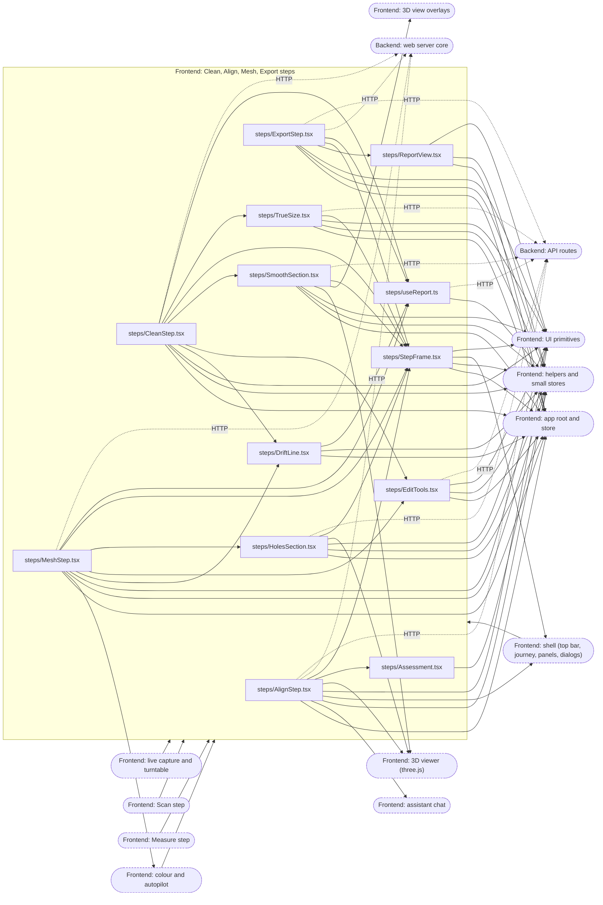
```mermaid
flowchart LR
  subgraph a_fe_steps["Frontend: Clean, Align, Mesh, Export steps"]
    n_frontend_src_steps_AlignStep_tsx["steps/AlignStep.tsx"]
    n_frontend_src_steps_Assessment_tsx["steps/Assessment.tsx"]
    n_frontend_src_steps_CleanStep_tsx["steps/CleanStep.tsx"]
    n_frontend_src_steps_DriftLine_tsx["steps/DriftLine.tsx"]
    n_frontend_src_steps_EditTools_tsx["steps/EditTools.tsx"]
    n_frontend_src_steps_ExportStep_tsx["steps/ExportStep.tsx"]
    n_frontend_src_steps_HolesSection_tsx["steps/HolesSection.tsx"]
    n_frontend_src_steps_MeshStep_tsx["steps/MeshStep.tsx"]
    n_frontend_src_steps_ReportView_tsx["steps/ReportView.tsx"]
    n_frontend_src_steps_SmoothSection_tsx["steps/SmoothSection.tsx"]
    n_frontend_src_steps_StepFrame_tsx["steps/StepFrame.tsx"]
    n_frontend_src_steps_TrueSize_tsx["steps/TrueSize.tsx"]
    n_frontend_src_steps_useReport_ts["steps/useReport.ts"]
  end
  a_fe_app(["Frontend: app root and store"]):::other
  a_fe_assistant(["Frontend: assistant chat"]):::other
  a_fe_capture(["Frontend: live capture and turntable"]):::other
  a_fe_capture_step(["Frontend: Scan step"]):::other
  a_fe_features(["Frontend: colour and autopilot"]):::other
  a_fe_lib(["Frontend: helpers and small stores"]):::other
  a_fe_measure(["Frontend: Measure step"]):::other
  a_fe_shell(["Frontend: shell (top bar, journey, panels, dialogs)"]):::other
  a_fe_ui(["Frontend: UI primitives"]):::other
  a_fe_viewer(["Frontend: 3D viewer (three.js)"]):::other
  a_fe_viewport(["Frontend: 3D view overlays"]):::other
  a_web_core(["Backend: web server core"]):::other
  a_web_routes(["Backend: API routes"]):::other
  n_frontend_src_steps_AlignStep_tsx --> a_fe_app
  n_frontend_src_steps_AlignStep_tsx --> a_fe_assistant
  n_frontend_src_steps_AlignStep_tsx --> a_fe_lib
  n_frontend_src_steps_AlignStep_tsx --> a_fe_shell
  n_frontend_src_steps_AlignStep_tsx --> a_fe_ui
  n_frontend_src_steps_AlignStep_tsx --> a_fe_viewer
  n_frontend_src_steps_AlignStep_tsx --> n_frontend_src_steps_Assessment_tsx
  n_frontend_src_steps_AlignStep_tsx --> n_frontend_src_steps_StepFrame_tsx
  n_frontend_src_steps_AlignStep_tsx -.->|HTTP| a_web_core
  n_frontend_src_steps_AlignStep_tsx -.->|HTTP| a_web_routes
  n_frontend_src_steps_Assessment_tsx --> a_fe_lib
  n_frontend_src_steps_CleanStep_tsx --> a_fe_app
  n_frontend_src_steps_CleanStep_tsx --> a_fe_lib
  n_frontend_src_steps_CleanStep_tsx --> a_fe_ui
  n_frontend_src_steps_CleanStep_tsx --> n_frontend_src_steps_DriftLine_tsx
  n_frontend_src_steps_CleanStep_tsx --> n_frontend_src_steps_EditTools_tsx
  n_frontend_src_steps_CleanStep_tsx --> n_frontend_src_steps_SmoothSection_tsx
  n_frontend_src_steps_CleanStep_tsx --> n_frontend_src_steps_StepFrame_tsx
  n_frontend_src_steps_CleanStep_tsx --> n_frontend_src_steps_TrueSize_tsx
  n_frontend_src_steps_CleanStep_tsx --> n_frontend_src_steps_useReport_ts
  n_frontend_src_steps_CleanStep_tsx -.->|HTTP| a_web_core
  n_frontend_src_steps_DriftLine_tsx --> a_fe_app
  n_frontend_src_steps_DriftLine_tsx --> a_fe_lib
  n_frontend_src_steps_DriftLine_tsx --> n_frontend_src_steps_useReport_ts
  n_frontend_src_steps_EditTools_tsx --> a_fe_app
  n_frontend_src_steps_EditTools_tsx --> a_fe_lib
  n_frontend_src_steps_EditTools_tsx --> a_fe_ui
  n_frontend_src_steps_EditTools_tsx -.->|HTTP| a_web_routes
  n_frontend_src_steps_ExportStep_tsx --> a_fe_app
  n_frontend_src_steps_ExportStep_tsx --> a_fe_lib
  n_frontend_src_steps_ExportStep_tsx --> a_fe_ui
  n_frontend_src_steps_ExportStep_tsx --> n_frontend_src_steps_ReportView_tsx
  n_frontend_src_steps_ExportStep_tsx --> n_frontend_src_steps_StepFrame_tsx
  n_frontend_src_steps_ExportStep_tsx --> n_frontend_src_steps_useReport_ts
  n_frontend_src_steps_ExportStep_tsx -.->|HTTP| a_web_core
  n_frontend_src_steps_ExportStep_tsx -.->|HTTP| a_web_routes
  n_frontend_src_steps_HolesSection_tsx --> a_fe_app
  n_frontend_src_steps_HolesSection_tsx --> a_fe_lib
  n_frontend_src_steps_HolesSection_tsx --> a_fe_ui
  n_frontend_src_steps_HolesSection_tsx --> a_fe_viewer
  n_frontend_src_steps_HolesSection_tsx --> n_frontend_src_steps_StepFrame_tsx
  n_frontend_src_steps_HolesSection_tsx -.->|HTTP| a_web_routes
  n_frontend_src_steps_MeshStep_tsx --> a_fe_app
  n_frontend_src_steps_MeshStep_tsx --> a_fe_features
  n_frontend_src_steps_MeshStep_tsx --> a_fe_lib
  n_frontend_src_steps_MeshStep_tsx --> a_fe_ui
  n_frontend_src_steps_MeshStep_tsx --> n_frontend_src_steps_DriftLine_tsx
  n_frontend_src_steps_MeshStep_tsx --> n_frontend_src_steps_EditTools_tsx
  n_frontend_src_steps_MeshStep_tsx --> n_frontend_src_steps_HolesSection_tsx
  n_frontend_src_steps_MeshStep_tsx --> n_frontend_src_steps_StepFrame_tsx
  n_frontend_src_steps_MeshStep_tsx --> n_frontend_src_steps_useReport_ts
  n_frontend_src_steps_MeshStep_tsx -.->|HTTP| a_web_core
  n_frontend_src_steps_ReportView_tsx --> a_fe_app
  n_frontend_src_steps_ReportView_tsx --> a_fe_lib
  n_frontend_src_steps_ReportView_tsx --> a_fe_ui
  n_frontend_src_steps_SmoothSection_tsx --> a_fe_app
  n_frontend_src_steps_SmoothSection_tsx --> a_fe_lib
  n_frontend_src_steps_SmoothSection_tsx --> a_fe_ui
  n_frontend_src_steps_SmoothSection_tsx --> a_fe_viewer
  n_frontend_src_steps_SmoothSection_tsx --> a_fe_viewport
  n_frontend_src_steps_SmoothSection_tsx --> n_frontend_src_steps_StepFrame_tsx
  n_frontend_src_steps_SmoothSection_tsx -.->|HTTP| a_web_routes
  n_frontend_src_steps_StepFrame_tsx --> a_fe_app
  n_frontend_src_steps_StepFrame_tsx --> a_fe_lib
  n_frontend_src_steps_StepFrame_tsx --> a_fe_shell
  n_frontend_src_steps_StepFrame_tsx --> a_fe_ui
  n_frontend_src_steps_TrueSize_tsx --> a_fe_app
  n_frontend_src_steps_TrueSize_tsx --> a_fe_lib
  n_frontend_src_steps_TrueSize_tsx --> a_fe_ui
  n_frontend_src_steps_TrueSize_tsx --> n_frontend_src_steps_StepFrame_tsx
  n_frontend_src_steps_TrueSize_tsx -.->|HTTP| a_web_routes
  n_frontend_src_steps_useReport_ts --> a_fe_lib
  n_frontend_src_steps_useReport_ts -.->|HTTP| a_web_routes
  a_fe_capture --> a_fe_steps
  a_fe_capture_step --> a_fe_steps
  a_fe_features --> a_fe_steps
  a_fe_measure --> a_fe_steps
  a_fe_shell --> a_fe_steps
  classDef other stroke-dasharray: 4 3
```

### Frontend: assistant chat

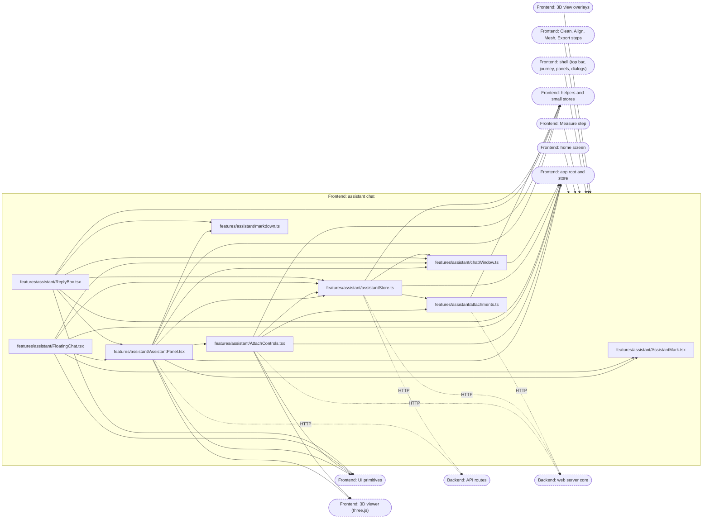
```mermaid
flowchart LR
  subgraph a_fe_assistant["Frontend: assistant chat"]
    n_frontend_src_features_assistant_AssistantMark_tsx["features/assistant/AssistantMark.tsx"]
    n_frontend_src_features_assistant_AssistantPanel_tsx["features/assistant/AssistantPanel.tsx"]
    n_frontend_src_features_assistant_AttachControls_tsx["features/assistant/AttachControls.tsx"]
    n_frontend_src_features_assistant_FloatingChat_tsx["features/assistant/FloatingChat.tsx"]
    n_frontend_src_features_assistant_ReplyBox_tsx["features/assistant/ReplyBox.tsx"]
    n_frontend_src_features_assistant_assistantStore_ts["features/assistant/assistantStore.ts"]
    n_frontend_src_features_assistant_attachments_ts["features/assistant/attachments.ts"]
    n_frontend_src_features_assistant_chatWindow_ts["features/assistant/chatWindow.ts"]
    n_frontend_src_features_assistant_markdown_ts["features/assistant/markdown.ts"]
  end
  a_fe_app(["Frontend: app root and store"]):::other
  a_fe_home(["Frontend: home screen"]):::other
  a_fe_lib(["Frontend: helpers and small stores"]):::other
  a_fe_measure(["Frontend: Measure step"]):::other
  a_fe_shell(["Frontend: shell (top bar, journey, panels, dialogs)"]):::other
  a_fe_steps(["Frontend: Clean, Align, Mesh, Export steps"]):::other
  a_fe_ui(["Frontend: UI primitives"]):::other
  a_fe_viewer(["Frontend: 3D viewer (three.js)"]):::other
  a_fe_viewport(["Frontend: 3D view overlays"]):::other
  a_web_core(["Backend: web server core"]):::other
  a_web_routes(["Backend: API routes"]):::other
  n_frontend_src_features_assistant_AssistantPanel_tsx --> a_fe_app
  n_frontend_src_features_assistant_AssistantPanel_tsx --> a_fe_lib
  n_frontend_src_features_assistant_AssistantPanel_tsx --> a_fe_ui
  n_frontend_src_features_assistant_AssistantPanel_tsx --> a_fe_viewer
  n_frontend_src_features_assistant_AssistantPanel_tsx --> n_frontend_src_features_assistant_AssistantMark_tsx
  n_frontend_src_features_assistant_AssistantPanel_tsx --> n_frontend_src_features_assistant_AttachControls_tsx
  n_frontend_src_features_assistant_AssistantPanel_tsx --> n_frontend_src_features_assistant_assistantStore_ts
  n_frontend_src_features_assistant_AssistantPanel_tsx --> n_frontend_src_features_assistant_chatWindow_ts
  n_frontend_src_features_assistant_AssistantPanel_tsx --> n_frontend_src_features_assistant_markdown_ts
  n_frontend_src_features_assistant_AssistantPanel_tsx -.->|HTTP| a_web_routes
  n_frontend_src_features_assistant_AttachControls_tsx --> a_fe_app
  n_frontend_src_features_assistant_AttachControls_tsx --> a_fe_lib
  n_frontend_src_features_assistant_AttachControls_tsx --> a_fe_ui
  n_frontend_src_features_assistant_AttachControls_tsx --> a_fe_viewer
  n_frontend_src_features_assistant_AttachControls_tsx --> n_frontend_src_features_assistant_assistantStore_ts
  n_frontend_src_features_assistant_AttachControls_tsx --> n_frontend_src_features_assistant_attachments_ts
  n_frontend_src_features_assistant_AttachControls_tsx -.->|HTTP| a_web_core
  n_frontend_src_features_assistant_FloatingChat_tsx --> a_fe_app
  n_frontend_src_features_assistant_FloatingChat_tsx --> a_fe_ui
  n_frontend_src_features_assistant_FloatingChat_tsx --> n_frontend_src_features_assistant_AssistantMark_tsx
  n_frontend_src_features_assistant_FloatingChat_tsx --> n_frontend_src_features_assistant_AssistantPanel_tsx
  n_frontend_src_features_assistant_FloatingChat_tsx --> n_frontend_src_features_assistant_assistantStore_ts
  n_frontend_src_features_assistant_FloatingChat_tsx --> n_frontend_src_features_assistant_chatWindow_ts
  n_frontend_src_features_assistant_ReplyBox_tsx --> a_fe_app
  n_frontend_src_features_assistant_ReplyBox_tsx --> a_fe_lib
  n_frontend_src_features_assistant_ReplyBox_tsx --> a_fe_ui
  n_frontend_src_features_assistant_ReplyBox_tsx --> n_frontend_src_features_assistant_AssistantPanel_tsx
  n_frontend_src_features_assistant_ReplyBox_tsx --> n_frontend_src_features_assistant_assistantStore_ts
  n_frontend_src_features_assistant_ReplyBox_tsx --> n_frontend_src_features_assistant_chatWindow_ts
  n_frontend_src_features_assistant_ReplyBox_tsx --> n_frontend_src_features_assistant_markdown_ts
  n_frontend_src_features_assistant_assistantStore_ts --> a_fe_app
  n_frontend_src_features_assistant_assistantStore_ts --> a_fe_lib
  n_frontend_src_features_assistant_assistantStore_ts --> n_frontend_src_features_assistant_attachments_ts
  n_frontend_src_features_assistant_assistantStore_ts --> n_frontend_src_features_assistant_chatWindow_ts
  n_frontend_src_features_assistant_assistantStore_ts -.->|HTTP| a_web_core
  n_frontend_src_features_assistant_assistantStore_ts -.->|HTTP| a_web_routes
  n_frontend_src_features_assistant_attachments_ts --> a_fe_lib
  n_frontend_src_features_assistant_attachments_ts -.->|HTTP| a_web_core
  n_frontend_src_features_assistant_chatWindow_ts --> a_fe_app
  a_fe_app --> a_fe_assistant
  a_fe_home --> a_fe_assistant
  a_fe_measure --> a_fe_assistant
  a_fe_shell --> a_fe_assistant
  a_fe_steps --> a_fe_assistant
  a_fe_viewport --> a_fe_assistant
  classDef other stroke-dasharray: 4 3
```

### Frontend: live capture and turntable

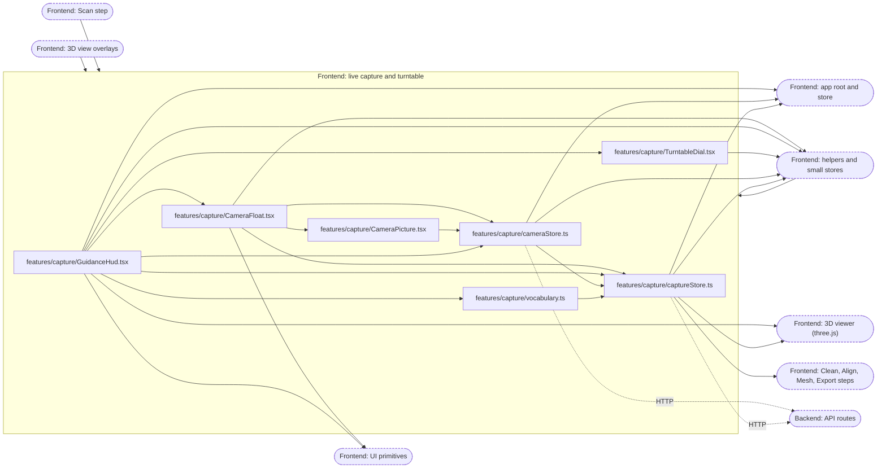
```mermaid
flowchart LR
  subgraph a_fe_capture["Frontend: live capture and turntable"]
    n_frontend_src_features_capture_CameraFloat_tsx["features/capture/CameraFloat.tsx"]
    n_frontend_src_features_capture_CameraPicture_tsx["features/capture/CameraPicture.tsx"]
    n_frontend_src_features_capture_GuidanceHud_tsx["features/capture/GuidanceHud.tsx"]
    n_frontend_src_features_capture_TurntableDial_tsx["features/capture/TurntableDial.tsx"]
    n_frontend_src_features_capture_cameraStore_ts["features/capture/cameraStore.ts"]
    n_frontend_src_features_capture_captureStore_ts["features/capture/captureStore.ts"]
    n_frontend_src_features_capture_vocabulary_ts["features/capture/vocabulary.ts"]
  end
  a_fe_app(["Frontend: app root and store"]):::other
  a_fe_capture_step(["Frontend: Scan step"]):::other
  a_fe_lib(["Frontend: helpers and small stores"]):::other
  a_fe_steps(["Frontend: Clean, Align, Mesh, Export steps"]):::other
  a_fe_ui(["Frontend: UI primitives"]):::other
  a_fe_viewer(["Frontend: 3D viewer (three.js)"]):::other
  a_fe_viewport(["Frontend: 3D view overlays"]):::other
  a_web_routes(["Backend: API routes"]):::other
  n_frontend_src_features_capture_CameraFloat_tsx --> a_fe_lib
  n_frontend_src_features_capture_CameraFloat_tsx --> a_fe_ui
  n_frontend_src_features_capture_CameraFloat_tsx --> n_frontend_src_features_capture_CameraPicture_tsx
  n_frontend_src_features_capture_CameraFloat_tsx --> n_frontend_src_features_capture_cameraStore_ts
  n_frontend_src_features_capture_CameraFloat_tsx --> n_frontend_src_features_capture_captureStore_ts
  n_frontend_src_features_capture_CameraPicture_tsx --> n_frontend_src_features_capture_cameraStore_ts
  n_frontend_src_features_capture_GuidanceHud_tsx --> a_fe_app
  n_frontend_src_features_capture_GuidanceHud_tsx --> a_fe_lib
  n_frontend_src_features_capture_GuidanceHud_tsx --> a_fe_ui
  n_frontend_src_features_capture_GuidanceHud_tsx --> a_fe_viewer
  n_frontend_src_features_capture_GuidanceHud_tsx --> n_frontend_src_features_capture_CameraFloat_tsx
  n_frontend_src_features_capture_GuidanceHud_tsx --> n_frontend_src_features_capture_TurntableDial_tsx
  n_frontend_src_features_capture_GuidanceHud_tsx --> n_frontend_src_features_capture_cameraStore_ts
  n_frontend_src_features_capture_GuidanceHud_tsx --> n_frontend_src_features_capture_captureStore_ts
  n_frontend_src_features_capture_GuidanceHud_tsx --> n_frontend_src_features_capture_vocabulary_ts
  n_frontend_src_features_capture_TurntableDial_tsx --> a_fe_lib
  n_frontend_src_features_capture_cameraStore_ts --> a_fe_app
  n_frontend_src_features_capture_cameraStore_ts --> a_fe_lib
  n_frontend_src_features_capture_cameraStore_ts --> n_frontend_src_features_capture_captureStore_ts
  n_frontend_src_features_capture_cameraStore_ts -.->|HTTP| a_web_routes
  n_frontend_src_features_capture_captureStore_ts --> a_fe_app
  n_frontend_src_features_capture_captureStore_ts --> a_fe_lib
  n_frontend_src_features_capture_captureStore_ts --> a_fe_steps
  n_frontend_src_features_capture_captureStore_ts --> a_fe_viewer
  n_frontend_src_features_capture_captureStore_ts -.->|HTTP| a_web_routes
  n_frontend_src_features_capture_vocabulary_ts --> n_frontend_src_features_capture_captureStore_ts
  a_fe_capture_step --> a_fe_capture
  a_fe_lib --> a_fe_capture
  a_fe_viewport --> a_fe_capture
  classDef other stroke-dasharray: 4 3
```

### Frontend: colour and autopilot

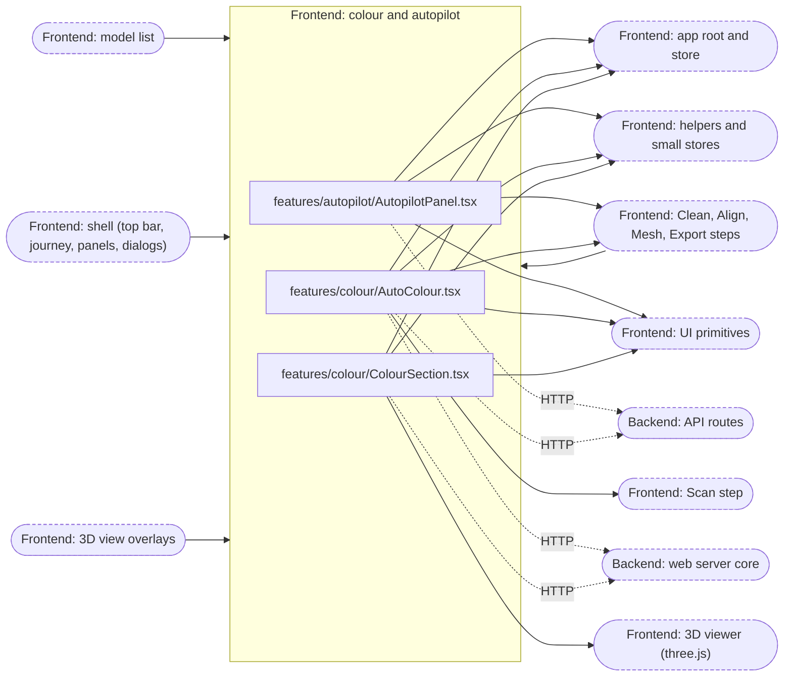
```mermaid
flowchart LR
  subgraph a_fe_features["Frontend: colour and autopilot"]
    n_frontend_src_features_autopilot_AutopilotPanel_tsx["features/autopilot/AutopilotPanel.tsx"]
    n_frontend_src_features_colour_AutoColour_tsx["features/colour/AutoColour.tsx"]
    n_frontend_src_features_colour_ColourSection_tsx["features/colour/ColourSection.tsx"]
  end
  a_fe_app(["Frontend: app root and store"]):::other
  a_fe_capture_step(["Frontend: Scan step"]):::other
  a_fe_lib(["Frontend: helpers and small stores"]):::other
  a_fe_models(["Frontend: model list"]):::other
  a_fe_shell(["Frontend: shell (top bar, journey, panels, dialogs)"]):::other
  a_fe_steps(["Frontend: Clean, Align, Mesh, Export steps"]):::other
  a_fe_ui(["Frontend: UI primitives"]):::other
  a_fe_viewer(["Frontend: 3D viewer (three.js)"]):::other
  a_fe_viewport(["Frontend: 3D view overlays"]):::other
  a_web_core(["Backend: web server core"]):::other
  a_web_routes(["Backend: API routes"]):::other
  n_frontend_src_features_autopilot_AutopilotPanel_tsx --> a_fe_app
  n_frontend_src_features_autopilot_AutopilotPanel_tsx --> a_fe_lib
  n_frontend_src_features_autopilot_AutopilotPanel_tsx --> a_fe_steps
  n_frontend_src_features_autopilot_AutopilotPanel_tsx --> a_fe_ui
  n_frontend_src_features_autopilot_AutopilotPanel_tsx -.->|HTTP| a_web_routes
  n_frontend_src_features_colour_AutoColour_tsx --> a_fe_app
  n_frontend_src_features_colour_AutoColour_tsx --> a_fe_capture_step
  n_frontend_src_features_colour_AutoColour_tsx --> a_fe_lib
  n_frontend_src_features_colour_AutoColour_tsx --> a_fe_steps
  n_frontend_src_features_colour_AutoColour_tsx --> a_fe_ui
  n_frontend_src_features_colour_AutoColour_tsx -.->|HTTP| a_web_core
  n_frontend_src_features_colour_AutoColour_tsx -.->|HTTP| a_web_routes
  n_frontend_src_features_colour_ColourSection_tsx --> a_fe_app
  n_frontend_src_features_colour_ColourSection_tsx --> a_fe_lib
  n_frontend_src_features_colour_ColourSection_tsx --> a_fe_ui
  n_frontend_src_features_colour_ColourSection_tsx --> a_fe_viewer
  n_frontend_src_features_colour_ColourSection_tsx -.->|HTTP| a_web_core
  a_fe_models --> a_fe_features
  a_fe_shell --> a_fe_features
  a_fe_steps --> a_fe_features
  a_fe_viewport --> a_fe_features
  classDef other stroke-dasharray: 4 3
```

### Frontend: 3D view overlays

```mermaid
flowchart LR
  subgraph a_fe_viewport["Frontend: 3D view overlays"]
    n_frontend_src_viewport_AskBar_tsx["viewport/AskBar.tsx"]
    n_frontend_src_viewport_Banners_tsx["viewport/Banners.tsx"]
    n_frontend_src_viewport_BrushOverlay_tsx["viewport/BrushOverlay.tsx"]
    n_frontend_src_viewport_FloorPanel_tsx["viewport/FloorPanel.tsx"]
    n_frontend_src_viewport_GoldenDimension_tsx["viewport/GoldenDimension.tsx"]
    n_frontend_src_viewport_GoldenPins_tsx["viewport/GoldenPins.tsx"]
    n_frontend_src_viewport_Labels_tsx["viewport/Labels.tsx"]
    n_frontend_src_viewport_Legend_tsx["viewport/Legend.tsx"]
    n_frontend_src_viewport_PairOverlay_tsx["viewport/PairOverlay.tsx"]
    n_frontend_src_viewport_PaneOverlay_tsx["viewport/PaneOverlay.tsx"]
    n_frontend_src_viewport_Rails_tsx["viewport/Rails.tsx"]
    n_frontend_src_viewport_SelectionOverlay_tsx["viewport/SelectionOverlay.tsx"]
    n_frontend_src_viewport_SizeTag_tsx["viewport/SizeTag.tsx"]
    n_frontend_src_viewport_Viewport_tsx["viewport/Viewport.tsx"]
  end
  a_fe_app(["Frontend: app root and store"]):::other
  a_fe_assistant(["Frontend: assistant chat"]):::other
  a_fe_capture(["Frontend: live capture and turntable"]):::other
  a_fe_features(["Frontend: colour and autopilot"]):::other
  a_fe_lib(["Frontend: helpers and small stores"]):::other
  a_fe_measure(["Frontend: Measure step"]):::other
  a_fe_shell(["Frontend: shell (top bar, journey, panels, dialogs)"]):::other
  a_fe_steps(["Frontend: Clean, Align, Mesh, Export steps"]):::other
  a_fe_ui(["Frontend: UI primitives"]):::other
  a_fe_viewer(["Frontend: 3D viewer (three.js)"]):::other
  a_web_routes(["Backend: API routes"]):::other
  n_frontend_src_viewport_AskBar_tsx --> a_fe_app
  n_frontend_src_viewport_AskBar_tsx --> a_fe_assistant
  n_frontend_src_viewport_Banners_tsx --> a_fe_app
  n_frontend_src_viewport_Banners_tsx --> a_fe_assistant
  n_frontend_src_viewport_Banners_tsx --> a_fe_capture
  n_frontend_src_viewport_Banners_tsx --> a_fe_lib
  n_frontend_src_viewport_Banners_tsx --> a_fe_ui
  n_frontend_src_viewport_Banners_tsx -.->|HTTP| a_web_routes
  n_frontend_src_viewport_BrushOverlay_tsx --> a_fe_app
  n_frontend_src_viewport_BrushOverlay_tsx --> a_fe_viewer
  n_frontend_src_viewport_FloorPanel_tsx --> a_fe_app
  n_frontend_src_viewport_FloorPanel_tsx --> a_fe_lib
  n_frontend_src_viewport_FloorPanel_tsx --> a_fe_ui
  n_frontend_src_viewport_FloorPanel_tsx --> a_fe_viewer
  n_frontend_src_viewport_FloorPanel_tsx -.->|HTTP| a_web_routes
  n_frontend_src_viewport_GoldenDimension_tsx --> a_fe_app
  n_frontend_src_viewport_GoldenDimension_tsx --> a_fe_lib
  n_frontend_src_viewport_GoldenDimension_tsx --> a_fe_viewer
  n_frontend_src_viewport_GoldenPins_tsx --> a_fe_app
  n_frontend_src_viewport_GoldenPins_tsx --> a_fe_lib
  n_frontend_src_viewport_GoldenPins_tsx --> a_fe_viewer
  n_frontend_src_viewport_Labels_tsx --> a_fe_app
  n_frontend_src_viewport_Labels_tsx --> a_fe_lib
  n_frontend_src_viewport_Labels_tsx --> a_fe_viewer
  n_frontend_src_viewport_Legend_tsx --> a_fe_app
  n_frontend_src_viewport_Legend_tsx --> a_fe_lib
  n_frontend_src_viewport_Legend_tsx --> a_fe_ui
  n_frontend_src_viewport_Legend_tsx --> a_fe_viewer
  n_frontend_src_viewport_PairOverlay_tsx --> a_fe_app
  n_frontend_src_viewport_PairOverlay_tsx --> a_fe_viewer
  n_frontend_src_viewport_PaneOverlay_tsx --> a_fe_app
  n_frontend_src_viewport_PaneOverlay_tsx --> a_fe_viewer
  n_frontend_src_viewport_Rails_tsx --> a_fe_app
  n_frontend_src_viewport_Rails_tsx --> a_fe_lib
  n_frontend_src_viewport_Rails_tsx --> a_fe_ui
  n_frontend_src_viewport_Rails_tsx --> a_fe_viewer
  n_frontend_src_viewport_Rails_tsx --> n_frontend_src_viewport_FloorPanel_tsx
  n_frontend_src_viewport_SelectionOverlay_tsx --> a_fe_app
  n_frontend_src_viewport_SelectionOverlay_tsx --> a_fe_viewer
  n_frontend_src_viewport_SizeTag_tsx --> a_fe_app
  n_frontend_src_viewport_SizeTag_tsx --> a_fe_lib
  n_frontend_src_viewport_SizeTag_tsx --> a_fe_ui
  n_frontend_src_viewport_Viewport_tsx --> a_fe_app
  n_frontend_src_viewport_Viewport_tsx --> a_fe_capture
  n_frontend_src_viewport_Viewport_tsx --> a_fe_features
  n_frontend_src_viewport_Viewport_tsx --> a_fe_lib
  n_frontend_src_viewport_Viewport_tsx --> a_fe_shell
  n_frontend_src_viewport_Viewport_tsx --> a_fe_ui
  n_frontend_src_viewport_Viewport_tsx --> a_fe_viewer
  n_frontend_src_viewport_Viewport_tsx --> n_frontend_src_viewport_AskBar_tsx
  n_frontend_src_viewport_Viewport_tsx --> n_frontend_src_viewport_Banners_tsx
  n_frontend_src_viewport_Viewport_tsx --> n_frontend_src_viewport_BrushOverlay_tsx
  n_frontend_src_viewport_Viewport_tsx --> n_frontend_src_viewport_FloorPanel_tsx
  n_frontend_src_viewport_Viewport_tsx --> n_frontend_src_viewport_GoldenDimension_tsx
  n_frontend_src_viewport_Viewport_tsx --> n_frontend_src_viewport_GoldenPins_tsx
  n_frontend_src_viewport_Viewport_tsx --> n_frontend_src_viewport_Labels_tsx
  n_frontend_src_viewport_Viewport_tsx --> n_frontend_src_viewport_Legend_tsx
  n_frontend_src_viewport_Viewport_tsx --> n_frontend_src_viewport_PairOverlay_tsx
  n_frontend_src_viewport_Viewport_tsx --> n_frontend_src_viewport_PaneOverlay_tsx
  n_frontend_src_viewport_Viewport_tsx --> n_frontend_src_viewport_Rails_tsx
  n_frontend_src_viewport_Viewport_tsx --> n_frontend_src_viewport_SelectionOverlay_tsx
  n_frontend_src_viewport_Viewport_tsx --> n_frontend_src_viewport_SizeTag_tsx
  a_fe_app --> a_fe_viewport
  a_fe_measure --> a_fe_viewport
  a_fe_steps --> a_fe_viewport
  classDef other stroke-dasharray: 4 3
```

### Frontend: 3D viewer (three.js)

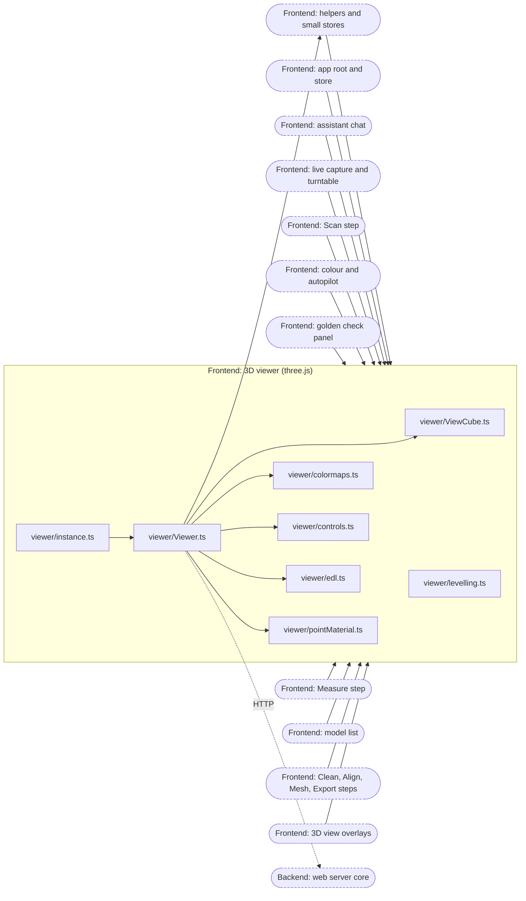
```mermaid
flowchart LR
  subgraph a_fe_viewer["Frontend: 3D viewer (three.js)"]
    n_frontend_src_viewer_ViewCube_ts["viewer/ViewCube.ts"]
    n_frontend_src_viewer_Viewer_ts["viewer/Viewer.ts"]
    n_frontend_src_viewer_colormaps_ts["viewer/colormaps.ts"]
    n_frontend_src_viewer_controls_ts["viewer/controls.ts"]
    n_frontend_src_viewer_edl_ts["viewer/edl.ts"]
    n_frontend_src_viewer_instance_ts["viewer/instance.ts"]
    n_frontend_src_viewer_levelling_ts["viewer/levelling.ts"]
    n_frontend_src_viewer_pointMaterial_ts["viewer/pointMaterial.ts"]
  end
  a_fe_app(["Frontend: app root and store"]):::other
  a_fe_assistant(["Frontend: assistant chat"]):::other
  a_fe_capture(["Frontend: live capture and turntable"]):::other
  a_fe_capture_step(["Frontend: Scan step"]):::other
  a_fe_features(["Frontend: colour and autopilot"]):::other
  a_fe_golden(["Frontend: golden check panel"]):::other
  a_fe_lib(["Frontend: helpers and small stores"]):::other
  a_fe_measure(["Frontend: Measure step"]):::other
  a_fe_models(["Frontend: model list"]):::other
  a_fe_steps(["Frontend: Clean, Align, Mesh, Export steps"]):::other
  a_fe_viewport(["Frontend: 3D view overlays"]):::other
  a_web_core(["Backend: web server core"]):::other
  n_frontend_src_viewer_Viewer_ts --> a_fe_lib
  n_frontend_src_viewer_Viewer_ts --> n_frontend_src_viewer_ViewCube_ts
  n_frontend_src_viewer_Viewer_ts --> n_frontend_src_viewer_colormaps_ts
  n_frontend_src_viewer_Viewer_ts --> n_frontend_src_viewer_controls_ts
  n_frontend_src_viewer_Viewer_ts --> n_frontend_src_viewer_edl_ts
  n_frontend_src_viewer_Viewer_ts --> n_frontend_src_viewer_pointMaterial_ts
  n_frontend_src_viewer_Viewer_ts -.->|HTTP| a_web_core
  n_frontend_src_viewer_instance_ts --> n_frontend_src_viewer_Viewer_ts
  a_fe_app --> a_fe_viewer
  a_fe_assistant --> a_fe_viewer
  a_fe_capture --> a_fe_viewer
  a_fe_capture_step --> a_fe_viewer
  a_fe_features --> a_fe_viewer
  a_fe_golden --> a_fe_viewer
  a_fe_lib --> a_fe_viewer
  a_fe_measure --> a_fe_viewer
  a_fe_models --> a_fe_viewer
  a_fe_steps --> a_fe_viewer
  a_fe_viewport --> a_fe_viewer
  classDef other stroke-dasharray: 4 3
```

### Frontend: helpers and small stores

```mermaid
flowchart LR
  subgraph a_fe_lib["Frontend: helpers and small stores"]
    n_frontend_src_lib_actions_ts["lib/actions.ts"]
    n_frontend_src_lib_api_ts["lib/api.ts"]
    n_frontend_src_lib_applyUi_ts["lib/applyUi.ts"]
    n_frontend_src_lib_auth_ts["lib/auth.ts"]
    n_frontend_src_lib_format_ts["lib/format.ts"]
    n_frontend_src_lib_golden_ts["lib/golden.ts"]
    n_frontend_src_lib_guide_ts["lib/guide.ts"]
    n_frontend_src_lib_importing_ts["lib/importing.ts"]
    n_frontend_src_lib_jobs_ts["lib/jobs.ts"]
    n_frontend_src_lib_journey_ts["lib/journey.ts"]
    n_frontend_src_lib_kabsch_ts["lib/kabsch.ts"]
    n_frontend_src_lib_measure_ts["lib/measure.ts"]
    n_frontend_src_lib_measureTools_ts["lib/measureTools.ts"]
    n_frontend_src_lib_motion_ts["lib/motion.ts"]
    n_frontend_src_lib_panelFit_ts["lib/panelFit.ts"]
    n_frontend_src_lib_projects_ts["lib/projects.ts"]
    n_frontend_src_lib_recon_ts["lib/recon.ts"]
    n_frontend_src_lib_regions_ts["lib/regions.ts"]
    n_frontend_src_lib_report_ts["lib/report.ts"]
    n_frontend_src_lib_summary_ts["lib/summary.ts"]
    n_frontend_src_lib_theme_ts["lib/theme.ts"]
    n_frontend_src_lib_thumbnails_ts["lib/thumbnails.ts"]
    n_frontend_src_lib_turntable_ts["lib/turntable.ts"]
    n_frontend_src_lib_types_ts["lib/types.ts"]
    n_frontend_src_lib_uid_ts["lib/uid.ts"]
  end
  a_fe_app(["Frontend: app root and store"]):::other
  a_fe_assistant(["Frontend: assistant chat"]):::other
  a_fe_capture(["Frontend: live capture and turntable"]):::other
  a_fe_capture_step(["Frontend: Scan step"]):::other
  a_fe_features(["Frontend: colour and autopilot"]):::other
  a_fe_golden(["Frontend: golden check panel"]):::other
  a_fe_home(["Frontend: home screen"]):::other
  a_fe_measure(["Frontend: Measure step"]):::other
  a_fe_models(["Frontend: model list"]):::other
  a_fe_shell(["Frontend: shell (top bar, journey, panels, dialogs)"]):::other
  a_fe_steps(["Frontend: Clean, Align, Mesh, Export steps"]):::other
  a_fe_ui(["Frontend: UI primitives"]):::other
  a_fe_viewer(["Frontend: 3D viewer (three.js)"]):::other
  a_fe_viewport(["Frontend: 3D view overlays"]):::other
  a_web_core(["Backend: web server core"]):::other
  a_web_routes(["Backend: API routes"]):::other
  n_frontend_src_lib_actions_ts --> a_fe_app
  n_frontend_src_lib_actions_ts --> a_fe_viewer
  n_frontend_src_lib_actions_ts --> n_frontend_src_lib_jobs_ts
  n_frontend_src_lib_actions_ts --> n_frontend_src_lib_types_ts
  n_frontend_src_lib_actions_ts -.->|HTTP| a_web_routes
  n_frontend_src_lib_api_ts --> n_frontend_src_lib_auth_ts
  n_frontend_src_lib_api_ts --> n_frontend_src_lib_types_ts
  n_frontend_src_lib_api_ts -.->|HTTP| a_web_core
  n_frontend_src_lib_api_ts -.->|HTTP| a_web_routes
  n_frontend_src_lib_applyUi_ts --> a_fe_app
  n_frontend_src_lib_applyUi_ts --> a_fe_capture
  n_frontend_src_lib_applyUi_ts --> a_fe_measure
  n_frontend_src_lib_applyUi_ts --> a_fe_viewer
  n_frontend_src_lib_applyUi_ts --> n_frontend_src_lib_actions_ts
  n_frontend_src_lib_applyUi_ts --> n_frontend_src_lib_guide_ts
  n_frontend_src_lib_applyUi_ts --> n_frontend_src_lib_types_ts
  n_frontend_src_lib_applyUi_ts --> n_frontend_src_lib_uid_ts
  n_frontend_src_lib_auth_ts -.->|HTTP| a_web_routes
  n_frontend_src_lib_format_ts --> n_frontend_src_lib_types_ts
  n_frontend_src_lib_guide_ts --> a_fe_app
  n_frontend_src_lib_guide_ts --> a_fe_measure
  n_frontend_src_lib_guide_ts --> n_frontend_src_lib_types_ts
  n_frontend_src_lib_importing_ts --> a_fe_app
  n_frontend_src_lib_importing_ts --> n_frontend_src_lib_api_ts
  n_frontend_src_lib_importing_ts --> n_frontend_src_lib_jobs_ts
  n_frontend_src_lib_importing_ts --> n_frontend_src_lib_projects_ts
  n_frontend_src_lib_importing_ts -.->|HTTP| a_web_core
  n_frontend_src_lib_importing_ts -.->|HTTP| a_web_routes
  n_frontend_src_lib_jobs_ts --> a_fe_app
  n_frontend_src_lib_jobs_ts --> a_fe_measure
  n_frontend_src_lib_jobs_ts --> a_fe_viewer
  n_frontend_src_lib_jobs_ts --> n_frontend_src_lib_api_ts
  n_frontend_src_lib_jobs_ts --> n_frontend_src_lib_types_ts
  n_frontend_src_lib_jobs_ts -.->|HTTP| a_web_core
  n_frontend_src_lib_journey_ts --> n_frontend_src_lib_types_ts
  n_frontend_src_lib_measureTools_ts --> a_fe_app
  n_frontend_src_lib_measureTools_ts --> a_fe_viewer
  n_frontend_src_lib_measureTools_ts --> n_frontend_src_lib_api_ts
  n_frontend_src_lib_measureTools_ts --> n_frontend_src_lib_jobs_ts
  n_frontend_src_lib_measureTools_ts --> n_frontend_src_lib_measure_ts
  n_frontend_src_lib_measureTools_ts --> n_frontend_src_lib_types_ts
  n_frontend_src_lib_measureTools_ts --> n_frontend_src_lib_uid_ts
  n_frontend_src_lib_measureTools_ts -.->|HTTP| a_web_routes
  n_frontend_src_lib_measure_ts --> a_fe_app
  n_frontend_src_lib_measure_ts --> n_frontend_src_lib_api_ts
  n_frontend_src_lib_measure_ts --> n_frontend_src_lib_uid_ts
  n_frontend_src_lib_measure_ts -.->|HTTP| a_web_routes
  n_frontend_src_lib_panelFit_ts --> a_fe_app
  n_frontend_src_lib_projects_ts --> n_frontend_src_lib_api_ts
  n_frontend_src_lib_projects_ts --> n_frontend_src_lib_types_ts
  n_frontend_src_lib_projects_ts -.->|HTTP| a_web_routes
  n_frontend_src_lib_recon_ts --> n_frontend_src_lib_api_ts
  n_frontend_src_lib_recon_ts -.->|HTTP| a_web_routes
  n_frontend_src_lib_regions_ts --> n_frontend_src_lib_types_ts
  n_frontend_src_lib_report_ts --> a_fe_app
  n_frontend_src_lib_report_ts --> a_fe_viewer
  n_frontend_src_lib_report_ts --> n_frontend_src_lib_format_ts
  n_frontend_src_lib_report_ts --> n_frontend_src_lib_journey_ts
  n_frontend_src_lib_report_ts --> n_frontend_src_lib_summary_ts
  n_frontend_src_lib_report_ts --> n_frontend_src_lib_types_ts
  n_frontend_src_lib_summary_ts --> n_frontend_src_lib_api_ts
  n_frontend_src_lib_summary_ts --> n_frontend_src_lib_types_ts
  n_frontend_src_lib_summary_ts -.->|HTTP| a_web_routes
  n_frontend_src_lib_theme_ts --> a_fe_app
  n_frontend_src_lib_thumbnails_ts --> a_fe_app
  n_frontend_src_lib_thumbnails_ts --> a_fe_viewer
  n_frontend_src_lib_thumbnails_ts -.->|HTTP| a_web_routes
  n_frontend_src_lib_turntable_ts --> n_frontend_src_lib_api_ts
  n_frontend_src_lib_turntable_ts -.->|HTTP| a_web_routes
  a_fe_app --> a_fe_lib
  a_fe_assistant --> a_fe_lib
  a_fe_capture --> a_fe_lib
  a_fe_capture_step --> a_fe_lib
  a_fe_features --> a_fe_lib
  a_fe_golden --> a_fe_lib
  a_fe_home --> a_fe_lib
  a_fe_measure --> a_fe_lib
  a_fe_models --> a_fe_lib
  a_fe_shell --> a_fe_lib
  a_fe_steps --> a_fe_lib
  a_fe_ui --> a_fe_lib
  a_fe_viewer --> a_fe_lib
  a_fe_viewport --> a_fe_lib
  classDef other stroke-dasharray: 4 3
```

### Frontend: UI primitives

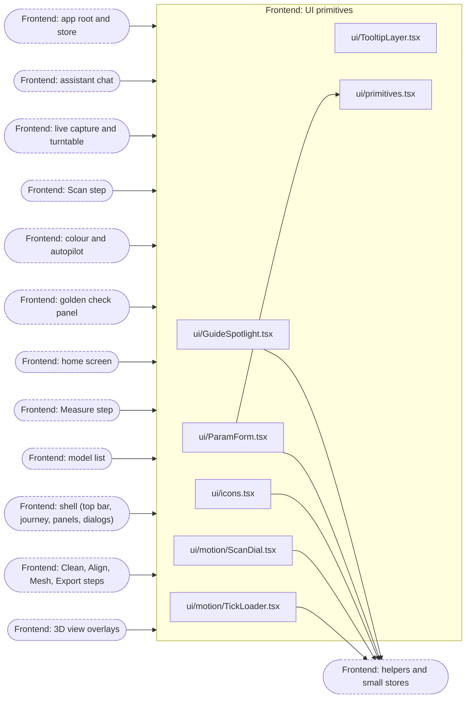
```mermaid
flowchart LR
  subgraph a_fe_ui["Frontend: UI primitives"]
    n_frontend_src_ui_GuideSpotlight_tsx["ui/GuideSpotlight.tsx"]
    n_frontend_src_ui_ParamForm_tsx["ui/ParamForm.tsx"]
    n_frontend_src_ui_TooltipLayer_tsx["ui/TooltipLayer.tsx"]
    n_frontend_src_ui_icons_tsx["ui/icons.tsx"]
    n_frontend_src_ui_motion_ScanDial_tsx["ui/motion/ScanDial.tsx"]
    n_frontend_src_ui_motion_TickLoader_tsx["ui/motion/TickLoader.tsx"]
    n_frontend_src_ui_primitives_tsx["ui/primitives.tsx"]
  end
  a_fe_app(["Frontend: app root and store"]):::other
  a_fe_assistant(["Frontend: assistant chat"]):::other
  a_fe_capture(["Frontend: live capture and turntable"]):::other
  a_fe_capture_step(["Frontend: Scan step"]):::other
  a_fe_features(["Frontend: colour and autopilot"]):::other
  a_fe_golden(["Frontend: golden check panel"]):::other
  a_fe_home(["Frontend: home screen"]):::other
  a_fe_lib(["Frontend: helpers and small stores"]):::other
  a_fe_measure(["Frontend: Measure step"]):::other
  a_fe_models(["Frontend: model list"]):::other
  a_fe_shell(["Frontend: shell (top bar, journey, panels, dialogs)"]):::other
  a_fe_steps(["Frontend: Clean, Align, Mesh, Export steps"]):::other
  a_fe_viewport(["Frontend: 3D view overlays"]):::other
  n_frontend_src_ui_GuideSpotlight_tsx --> a_fe_lib
  n_frontend_src_ui_ParamForm_tsx --> a_fe_lib
  n_frontend_src_ui_ParamForm_tsx --> n_frontend_src_ui_primitives_tsx
  n_frontend_src_ui_icons_tsx --> a_fe_lib
  n_frontend_src_ui_motion_ScanDial_tsx --> a_fe_lib
  n_frontend_src_ui_motion_TickLoader_tsx --> a_fe_lib
  a_fe_app --> a_fe_ui
  a_fe_assistant --> a_fe_ui
  a_fe_capture --> a_fe_ui
  a_fe_capture_step --> a_fe_ui
  a_fe_features --> a_fe_ui
  a_fe_golden --> a_fe_ui
  a_fe_home --> a_fe_ui
  a_fe_measure --> a_fe_ui
  a_fe_models --> a_fe_ui
  a_fe_shell --> a_fe_ui
  a_fe_steps --> a_fe_ui
  a_fe_viewport --> a_fe_ui
  classDef other stroke-dasharray: 4 3
```

### Backend: web server core

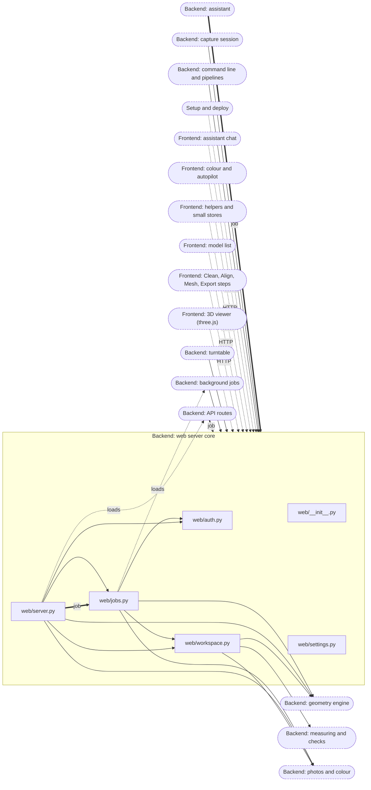
```mermaid
flowchart LR
  subgraph a_web_core["Backend: web server core"]
    n_cloudclean_web___init___py["web/__init__.py"]
    n_cloudclean_web_auth_py["web/auth.py"]
    n_cloudclean_web_jobs_py["web/jobs.py"]
    n_cloudclean_web_server_py["web/server.py"]
    n_cloudclean_web_settings_py["web/settings.py"]
    n_cloudclean_web_workspace_py["web/workspace.py"]
  end
  a_assistant(["Backend: assistant"]):::other
  a_capture(["Backend: capture session"]):::other
  a_cli(["Backend: command line and pipelines"]):::other
  a_deploy(["Setup and deploy"]):::other
  a_engine(["Backend: geometry engine"]):::other
  a_fe_assistant(["Frontend: assistant chat"]):::other
  a_fe_features(["Frontend: colour and autopilot"]):::other
  a_fe_lib(["Frontend: helpers and small stores"]):::other
  a_fe_models(["Frontend: model list"]):::other
  a_fe_steps(["Frontend: Clean, Align, Mesh, Export steps"]):::other
  a_fe_viewer(["Frontend: 3D viewer (three.js)"]):::other
  a_measure(["Backend: measuring and checks"]):::other
  a_photos(["Backend: photos and colour"]):::other
  a_turntable(["Backend: turntable"]):::other
  a_web_jobs(["Backend: background jobs"]):::other
  a_web_routes(["Backend: API routes"]):::other
  n_cloudclean_web_jobs_py --> a_engine
  n_cloudclean_web_jobs_py --> a_photos
  n_cloudclean_web_jobs_py --> n_cloudclean_web_auth_py
  n_cloudclean_web_jobs_py --> n_cloudclean_web_workspace_py
  n_cloudclean_web_jobs_py -.->|loads| a_web_jobs
  n_cloudclean_web_server_py --> a_engine
  n_cloudclean_web_server_py --> a_photos
  n_cloudclean_web_server_py --> n_cloudclean_web_auth_py
  n_cloudclean_web_server_py --> n_cloudclean_web_jobs_py
  n_cloudclean_web_server_py --> n_cloudclean_web_workspace_py
  n_cloudclean_web_server_py -.->|loads| a_web_routes
  n_cloudclean_web_server_py ==>|job| n_cloudclean_web_jobs_py
  n_cloudclean_web_workspace_py --> a_engine
  n_cloudclean_web_workspace_py --> a_measure
  n_cloudclean_web_workspace_py --> a_photos
  a_assistant ==>|job| a_web_core
  a_capture --> a_web_core
  a_cli --> a_web_core
  a_deploy -.->|HTTP| a_web_core
  a_fe_assistant -.->|HTTP| a_web_core
  a_fe_features -.->|HTTP| a_web_core
  a_fe_lib -.->|HTTP| a_web_core
  a_fe_models -.->|HTTP| a_web_core
  a_fe_steps -.->|HTTP| a_web_core
  a_fe_viewer -.->|HTTP| a_web_core
  a_turntable --> a_web_core
  a_web_jobs --> a_web_core
  a_web_routes ==>|job| a_web_core
  classDef other stroke-dasharray: 4 3
```

### Backend: API routes

```mermaid
flowchart LR
  subgraph a_web_routes["Backend: API routes"]
    n_cloudclean_web_routes_accuracy_py["web/routes_accuracy.py"]
    n_cloudclean_web_routes_assistant_py["web/routes_assistant.py"]
    n_cloudclean_web_routes_auth_py["web/routes_auth.py"]
    n_cloudclean_web_routes_autopilot_py["web/routes_autopilot.py"]
    n_cloudclean_web_routes_capture_py["web/routes_capture.py"]
    n_cloudclean_web_routes_colour_photos_py["web/routes_colour_photos.py"]
    n_cloudclean_web_routes_compare_py["web/routes_compare.py"]
    n_cloudclean_web_routes_edit_py["web/routes_edit.py"]
    n_cloudclean_web_routes_golden_py["web/routes_golden.py"]
    n_cloudclean_web_routes_holes_py["web/routes_holes.py"]
    n_cloudclean_web_routes_markers_py["web/routes_markers.py"]
    n_cloudclean_web_routes_measure_py["web/routes_measure.py"]
    n_cloudclean_web_routes_merge_py["web/routes_merge.py"]
    n_cloudclean_web_routes_merge_options_py["web/routes_merge_options.py"]
    n_cloudclean_web_routes_photo_fill_py["web/routes_photo_fill.py"]
    n_cloudclean_web_routes_photos3d_py["web/routes_photos3d.py"]
    n_cloudclean_web_routes_projects_py["web/routes_projects.py"]
    n_cloudclean_web_routes_system_py["web/routes_system.py"]
    n_cloudclean_web_routes_turntable_py["web/routes_turntable.py"]
    n_cloudclean_web_routes_understand_py["web/routes_understand.py"]
  end
  a_assistant(["Backend: assistant"]):::other
  a_capture(["Backend: capture session"]):::other
  a_cli(["Backend: command line and pipelines"]):::other
  a_deploy(["Setup and deploy"]):::other
  a_engine(["Backend: geometry engine"]):::other
  a_fe_assistant(["Frontend: assistant chat"]):::other
  a_fe_capture(["Frontend: live capture and turntable"]):::other
  a_fe_capture_step(["Frontend: Scan step"]):::other
  a_fe_features(["Frontend: colour and autopilot"]):::other
  a_fe_home(["Frontend: home screen"]):::other
  a_fe_lib(["Frontend: helpers and small stores"]):::other
  a_fe_measure(["Frontend: Measure step"]):::other
  a_fe_models(["Frontend: model list"]):::other
  a_fe_shell(["Frontend: shell (top bar, journey, panels, dialogs)"]):::other
  a_fe_steps(["Frontend: Clean, Align, Mesh, Export steps"]):::other
  a_fe_viewport(["Frontend: 3D view overlays"]):::other
  a_measure(["Backend: measuring and checks"]):::other
  a_turntable(["Backend: turntable"]):::other
  a_web_core(["Backend: web server core"]):::other
  a_web_jobs(["Backend: background jobs"]):::other
  n_cloudclean_web_routes_accuracy_py --> a_engine
  n_cloudclean_web_routes_accuracy_py --> a_measure
  n_cloudclean_web_routes_accuracy_py ==>|job| a_web_jobs
  n_cloudclean_web_routes_assistant_py --> a_assistant
  n_cloudclean_web_routes_assistant_py --> a_web_core
  n_cloudclean_web_routes_auth_py --> a_web_core
  n_cloudclean_web_routes_autopilot_py --> a_cli
  n_cloudclean_web_routes_autopilot_py --> a_engine
  n_cloudclean_web_routes_autopilot_py --> a_web_core
  n_cloudclean_web_routes_autopilot_py ==>|job| a_web_jobs
  n_cloudclean_web_routes_capture_py --> a_capture
  n_cloudclean_web_routes_capture_py --> a_engine
  n_cloudclean_web_routes_capture_py --> a_measure
  n_cloudclean_web_routes_capture_py --> a_web_core
  n_cloudclean_web_routes_capture_py ==>|job| a_web_core
  n_cloudclean_web_routes_colour_photos_py --> a_web_jobs
  n_cloudclean_web_routes_colour_photos_py ==>|job| a_web_jobs
  n_cloudclean_web_routes_compare_py --> a_engine
  n_cloudclean_web_routes_compare_py ==>|job| a_web_jobs
  n_cloudclean_web_routes_edit_py --> a_engine
  n_cloudclean_web_routes_edit_py --> a_web_jobs
  n_cloudclean_web_routes_edit_py ==>|job| a_web_jobs
  n_cloudclean_web_routes_golden_py --> a_measure
  n_cloudclean_web_routes_golden_py ==>|job| a_web_jobs
  n_cloudclean_web_routes_holes_py --> a_engine
  n_cloudclean_web_routes_holes_py ==>|job| a_web_jobs
  n_cloudclean_web_routes_markers_py --> a_engine
  n_cloudclean_web_routes_measure_py --> a_engine
  n_cloudclean_web_routes_measure_py --> a_measure
  n_cloudclean_web_routes_merge_options_py ==>|job| a_web_jobs
  n_cloudclean_web_routes_merge_py --> a_engine
  n_cloudclean_web_routes_merge_py ==>|job| a_web_jobs
  n_cloudclean_web_routes_photo_fill_py --> a_web_jobs
  n_cloudclean_web_routes_photo_fill_py ==>|job| a_web_jobs
  n_cloudclean_web_routes_photos3d_py --> a_measure
  n_cloudclean_web_routes_photos3d_py --> a_web_jobs
  n_cloudclean_web_routes_photos3d_py ==>|job| a_web_jobs
  n_cloudclean_web_routes_projects_py --> a_web_core
  n_cloudclean_web_routes_turntable_py --> a_turntable
  n_cloudclean_web_routes_understand_py --> a_measure
  n_cloudclean_web_routes_understand_py ==>|job| a_web_jobs
  a_assistant --> a_web_routes
  a_deploy -.->|HTTP| a_web_routes
  a_fe_assistant -.->|HTTP| a_web_routes
  a_fe_capture -.->|HTTP| a_web_routes
  a_fe_capture_step -.->|HTTP| a_web_routes
  a_fe_features -.->|HTTP| a_web_routes
  a_fe_home -.->|HTTP| a_web_routes
  a_fe_lib -.->|HTTP| a_web_routes
  a_fe_measure -.->|HTTP| a_web_routes
  a_fe_models -.->|HTTP| a_web_routes
  a_fe_shell -.->|HTTP| a_web_routes
  a_fe_steps -.->|HTTP| a_web_routes
  a_fe_viewport -.->|HTTP| a_web_routes
  a_turntable --> a_web_routes
  a_web_core -.->|loads| a_web_routes
  classDef other stroke-dasharray: 4 3
```

### Backend: background jobs

```mermaid
flowchart LR
  subgraph a_web_jobs["Backend: background jobs"]
    n_cloudclean_web_jobs_accuracy_py["web/jobs_accuracy.py"]
    n_cloudclean_web_jobs_autopilot_py["web/jobs_autopilot.py"]
    n_cloudclean_web_jobs_colour_photos_py["web/jobs_colour_photos.py"]
    n_cloudclean_web_jobs_compare_py["web/jobs_compare.py"]
    n_cloudclean_web_jobs_edit_py["web/jobs_edit.py"]
    n_cloudclean_web_jobs_golden_py["web/jobs_golden.py"]
    n_cloudclean_web_jobs_holes_py["web/jobs_holes.py"]
    n_cloudclean_web_jobs_merge_py["web/jobs_merge.py"]
    n_cloudclean_web_jobs_merge_options_py["web/jobs_merge_options.py"]
    n_cloudclean_web_jobs_photo_fill_py["web/jobs_photo_fill.py"]
    n_cloudclean_web_jobs_photos3d_py["web/jobs_photos3d.py"]
    n_cloudclean_web_jobs_understand_py["web/jobs_understand.py"]
  end
  a_assistant(["Backend: assistant"]):::other
  a_capture(["Backend: capture session"]):::other
  a_cli(["Backend: command line and pipelines"]):::other
  a_engine(["Backend: geometry engine"]):::other
  a_measure(["Backend: measuring and checks"]):::other
  a_photos(["Backend: photos and colour"]):::other
  a_web_core(["Backend: web server core"]):::other
  a_web_routes(["Backend: API routes"]):::other
  n_cloudclean_web_jobs_accuracy_py --> a_engine
  n_cloudclean_web_jobs_accuracy_py --> a_measure
  n_cloudclean_web_jobs_accuracy_py --> a_web_core
  n_cloudclean_web_jobs_autopilot_py --> a_cli
  n_cloudclean_web_jobs_autopilot_py --> a_engine
  n_cloudclean_web_jobs_autopilot_py --> a_web_core
  n_cloudclean_web_jobs_autopilot_py --> n_cloudclean_web_jobs_compare_py
  n_cloudclean_web_jobs_autopilot_py --> n_cloudclean_web_jobs_merge_py
  n_cloudclean_web_jobs_colour_photos_py --> a_engine
  n_cloudclean_web_jobs_colour_photos_py --> a_photos
  n_cloudclean_web_jobs_colour_photos_py --> a_web_core
  n_cloudclean_web_jobs_colour_photos_py --> n_cloudclean_web_jobs_photos3d_py
  n_cloudclean_web_jobs_compare_py --> a_engine
  n_cloudclean_web_jobs_compare_py --> a_web_core
  n_cloudclean_web_jobs_edit_py --> a_engine
  n_cloudclean_web_jobs_edit_py --> a_web_core
  n_cloudclean_web_jobs_golden_py --> a_engine
  n_cloudclean_web_jobs_golden_py --> a_measure
  n_cloudclean_web_jobs_golden_py --> a_web_core
  n_cloudclean_web_jobs_holes_py --> a_engine
  n_cloudclean_web_jobs_holes_py --> a_web_core
  n_cloudclean_web_jobs_merge_options_py --> a_engine
  n_cloudclean_web_jobs_merge_options_py --> a_web_core
  n_cloudclean_web_jobs_merge_py --> a_engine
  n_cloudclean_web_jobs_merge_py --> a_web_core
  n_cloudclean_web_jobs_photo_fill_py --> a_engine
  n_cloudclean_web_jobs_photo_fill_py --> a_photos
  n_cloudclean_web_jobs_photo_fill_py --> a_web_core
  n_cloudclean_web_jobs_photo_fill_py --> n_cloudclean_web_jobs_colour_photos_py
  n_cloudclean_web_jobs_photo_fill_py --> n_cloudclean_web_jobs_photos3d_py
  n_cloudclean_web_jobs_photos3d_py --> a_web_core
  n_cloudclean_web_jobs_understand_py --> a_measure
  n_cloudclean_web_jobs_understand_py --> a_web_core
  a_assistant ==>|job| a_web_jobs
  a_capture ==>|job| a_web_jobs
  a_web_core -.->|loads| a_web_jobs
  a_web_routes ==>|job| a_web_jobs
  classDef other stroke-dasharray: 4 3
```

### Backend: assistant

```mermaid
flowchart LR
  subgraph a_assistant["Backend: assistant"]
    n_cloudclean_assistant___init___py["assistant/__init__.py"]
    n_cloudclean_assistant_agent_py["assistant/agent.py"]
    n_cloudclean_assistant_guide_py["assistant/guide.py"]
    n_cloudclean_assistant_llm_py["assistant/llm.py"]
    n_cloudclean_assistant_routing_py["assistant/routing.py"]
    n_cloudclean_assistant_tools_py["assistant/tools.py"]
    n_cloudclean_assistant_tools_v3_py["assistant/tools_v3.py"]
  end
  a_capture(["Backend: capture session"]):::other
  a_engine(["Backend: geometry engine"]):::other
  a_measure(["Backend: measuring and checks"]):::other
  a_turntable(["Backend: turntable"]):::other
  a_web_core(["Backend: web server core"]):::other
  a_web_jobs(["Backend: background jobs"]):::other
  a_web_routes(["Backend: API routes"]):::other
  n_cloudclean_assistant_agent_py --> a_measure
  n_cloudclean_assistant_agent_py --> a_web_routes
  n_cloudclean_assistant_agent_py --> n_cloudclean_assistant_llm_py
  n_cloudclean_assistant_agent_py --> n_cloudclean_assistant_routing_py
  n_cloudclean_assistant_agent_py --> n_cloudclean_assistant_tools_py
  n_cloudclean_assistant_agent_py --> n_cloudclean_assistant_tools_v3_py
  n_cloudclean_assistant_tools_py --> a_engine
  n_cloudclean_assistant_tools_py --> a_measure
  n_cloudclean_assistant_tools_py --> a_web_core
  n_cloudclean_assistant_tools_py --> a_web_jobs
  n_cloudclean_assistant_tools_py --> n_cloudclean_assistant_tools_v3_py
  n_cloudclean_assistant_tools_py ==>|job| a_web_core
  n_cloudclean_assistant_tools_py ==>|job| a_web_jobs
  n_cloudclean_assistant_tools_v3_py --> a_capture
  n_cloudclean_assistant_tools_v3_py --> a_engine
  n_cloudclean_assistant_tools_v3_py --> a_measure
  n_cloudclean_assistant_tools_v3_py --> a_turntable
  n_cloudclean_assistant_tools_v3_py --> a_web_jobs
  n_cloudclean_assistant_tools_v3_py --> a_web_routes
  n_cloudclean_assistant_tools_v3_py --> n_cloudclean_assistant_guide_py
  n_cloudclean_assistant_tools_v3_py --> n_cloudclean_assistant_tools_py
  n_cloudclean_assistant_tools_v3_py ==>|job| a_web_jobs
  a_web_routes --> a_assistant
  classDef other stroke-dasharray: 4 3
```

### Backend: scanner drivers

```mermaid
flowchart LR
  subgraph a_drivers["Backend: scanner drivers"]
    n_cloudclean_capture_drivers___init___py["capture/drivers/__init__.py"]
    n_cloudclean_capture_drivers_base_py["capture/drivers/base.py"]
    n_cloudclean_capture_drivers_depth_camera_py["capture/drivers/depth_camera.py"]
    n_cloudclean_capture_drivers_folder_py["capture/drivers/folder.py"]
    n_cloudclean_capture_drivers_metroy_usb_py["capture/drivers/metroy_usb.py"]
    n_cloudclean_capture_drivers_revo_bridge_py["capture/drivers/revo_bridge.py"]
    n_cloudclean_capture_drivers_revopoint_sdk_py["capture/drivers/revopoint_sdk.py"]
    n_cloudclean_capture_drivers_simulated_py["capture/drivers/simulated.py"]
    n_cloudclean_capture_drivers_simulated_camera_py["capture/drivers/simulated_camera.py"]
  end
  a_capture(["Backend: capture session"]):::other
  a_engine(["Backend: geometry engine"]):::other
  a_metroy(["Backend: MetroY native capture"]):::other
  a_turntable(["Backend: turntable"]):::other
  n_cloudclean_capture_drivers___init___py --> n_cloudclean_capture_drivers_base_py
  n_cloudclean_capture_drivers_base_py -.->|loads| n_cloudclean_capture_drivers_depth_camera_py
  n_cloudclean_capture_drivers_base_py -.->|loads| n_cloudclean_capture_drivers_folder_py
  n_cloudclean_capture_drivers_base_py -.->|loads| n_cloudclean_capture_drivers_metroy_usb_py
  n_cloudclean_capture_drivers_base_py -.->|loads| n_cloudclean_capture_drivers_revo_bridge_py
  n_cloudclean_capture_drivers_base_py -.->|loads| n_cloudclean_capture_drivers_revopoint_sdk_py
  n_cloudclean_capture_drivers_base_py -.->|loads| n_cloudclean_capture_drivers_simulated_py
  n_cloudclean_capture_drivers_depth_camera_py --> n_cloudclean_capture_drivers_base_py
  n_cloudclean_capture_drivers_folder_py --> a_engine
  n_cloudclean_capture_drivers_folder_py --> n_cloudclean_capture_drivers_base_py
  n_cloudclean_capture_drivers_metroy_usb_py --> a_metroy
  n_cloudclean_capture_drivers_metroy_usb_py --> n_cloudclean_capture_drivers_base_py
  n_cloudclean_capture_drivers_revo_bridge_py --> n_cloudclean_capture_drivers_base_py
  n_cloudclean_capture_drivers_revo_bridge_py --> n_cloudclean_capture_drivers_folder_py
  n_cloudclean_capture_drivers_revopoint_sdk_py --> n_cloudclean_capture_drivers_base_py
  n_cloudclean_capture_drivers_simulated_camera_py --> a_metroy
  n_cloudclean_capture_drivers_simulated_py --> a_metroy
  n_cloudclean_capture_drivers_simulated_py --> a_turntable
  n_cloudclean_capture_drivers_simulated_py --> n_cloudclean_capture_drivers_base_py
  n_cloudclean_capture_drivers_simulated_py --> n_cloudclean_capture_drivers_simulated_camera_py
  a_capture --> a_drivers
  classDef other stroke-dasharray: 4 3
```

### Backend: MetroY native capture

```mermaid
flowchart LR
  subgraph a_metroy["Backend: MetroY native capture"]
    n_cloudclean_capture_metroy___init___py["capture/metroy/__init__.py"]
    n_cloudclean_capture_metroy_camera_py["capture/metroy/camera.py"]
    n_cloudclean_capture_metroy_exposure_py["capture/metroy/exposure.py"]
    n_cloudclean_capture_metroy_hid_py["capture/metroy/hid.py"]
    n_cloudclean_capture_metroy_laserfile_py["capture/metroy/laserfile.py"]
    n_cloudclean_capture_metroy_markers_py["capture/metroy/markers.py"]
    n_cloudclean_capture_metroy_scanner_py["capture/metroy/scanner.py"]
    n_cloudclean_capture_metroy_stripes_py["capture/metroy/stripes.py"]
    n_cloudclean_capture_metroy_v4l2_py["capture/metroy/v4l2.py"]
  end
  a_drivers(["Backend: scanner drivers"]):::other
  n_cloudclean_capture_metroy_camera_py --> n_cloudclean_capture_metroy_exposure_py
  n_cloudclean_capture_metroy_hid_py --> n_cloudclean_capture_metroy_exposure_py
  n_cloudclean_capture_metroy_scanner_py --> n_cloudclean_capture_metroy_camera_py
  n_cloudclean_capture_metroy_scanner_py --> n_cloudclean_capture_metroy_exposure_py
  n_cloudclean_capture_metroy_scanner_py --> n_cloudclean_capture_metroy_hid_py
  n_cloudclean_capture_metroy_scanner_py --> n_cloudclean_capture_metroy_markers_py
  n_cloudclean_capture_metroy_scanner_py --> n_cloudclean_capture_metroy_stripes_py
  n_cloudclean_capture_metroy_scanner_py --> n_cloudclean_capture_metroy_v4l2_py
  n_cloudclean_capture_metroy_stripes_py --> n_cloudclean_capture_metroy_laserfile_py
  a_drivers --> a_metroy
  classDef other stroke-dasharray: 4 3
```

### Backend: turntable

```mermaid
flowchart LR
  subgraph a_turntable["Backend: turntable"]
    n_cloudclean_capture_turntable___init___py["capture/turntable/__init__.py"]
    n_cloudclean_capture_turntable_base_py["capture/turntable/base.py"]
    n_cloudclean_capture_turntable_ble_py["capture/turntable/ble.py"]
    n_cloudclean_capture_turntable_manager_py["capture/turntable/manager.py"]
    n_cloudclean_capture_turntable_program_py["capture/turntable/program.py"]
    n_cloudclean_capture_turntable_protocol_py["capture/turntable/protocol.py"]
    n_cloudclean_capture_turntable_simulated_py["capture/turntable/simulated.py"]
  end
  a_assistant(["Backend: assistant"]):::other
  a_capture(["Backend: capture session"]):::other
  a_drivers(["Backend: scanner drivers"]):::other
  a_web_core(["Backend: web server core"]):::other
  a_web_routes(["Backend: API routes"]):::other
  n_cloudclean_capture_turntable___init___py --> n_cloudclean_capture_turntable_base_py
  n_cloudclean_capture_turntable___init___py --> n_cloudclean_capture_turntable_ble_py
  n_cloudclean_capture_turntable___init___py --> n_cloudclean_capture_turntable_manager_py
  n_cloudclean_capture_turntable___init___py --> n_cloudclean_capture_turntable_simulated_py
  n_cloudclean_capture_turntable_ble_py --> n_cloudclean_capture_turntable_base_py
  n_cloudclean_capture_turntable_ble_py --> n_cloudclean_capture_turntable_protocol_py
  n_cloudclean_capture_turntable_manager_py --> a_web_core
  n_cloudclean_capture_turntable_manager_py --> a_web_routes
  n_cloudclean_capture_turntable_manager_py --> n_cloudclean_capture_turntable_base_py
  n_cloudclean_capture_turntable_manager_py --> n_cloudclean_capture_turntable_ble_py
  n_cloudclean_capture_turntable_manager_py --> n_cloudclean_capture_turntable_program_py
  n_cloudclean_capture_turntable_manager_py --> n_cloudclean_capture_turntable_protocol_py
  n_cloudclean_capture_turntable_manager_py --> n_cloudclean_capture_turntable_simulated_py
  n_cloudclean_capture_turntable_program_py --> n_cloudclean_capture_turntable_base_py
  n_cloudclean_capture_turntable_program_py --> n_cloudclean_capture_turntable_protocol_py
  n_cloudclean_capture_turntable_simulated_py --> n_cloudclean_capture_turntable_base_py
  a_assistant --> a_turntable
  a_capture --> a_turntable
  a_drivers --> a_turntable
  a_web_routes --> a_turntable
  classDef other stroke-dasharray: 4 3
```

### Backend: capture session

```mermaid
flowchart LR
  subgraph a_capture["Backend: capture session"]
    n_cloudclean_capture___init___py["capture/__init__.py"]
    n_cloudclean_capture_bridge_py["capture/bridge.py"]
    n_cloudclean_capture_fusion_py["capture/fusion.py"]
    n_cloudclean_capture_grid_py["capture/grid.py"]
    n_cloudclean_capture_guidance_py["capture/guidance.py"]
    n_cloudclean_capture_manager_py["capture/manager.py"]
    n_cloudclean_capture_session_py["capture/session.py"]
  end
  a_assistant(["Backend: assistant"]):::other
  a_cli(["Backend: command line and pipelines"]):::other
  a_drivers(["Backend: scanner drivers"]):::other
  a_engine(["Backend: geometry engine"]):::other
  a_turntable(["Backend: turntable"]):::other
  a_web_core(["Backend: web server core"]):::other
  a_web_jobs(["Backend: background jobs"]):::other
  a_web_routes(["Backend: API routes"]):::other
  n_cloudclean_capture_fusion_py --> n_cloudclean_capture_grid_py
  n_cloudclean_capture_guidance_py --> n_cloudclean_capture_grid_py
  n_cloudclean_capture_manager_py --> a_drivers
  n_cloudclean_capture_manager_py --> a_turntable
  n_cloudclean_capture_manager_py --> a_web_core
  n_cloudclean_capture_manager_py --> n_cloudclean_capture_session_py
  n_cloudclean_capture_manager_py ==>|job| a_web_jobs
  n_cloudclean_capture_session_py --> a_drivers
  n_cloudclean_capture_session_py --> a_engine
  n_cloudclean_capture_session_py --> n_cloudclean_capture_fusion_py
  n_cloudclean_capture_session_py --> n_cloudclean_capture_grid_py
  n_cloudclean_capture_session_py --> n_cloudclean_capture_guidance_py
  a_assistant --> a_capture
  a_cli --> a_capture
  a_web_routes --> a_capture
  classDef other stroke-dasharray: 4 3
```

### Backend: command line and pipelines

```mermaid
flowchart LR
  subgraph a_cli["Backend: command line and pipelines"]
    n_cloudclean___init___py["__init__.py"]
    n_cloudclean_autopilot_py["autopilot.py"]
    n_cloudclean_cli_py["cli.py"]
    n_cloudclean_pipeline_py["pipeline.py"]
  end
  a_capture(["Backend: capture session"]):::other
  a_deploy(["Setup and deploy"]):::other
  a_engine(["Backend: geometry engine"]):::other
  a_photos(["Backend: photos and colour"]):::other
  a_web_core(["Backend: web server core"]):::other
  a_web_jobs(["Backend: background jobs"]):::other
  a_web_routes(["Backend: API routes"]):::other
  n_cloudclean_autopilot_py --> a_engine
  n_cloudclean_autopilot_py --> n_cloudclean_pipeline_py
  n_cloudclean_cli_py --> a_capture
  n_cloudclean_cli_py --> a_engine
  n_cloudclean_cli_py --> a_photos
  n_cloudclean_cli_py --> a_web_core
  n_cloudclean_cli_py --> n_cloudclean_autopilot_py
  n_cloudclean_cli_py --> n_cloudclean_pipeline_py
  n_cloudclean_pipeline_py --> a_engine
  n_cloudclean_pipeline_py --> a_photos
  a_deploy -.->|runs| a_cli
  a_web_jobs --> a_cli
  a_web_routes --> a_cli
  classDef other stroke-dasharray: 4 3
```

### Backend: measuring and checks

```mermaid
flowchart LR
  subgraph a_measure["Backend: measuring and checks"]
    n_cloudclean_accuracy_py["accuracy.py"]
    n_cloudclean_analysis_py["analysis.py"]
    n_cloudclean_fitting_py["fitting.py"]
    n_cloudclean_golden_py["golden.py"]
    n_cloudclean_golden_words_py["golden_words.py"]
    n_cloudclean_regions_py["regions.py"]
    n_cloudclean_scale_sheet_py["scale_sheet.py"]
    n_cloudclean_understand_py["understand.py"]
  end
  a_assistant(["Backend: assistant"]):::other
  a_engine(["Backend: geometry engine"]):::other
  a_outline(["Backend: outline check (photo vs golden model)"]):::other
  a_web_core(["Backend: web server core"]):::other
  a_web_jobs(["Backend: background jobs"]):::other
  a_web_routes(["Backend: API routes"]):::other
  n_cloudclean_accuracy_py --> a_engine
  n_cloudclean_accuracy_py --> n_cloudclean_analysis_py
  n_cloudclean_accuracy_py --> n_cloudclean_regions_py
  n_cloudclean_analysis_py --> a_engine
  n_cloudclean_analysis_py --> n_cloudclean_accuracy_py
  n_cloudclean_golden_py --> a_engine
  n_cloudclean_golden_py --> n_cloudclean_golden_words_py
  n_cloudclean_golden_words_py --> a_outline
  n_cloudclean_regions_py --> a_engine
  n_cloudclean_scale_sheet_py --> a_engine
  n_cloudclean_understand_py --> a_engine
  n_cloudclean_understand_py --> n_cloudclean_fitting_py
  n_cloudclean_understand_py --> n_cloudclean_regions_py
  a_assistant --> a_measure
  a_engine --> a_measure
  a_outline --> a_measure
  a_web_core --> a_measure
  a_web_jobs --> a_measure
  a_web_routes --> a_measure
  classDef other stroke-dasharray: 4 3
```

### Backend: outline check (photo vs golden model)

```mermaid
flowchart LR
  subgraph a_outline["Backend: outline check (photo vs golden model)"]
    n_cloudclean_outline_camera_py["outline_camera.py"]
    n_cloudclean_outline_check_py["outline_check.py"]
    n_cloudclean_outline_synthetic_py["outline_synthetic.py"]
    n_cloudclean_outline_thread_py["outline_thread.py"]
  end
  a_engine(["Backend: geometry engine"]):::other
  a_measure(["Backend: measuring and checks"]):::other
  n_cloudclean_outline_camera_py --> a_measure
  n_cloudclean_outline_check_py --> a_engine
  n_cloudclean_outline_check_py --> a_measure
  n_cloudclean_outline_check_py --> n_cloudclean_outline_camera_py
  n_cloudclean_outline_check_py --> n_cloudclean_outline_thread_py
  n_cloudclean_outline_synthetic_py --> a_engine
  n_cloudclean_outline_synthetic_py --> a_measure
  n_cloudclean_outline_synthetic_py --> n_cloudclean_outline_camera_py
  n_cloudclean_outline_synthetic_py --> n_cloudclean_outline_check_py
  n_cloudclean_outline_thread_py --> a_measure
  n_cloudclean_outline_thread_py --> n_cloudclean_outline_camera_py
  n_cloudclean_outline_thread_py --> n_cloudclean_outline_check_py
  a_measure --> a_outline
  classDef other stroke-dasharray: 4 3
```

### Backend: photos and colour

```mermaid
flowchart LR
  subgraph a_photos["Backend: photos and colour"]
    n_cloudclean_photo_align_py["photo_align.py"]
    n_cloudclean_photo_check_py["photo_check.py"]
    n_cloudclean_photo_fill_py["photo_fill.py"]
    n_cloudclean_texture_py["texture.py"]
  end
  a_cli(["Backend: command line and pipelines"]):::other
  a_engine(["Backend: geometry engine"]):::other
  a_web_core(["Backend: web server core"]):::other
  a_web_jobs(["Backend: background jobs"]):::other
  n_cloudclean_photo_align_py --> a_engine
  n_cloudclean_photo_check_py --> n_cloudclean_texture_py
  n_cloudclean_photo_fill_py --> a_engine
  n_cloudclean_texture_py --> a_engine
  a_cli --> a_photos
  a_web_core --> a_photos
  a_web_jobs --> a_photos
  classDef other stroke-dasharray: 4 3
```

### Backend: geometry engine

```mermaid
flowchart LR
  subgraph a_engine["Backend: geometry engine"]
    n_cloudclean_cad_py["cad.py"]
    n_cloudclean_clean_py["clean.py"]
    n_cloudclean_compare_py["compare.py"]
    n_cloudclean_edit_py["edit.py"]
    n_cloudclean_holes_py["holes.py"]
    n_cloudclean_io_py["io.py"]
    n_cloudclean_markers_py["markers.py"]
    n_cloudclean_merge_views_py["merge_views.py"]
    n_cloudclean_mesh_py["mesh.py"]
    n_cloudclean_params_py["params.py"]
    n_cloudclean_register_py["register.py"]
  end
  a_assistant(["Backend: assistant"]):::other
  a_capture(["Backend: capture session"]):::other
  a_cli(["Backend: command line and pipelines"]):::other
  a_drivers(["Backend: scanner drivers"]):::other
  a_measure(["Backend: measuring and checks"]):::other
  a_outline(["Backend: outline check (photo vs golden model)"]):::other
  a_photos(["Backend: photos and colour"]):::other
  a_web_core(["Backend: web server core"]):::other
  a_web_jobs(["Backend: background jobs"]):::other
  a_web_routes(["Backend: API routes"]):::other
  n_cloudclean_cad_py --> n_cloudclean_compare_py
  n_cloudclean_clean_py --> n_cloudclean_io_py
  n_cloudclean_clean_py --> n_cloudclean_params_py
  n_cloudclean_compare_py --> n_cloudclean_io_py
  n_cloudclean_compare_py --> n_cloudclean_params_py
  n_cloudclean_compare_py --> n_cloudclean_register_py
  n_cloudclean_edit_py --> a_measure
  n_cloudclean_edit_py --> n_cloudclean_clean_py
  n_cloudclean_edit_py --> n_cloudclean_io_py
  n_cloudclean_io_py --> a_measure
  n_cloudclean_io_py --> n_cloudclean_cad_py
  n_cloudclean_markers_py --> n_cloudclean_holes_py
  n_cloudclean_markers_py --> n_cloudclean_io_py
  n_cloudclean_markers_py --> n_cloudclean_register_py
  n_cloudclean_merge_views_py --> n_cloudclean_io_py
  n_cloudclean_merge_views_py --> n_cloudclean_register_py
  n_cloudclean_mesh_py --> n_cloudclean_clean_py
  n_cloudclean_mesh_py --> n_cloudclean_io_py
  n_cloudclean_mesh_py --> n_cloudclean_params_py
  n_cloudclean_register_py --> n_cloudclean_io_py
  n_cloudclean_register_py --> n_cloudclean_markers_py
  n_cloudclean_register_py --> n_cloudclean_params_py
  a_assistant --> a_engine
  a_capture --> a_engine
  a_cli --> a_engine
  a_drivers --> a_engine
  a_measure --> a_engine
  a_outline --> a_engine
  a_photos --> a_engine
  a_web_core --> a_engine
  a_web_jobs --> a_engine
  a_web_routes --> a_engine
  classDef other stroke-dasharray: 4 3
```

### Setup and deploy

```mermaid
flowchart LR
  subgraph a_deploy["Setup and deploy"]
    n_CloudClean_bat["CloudClean.bat"]
    n_Dockerfile["Dockerfile"]
    n_cloudclean_sh["cloudclean.sh"]
    n_compose_yaml["compose.yaml"]
    n_deploy_install_autoupdate_sh["deploy/install-autoupdate.sh"]
    n_deploy_install_scanner_access_sh["deploy/install-scanner-access.sh"]
    n_deploy_install_service_sh["deploy/install-service.sh"]
    n_deploy_update_sh["deploy/update.sh"]
  end
  a_cli(["Backend: command line and pipelines"]):::other
  a_web_core(["Backend: web server core"]):::other
  a_web_routes(["Backend: API routes"]):::other
  n_CloudClean_bat -.->|runs| a_cli
  n_Dockerfile -.->|runs| a_cli
  n_Dockerfile -.->|runs| n_cloudclean_sh
  n_cloudclean_sh -.->|runs| a_cli
  n_cloudclean_sh -.->|runs| n_deploy_install_service_sh
  n_deploy_install_autoupdate_sh -.->|runs| n_deploy_install_service_sh
  n_deploy_install_autoupdate_sh -.->|runs| n_deploy_update_sh
  n_deploy_install_service_sh -.->|runs| a_cli
  n_deploy_install_service_sh -.->|runs| n_cloudclean_sh
  n_deploy_update_sh -.->|HTTP| a_web_core
  n_deploy_update_sh -.->|HTTP| a_web_routes
  n_deploy_update_sh -.->|runs| n_cloudclean_sh
  n_deploy_update_sh -.->|runs| n_deploy_install_autoupdate_sh
  classDef other stroke-dasharray: 4 3
```

## API routes: who serves, who calls

Callers are frontend files and deploy scripts. A route no file here calls is used by the assistant, the CLI, the Revo Metro bridge or the tests.

| Route | Method | Served by | Called from |
|---|---|---|---|
| `/api/accuracy/compare-scans` | POST | `web/routes_accuracy.py` | `lib/measureTools.ts` |
| `/api/accuracy/dimensions` | POST | `web/routes_accuracy.py` | — |
| `/api/accuracy/drift` | POST | `web/routes_accuracy.py` | `lib/measureTools.ts`, `steps/useReport.ts` |
| `/api/accuracy/reference` | POST | `web/routes_accuracy.py` | `lib/measureTools.ts` |
| `/api/assets` | GET | `web/server.py` | `lib/api.ts` |
| `/api/assets/summaries` | POST | `web/routes_understand.py` | `features/assistant/AssistantPanel.tsx`, `lib/api.ts`, `shell/models/ModelRow.tsx`, `shell/models/photos.tsx` |
| `/api/assets/{asset_id}` | DELETE | `web/server.py` | — |
| `/api/assets/{asset_id}` | GET | `web/server.py` | — |
| `/api/assets/{asset_id}` | PATCH | `web/server.py` | — |
| `/api/assets/{asset_id}/download` | GET | `web/server.py` | `shell/models/ModelRow.tsx`, `steps/ExportStep.tsx` |
| `/api/assets/{asset_id}/golden-report` | GET | `web/routes_golden.py` | `steps/measure/GoldenCheck.tsx` |
| `/api/assets/{asset_id}/holes` | GET | `web/routes_holes.py` | `steps/HolesSection.tsx` |
| `/api/assets/{asset_id}/image` | GET | `web/server.py` | `features/assistant/AttachControls.tsx`, `features/colour/AutoColour.tsx`, `features/colour/ColourSection.tsx`, `shell/models/photos.tsx`, `shell/models/thumb.tsx` |
| `/api/assets/{asset_id}/inspection-report` | GET | `web/routes_compare.py` | `steps/ExportStep.tsx`, `steps/measure/CadCompare.tsx` |
| `/api/assets/{asset_id}/markers` | GET | `web/routes_markers.py` | `steps/AlignStep.tsx` |
| `/api/assets/{asset_id}/move` | POST | `web/routes_projects.py` | `lib/projects.ts` |
| `/api/assets/{asset_id}/preview` | GET | `web/server.py` | `viewer/Viewer.ts` |
| `/api/assets/{asset_id}/scalars/{name}` | GET | `web/server.py` | `viewer/Viewer.ts` |
| `/api/assets/{asset_id}/summary` | GET | `web/routes_understand.py` | `lib/summary.ts` |
| `/api/assets/{asset_id}/thumbnail` | GET | `web/routes_projects.py` | `home/HomeScreen.tsx`, `lib/thumbnails.ts`, `shell/models/thumb.tsx` |
| `/api/assets/{asset_id}/thumbnail` | PUT | `web/routes_projects.py` | `home/HomeScreen.tsx`, `lib/thumbnails.ts`, `shell/models/thumb.tsx` |
| `/api/assistant/busy` | GET | `web/routes_assistant.py` | `deploy/update.sh` |
| `/api/assistant/chat` | POST | `web/routes_assistant.py` | `features/assistant/assistantStore.ts` |
| `/api/assistant/conversations` | GET | `web/routes_assistant.py` | `features/assistant/AssistantPanel.tsx` |
| `/api/assistant/conversations/{conversation_id}` | DELETE | `web/routes_assistant.py` | `features/assistant/AssistantPanel.tsx`, `features/assistant/assistantStore.ts` |
| `/api/assistant/conversations/{conversation_id}` | GET | `web/routes_assistant.py` | `features/assistant/AssistantPanel.tsx`, `features/assistant/assistantStore.ts` |
| `/api/assistant/settings` | GET | `web/routes_assistant.py` | `shell/SettingsDialog.tsx` |
| `/api/assistant/settings` | PUT | `web/routes_assistant.py` | `shell/SettingsDialog.tsx` |
| `/api/assistant/status` | GET | `web/routes_assistant.py` | `features/assistant/assistantStore.ts` |
| `/api/assistant/stop` | POST | `web/routes_assistant.py` | `features/assistant/assistantStore.ts` |
| `/api/auth/login` | POST | `web/routes_auth.py` | `lib/auth.ts` |
| `/api/auth/logout` | POST | `web/routes_auth.py` | `lib/auth.ts` |
| `/api/auth/machine-key` | GET | `web/routes_auth.py` | `shell/AccountSettings.tsx`, `steps/capture/CaptureStep.tsx` |
| `/api/auth/machine-key` | POST | `web/routes_auth.py` | `shell/AccountSettings.tsx`, `steps/capture/CaptureStep.tsx` |
| `/api/auth/me` | GET | `web/routes_auth.py` | — |
| `/api/auth/password` | POST | `web/routes_auth.py` | `lib/auth.ts` |
| `/api/auth/register` | POST | `web/routes_auth.py` | `lib/auth.ts` |
| `/api/auth/status` | GET | `web/routes_auth.py` | `lib/auth.ts` |
| `/api/auth/users` | GET | `web/routes_auth.py` | `shell/AccountSettings.tsx` |
| `/api/auth/users/{username}` | DELETE | `web/routes_auth.py` | `shell/AccountSettings.tsx` |
| `/api/autopilot/decide` | POST | `web/routes_autopilot.py` | `features/autopilot/AutopilotPanel.tsx` |
| `/api/autopilot/run` | POST | `web/routes_autopilot.py` | `features/autopilot/AutopilotPanel.tsx` |
| `/api/autopilot/settings` | GET | `web/routes_autopilot.py` | `features/autopilot/AutopilotPanel.tsx`, `features/capture/captureStore.ts`, `lib/importing.ts` |
| `/api/autopilot/settings` | PUT | `web/routes_autopilot.py` | `features/autopilot/AutopilotPanel.tsx`, `features/capture/captureStore.ts`, `lib/importing.ts` |
| `/api/autopilot/status` | GET | `web/routes_autopilot.py` | `features/autopilot/AutopilotPanel.tsx` |
| `/api/autopilot/upload` | POST | `web/routes_autopilot.py` | `features/autopilot/AutopilotPanel.tsx`, `lib/importing.ts` |
| `/api/capture/bridge/ping` | GET | `web/routes_capture.py` | — |
| `/api/capture/bridge/upload` | POST | `web/routes_capture.py` | — |
| `/api/capture/camera` | GET | `web/routes_capture.py` | `features/capture/cameraStore.ts`, `features/capture/captureStore.ts` |
| `/api/capture/camera` | POST | `web/routes_capture.py` | `features/capture/cameraStore.ts`, `features/capture/captureStore.ts` |
| `/api/capture/camera/preview` | POST | `web/routes_capture.py` | `features/capture/cameraStore.ts` |
| `/api/capture/camera/view` | GET | `web/routes_capture.py` | `features/capture/cameraStore.ts` |
| `/api/capture/connect` | POST | `web/routes_capture.py` | `features/capture/captureStore.ts` |
| `/api/capture/discard` | POST | `web/routes_capture.py` | `features/capture/captureStore.ts` |
| `/api/capture/driver/{name}` | POST | `web/routes_capture.py` | — |
| `/api/capture/drivers` | GET | `web/routes_capture.py` | `features/capture/captureStore.ts`, `home/HomeScreen.tsx` |
| `/api/capture/pause` | POST | `web/routes_capture.py` | `features/capture/captureStore.ts` |
| `/api/capture/pending` | GET | `web/routes_capture.py` | `features/capture/captureStore.ts` |
| `/api/capture/pending/{scan_id}` | POST | `web/routes_capture.py` | `features/capture/captureStore.ts` |
| `/api/capture/resume` | POST | `web/routes_capture.py` | `features/capture/captureStore.ts` |
| `/api/capture/save` | POST | `web/routes_capture.py` | `features/capture/captureStore.ts` |
| `/api/capture/start` | POST | `web/routes_capture.py` | `features/capture/captureStore.ts` |
| `/api/capture/status` | GET | `web/routes_capture.py` | `deploy/update.sh`, `features/capture/captureStore.ts`, `home/HomeScreen.tsx` |
| `/api/capture/stop` | POST | `web/routes_capture.py` | `features/capture/captureStore.ts` |
| `/api/capture/stream` | WEBSOCKET | `web/routes_capture.py` | `features/capture/captureStore.ts` |
| `/api/clean` | POST | `web/server.py` | `steps/CleanStep.tsx` |
| `/api/colour-from-photos` | POST | `web/routes_colour_photos.py` | `features/colour/AutoColour.tsx` |
| `/api/compare` | POST | `web/routes_compare.py` | `steps/measure/CadCompare.tsx` |
| `/api/edit` | POST | `web/routes_edit.py` | `lib/actions.ts`, `steps/EditTools.tsx`, `steps/SmoothSection.tsx`, `steps/TrueSize.tsx`, `viewport/Banners.tsx`, `viewport/FloorPanel.tsx` |
| `/api/edit/ops` | GET | `web/routes_edit.py` | `steps/EditTools.tsx` |
| `/api/export` | POST | `web/routes_edit.py` | `steps/ExportStep.tsx` |
| `/api/fill-from-photos` | POST | `web/routes_photo_fill.py` | `steps/measure/GoldenCheck.tsx` |
| `/api/golden-check` | POST | `web/routes_golden.py` | `steps/measure/GoldenCheck.tsx` |
| `/api/holes/fill` | POST | `web/routes_holes.py` | `steps/HolesSection.tsx` |
| `/api/images/jpeg` | POST | `web/server.py` | `features/assistant/attachments.ts` |
| `/api/import-paths` | POST | `web/server.py` | `lib/importing.ts` |
| `/api/jobs` | GET | `web/server.py` | `deploy/update.sh`, `lib/api.ts` |
| `/api/jobs/{job_id}/cancel` | POST | `web/server.py` | `lib/jobs.ts` |
| `/api/measure` | POST | `web/routes_edit.py` | — |
| `/api/measure/angle` | POST | `web/routes_understand.py` | `lib/measureTools.ts` |
| `/api/measure/caliper` | POST | `web/routes_understand.py` | `lib/measureTools.ts` |
| `/api/measure/diameter` | POST | `web/routes_understand.py` | `lib/measureTools.ts` |
| `/api/measure/distance` | POST | `web/routes_measure.py` | `lib/measure.ts` |
| `/api/measure/extent` | POST | `web/routes_understand.py` | `lib/measureTools.ts` |
| `/api/measure/faces` | POST | `web/routes_understand.py` | `lib/measureTools.ts` |
| `/api/measure/plane` | POST | `web/routes_understand.py` | `lib/measureTools.ts` |
| `/api/measure/section` | POST | `web/routes_understand.py` | `lib/measureTools.ts` |
| `/api/measure/snap` | POST | `web/routes_accuracy.py` | `lib/measure.ts` |
| `/api/measure/sphere` | POST | `web/routes_understand.py` | `lib/measureTools.ts` |
| `/api/measure/thread` | POST | `web/routes_measure.py` | `steps/measure/ThreadTab.tsx` |
| `/api/merge` | POST | `web/server.py` | `steps/AlignStep.tsx` |
| `/api/merge/assess` | POST | `web/routes_merge.py` | `steps/AlignStep.tsx` |
| `/api/merge/markers-preview` | POST | `web/routes_markers.py` | `steps/AlignStep.tsx` |
| `/api/merge/options` | POST | `web/routes_merge_options.py` | — |
| `/api/merge/options/{key}/{name}` | GET | `web/routes_merge_options.py` | — |
| `/api/mesh` | POST | `web/server.py` | `steps/MeshStep.tsx` |
| `/api/params` | GET | `web/server.py` | `lib/api.ts` |
| `/api/photos-to-3d` | POST | `web/routes_photos3d.py` | `steps/capture/PhotosBlock.tsx` |
| `/api/photos-to-3d/status` | GET | `web/routes_photos3d.py` | `lib/recon.ts` |
| `/api/photos/scale-sheet` | GET | `web/routes_photos3d.py` | `steps/capture/PhotosBlock.tsx` |
| `/api/pipeline` | POST | `web/server.py` | — |
| `/api/projects` | GET | `web/routes_projects.py` | `lib/projects.ts` |
| `/api/projects` | POST | `web/routes_projects.py` | `lib/projects.ts` |
| `/api/projects/{project_id}` | DELETE | `web/routes_projects.py` | `lib/projects.ts`, `shell/models/ModelRow.tsx` |
| `/api/projects/{project_id}` | GET | `web/routes_projects.py` | `lib/projects.ts`, `shell/models/ModelRow.tsx` |
| `/api/projects/{project_id}` | PATCH | `web/routes_projects.py` | `lib/projects.ts`, `shell/models/ModelRow.tsx` |
| `/api/regions/resolve` | POST | `web/routes_understand.py` | — |
| `/api/system` | GET | `web/routes_system.py` | `shell/SettingsDialog.tsx` |
| `/api/texture` | POST | `web/server.py` | `features/colour/ColourSection.tsx` |
| `/api/turntable/connect` | POST | `web/routes_turntable.py` | `lib/turntable.ts` |
| `/api/turntable/devices` | GET | `web/routes_turntable.py` | `lib/turntable.ts` |
| `/api/turntable/disconnect` | POST | `web/routes_turntable.py` | `lib/turntable.ts` |
| `/api/turntable/program` | POST | `web/routes_turntable.py` | `lib/turntable.ts` |
| `/api/turntable/program/stop` | POST | `web/routes_turntable.py` | `lib/turntable.ts` |
| `/api/turntable/rotate` | POST | `web/routes_turntable.py` | `lib/turntable.ts` |
| `/api/turntable/speed` | POST | `web/routes_turntable.py` | `lib/turntable.ts` |
| `/api/turntable/spin` | POST | `web/routes_turntable.py` | `lib/turntable.ts` |
| `/api/turntable/status` | GET | `web/routes_turntable.py` | `deploy/update.sh`, `home/HomeScreen.tsx`, `lib/turntable.ts` |
| `/api/turntable/stop` | POST | `web/routes_turntable.py` | `lib/turntable.ts` |
| `/api/turntable/tilt` | POST | `web/routes_turntable.py` | `lib/turntable.ts` |
| `/api/upload` | POST | `web/server.py` | `features/assistant/assistantStore.ts`, `lib/importing.ts` |

## Job kinds

| Job kind | Started by | Run by |
|---|---|---|
| `autopilot` | `capture/manager.py`, `web/routes_autopilot.py` | `web/jobs_autopilot.py` |
| `clean` | `assistant/tools.py`, `web/server.py` | `web/jobs.py` |
| `colour_from_photos` | `assistant/tools_v3.py`, `web/routes_colour_photos.py` | `web/jobs_colour_photos.py` |
| `compare` | `assistant/tools.py`, `web/routes_compare.py` | `web/jobs_compare.py` |
| `compare_scans` | `web/routes_accuracy.py` | `web/jobs_accuracy.py` |
| `edit` | `assistant/tools.py`, `web/routes_edit.py` | `web/jobs_edit.py` |
| `export` | — | `web/jobs_edit.py` |
| `fill_from_photos` | `assistant/tools.py`, `web/routes_photo_fill.py` | `web/jobs_photo_fill.py` |
| `fill_holes_selected` | `assistant/tools_v3.py`, `web/routes_holes.py` | `web/jobs_holes.py` |
| `golden_check` | `assistant/tools.py`, `web/routes_golden.py` | `web/jobs_golden.py` |
| `import` | `web/routes_capture.py`, `web/server.py` | `web/jobs.py` |
| `merge` | `assistant/tools.py`, `web/server.py` | `web/jobs.py` |
| `merge_assess` | `assistant/tools.py`, `web/routes_merge.py` | `web/jobs_merge.py` |
| `merge_options` | `assistant/tools_v3.py`, `web/routes_merge_options.py` | `web/jobs_merge_options.py` |
| `mesh` | `assistant/tools.py`, `web/server.py` | `web/jobs.py` |
| `photos_to_3d` | `assistant/tools_v3.py`, `web/routes_photos3d.py` | `web/jobs_photos3d.py` |
| `pipeline` | `assistant/tools.py`, `web/server.py` | `web/jobs.py` |
| `summary` | `web/routes_understand.py` | `web/jobs_understand.py` |
| `texture` | `web/server.py` | `web/jobs.py` |

## File index

### Frontend: app root and store

| File | What it does | Uses | Used by | API, jobs, tests |
|---|---|---|---|---|
| [frontend/index.html](../frontend/index.html) | The page the browser loads: the root element, the start-up intro and the entry script. | `main.tsx` | — | — |
| [App.tsx](../frontend/src/App.tsx) | The app's frame: the top bar over either Home or the workspace (model list, 3D view, side panel), with the floating chat, jobs, toasts, Settings and tour on top. | `features/assistant/FloatingChat.tsx`, `home/HomeScreen.tsx`, `lib/api.ts`, `lib/jobs.ts`, `lib/panelFit.ts`, `lib/theme.ts`, `shell/DropOverlay.tsx`, `shell/Gutter.tsx`, `shell/JobsDrawer.tsx`, `shell/ModelsPanel.tsx`, `shell/SettingsDialog.tsx`, `shell/SidePanel.tsx`, `shell/Toasts.tsx`, `shell/TopBar.tsx`, `shell/Tour.tsx`, `shell/shortcuts.ts`, `store.ts`, `ui/GuideSpotlight.tsx`, `ui/TooltipLayer.tsx`, `ui/primitives.tsx`, `viewport/Viewport.tsx` | `main.tsx` | — |
| [main.tsx](../frontend/src/main.tsx) | The entry point the page loads: brings in the fonts and every stylesheet, then starts the app (App.tsx) behind the sign-in gate (shell/AuthScreen.tsx). | `App.tsx`, `shell/AuthScreen.tsx`, `styles/assistant.css`, `styles/auth.css`, `styles/base.css`, `styles/camera.css`, `styles/capture.css`, `styles/golden.css`, `styles/home.css`, `styles/measure.css`, `styles/models.css`, `styles/primitives.css`, `styles/settings.css`, `styles/shell.css`, `styles/steps.css`, `styles/tokens.css`, `styles/viewport.css` | `frontend/index.html` | — |
| [store.ts](../frontend/src/store.ts) | The app's shared state (zustand `useStore`): models and projects from the server, the screen and step, the current and shown models, layout, display settings, measurements and toasts. | `lib/api.ts`, `lib/panelFit.ts`, `lib/projects.ts`, `lib/types.ts`, `viewer/Viewer.ts`, `viewer/colormaps.ts` | `App.tsx`, `features/assistant/AssistantPanel.tsx`, `features/assistant/AttachControls.tsx`, `features/assistant/FloatingChat.tsx`, `features/assistant/ReplyBox.tsx`, `features/assistant/assistantStore.ts`, `features/assistant/chatWindow.ts`, `features/autopilot/AutopilotPanel.tsx`, `features/capture/GuidanceHud.tsx`, `features/capture/cameraStore.ts`, `features/capture/captureStore.ts`, `features/colour/AutoColour.tsx`, `features/colour/ColourSection.tsx`, `home/HomeScreen.tsx`, `lib/actions.ts`, `lib/applyUi.ts`, `lib/guide.ts`, `lib/importing.ts`, `lib/jobs.ts`, `lib/measure.ts`, `lib/measureTools.ts`, `lib/panelFit.ts`, `lib/report.ts`, `lib/theme.ts`, `lib/thumbnails.ts`, `shell/AccountSettings.tsx`, `shell/Gutter.tsx`, `shell/JobsDrawer.tsx`, `shell/Journey.tsx`, `shell/ModelsPanel.tsx`, `shell/SettingsDialog.tsx`, `shell/SidePanel.tsx`, `shell/Toasts.tsx`, `shell/TopBar.tsx`, `shell/Tour.tsx`, `shell/models/GroupCard.tsx`, `shell/models/ModelRow.tsx`, `shell/models/panelState.ts`, `shell/models/photos.tsx`, `shell/models/thumb.tsx`, `shell/shortcuts.ts`, `steps/AlignStep.tsx`, `steps/CleanStep.tsx`, `steps/DriftLine.tsx`, `steps/EditTools.tsx`, `steps/ExportStep.tsx`, `steps/HolesSection.tsx`, `steps/MeshStep.tsx`, `steps/ReportView.tsx`, `steps/SmoothSection.tsx`, `steps/StepFrame.tsx`, `steps/TrueSize.tsx`, `steps/capture/CaptureStep.tsx`, `steps/capture/DevicesSection.tsx`, `steps/capture/PhotosBlock.tsx`, `steps/capture/TurntableBlock.tsx`, `steps/measure/AccuracyTab.tsx`, `steps/measure/CadCompare.tsx`, `steps/measure/GoldenCheck.tsx`, `steps/measure/MeasureStep.tsx`, `steps/measure/MergeCaveat.tsx`, `steps/measure/PartSize.tsx`, `steps/measure/Results.tsx`, `steps/measure/ThreadTab.tsx`, `steps/measure/Tools.tsx`, `steps/measure/golden/pointing.ts`, `steps/measure/parts.tsx`, `steps/measure/state.ts`, `viewport/AskBar.tsx`, `viewport/Banners.tsx`, `viewport/BrushOverlay.tsx`, `viewport/FloorPanel.tsx`, `viewport/GoldenDimension.tsx`, `viewport/GoldenPins.tsx`, `viewport/Labels.tsx`, `viewport/Legend.tsx`, `viewport/PairOverlay.tsx`, `viewport/PaneOverlay.tsx`, `viewport/Rails.tsx`, `viewport/SelectionOverlay.tsx`, `viewport/SizeTag.tsx`, `viewport/Viewport.tsx` | — |
| [frontend/vite.config.ts](../frontend/vite.config.ts) | Built straight into the Python package so `pip install` ships the UI (no Node needed on the DGX Spark). | — | — | — |

### Frontend: home screen

| File | What it does | Uses | Used by | API, jobs, tests |
|---|---|---|---|---|
| [home/HomeScreen.tsx](../frontend/src/home/HomeScreen.tsx) | Home, the first screen: the Ask prompt, the turntable dial that continues the latest project, three start cards (scan, open files, golden model check) and the project cards. | `features/assistant/AssistantMark.tsx`, `features/assistant/AttachControls.tsx`, `features/assistant/assistantStore.ts`, `lib/api.ts`, `lib/format.ts`, `lib/importing.ts`, `lib/journey.ts`, `lib/motion.ts`, `lib/projects.ts`, `lib/thumbnails.ts`, `lib/types.ts`, `steps/measure/state.ts`, `store.ts`, `ui/icons.tsx`, `ui/motion/ScanDial.tsx`, `ui/primitives.tsx` | `App.tsx` | calls `/api/assets/{asset_id}/thumbnail`, `/api/capture/drivers`, `/api/capture/status`, `/api/turntable/status` |

### Frontend: model list

| File | What it does | Uses | Used by | API, jobs, tests |
|---|---|---|---|---|
| [shell/models/GroupCard.tsx](../frontend/src/shell/models/GroupCard.tsx) | One group of the model list (scans, made from them, checks, CAD / golden models, photos) as a card of its own colour, with its icon, title and count. | `lib/importing.ts`, `lib/types.ts`, `shell/models/groups.ts`, `shell/models/panelState.ts`, `shell/models/photos.tsx`, `steps/measure/glyphs.tsx`, `store.ts`, `ui/icons.tsx`, `ui/primitives.tsx` | `shell/ModelsPanel.tsx` | — |
| [shell/models/ModelRow.tsx](../frontend/src/shell/models/ModelRow.tsx) | One model in the model list: thumbnail, name, size, where it came from, and the eye that shows it in the 3D view. | `lib/api.ts`, `lib/projects.ts`, `lib/types.ts`, `shell/models/checkInfo.ts`, `shell/models/groups.ts`, `shell/models/panelState.ts`, `shell/models/photos.tsx`, `shell/models/thumb.tsx`, `steps/measure/state.ts`, `store.ts`, `ui/primitives.tsx`, `viewer/instance.ts` | `shell/ModelsPanel.tsx` | calls `/api/assets/summaries`, `/api/assets/{asset_id}/download`, `/api/projects/{project_id}` |
| [shell/models/checkInfo.ts](../frontend/src/shell/models/checkInfo.ts) | What the model list shows of a golden check, read once from its report (GET /api/assets/{id}) and kept. | `lib/api.ts`, `lib/golden.ts` | `shell/ModelsPanel.tsx`, `shell/models/ModelRow.tsx` | — |
| [shell/models/groups.ts](../frontend/src/shell/models/groups.ts) | The model list, sorted by what each thing IS: scans from the scanner, what was made from them, checks against the golden model, the CAD / golden models and photos. | `lib/format.ts`, `lib/journey.ts`, `lib/types.ts` | `shell/ModelsPanel.tsx`, `shell/models/GroupCard.tsx`, `shell/models/ModelRow.tsx`, `shell/models/panelState.ts`, `shell/models/photos.tsx` | — |
| [shell/models/panelState.ts](../frontend/src/shell/models/panelState.ts) | The model list's own state (`usePanelUi`): which groups are folded shut (kept in this browser) and which model to bring into view, as when a "Made from" link opens a model (`revealModel`). | `shell/models/groups.ts`, `store.ts` | `shell/models/GroupCard.tsx`, `shell/models/ModelRow.tsx` | — |
| [shell/models/photos.tsx](../frontend/src/shell/models/photos.tsx) | Photos of the real part: tiles that open a full-size photo viewer, and a way to delete every photo (the × on a tile, Delete in the viewer, "Delete all photos" in the Photos group). | `features/colour/ColourSection.tsx`, `lib/api.ts`, `lib/guide.ts`, `lib/types.ts`, `shell/models/groups.ts`, `store.ts`, `ui/primitives.tsx`, `viewer/instance.ts` | `shell/ModelsPanel.tsx`, `shell/models/GroupCard.tsx`, `shell/models/ModelRow.tsx`, `steps/capture/PhotosBlock.tsx` | calls `/api/assets/summaries`, `/api/assets/{asset_id}/image` |
| [shell/models/thumb.tsx](../frontend/src/shell/models/thumb.tsx) | A model's picture in the model list (`Thumb`, with its colour swatch), each model's steady colour (`assetColorVar`) and its size as text (`sizeText`). | `lib/thumbnails.ts`, `lib/types.ts`, `store.ts` | `shell/ModelsPanel.tsx`, `shell/models/ModelRow.tsx` | calls `/api/assets/{asset_id}/image`, `/api/assets/{asset_id}/thumbnail` |

### Frontend: shell (top bar, journey, panels, dialogs)

| File | What it does | Uses | Used by | API, jobs, tests |
|---|---|---|---|---|
| [shell/AccountSettings.tsx](../frontend/src/shell/AccountSettings.tsx) | Accounts in the app: Settings -> Account (password, sign out) and, for admins, Settings -> Users (everyone, recent activity, the Revo Metro bridge key). Also the account chip in the top bar. | `lib/api.ts`, `lib/auth.ts`, `lib/format.ts`, `steps/capture/parts.tsx`, `store.ts`, `ui/primitives.tsx` | `shell/SettingsDialog.tsx`, `shell/TopBar.tsx` | calls `/api/auth/machine-key`, `/api/auth/users`, `/api/auth/users/{username}` |
| [shell/AuthScreen.tsx](../frontend/src/shell/AuthScreen.tsx) | Shows the app once someone is signed in, the sign-in page until then (docs/accounts.md). | `lib/auth.ts`, `ui/icons.tsx`, `ui/primitives.tsx` | `main.tsx` | — |
| [shell/DropOverlay.tsx](../frontend/src/shell/DropOverlay.tsx) | Files can be dropped anywhere on the window. | `lib/importing.ts` | `App.tsx` | — |
| [shell/Gutter.tsx](../frontend/src/shell/Gutter.tsx) | The drag handle between a side panel and the 3D view: drag to resize the model list or the side panel, double-click to reset, arrow keys to nudge. Widths are kept in the store's layout. | `store.ts` | `App.tsx` | — |
| [shell/JobsDrawer.tsx](../frontend/src/shell/JobsDrawer.tsx) | The Jobs drawer (the Jobs button in the top bar): every operation as a job with its progress, its full log and a Cancel button. | `lib/format.ts`, `lib/jobs.ts`, `lib/motion.ts`, `store.ts`, `ui/motion/TickLoader.tsx`, `ui/primitives.tsx` | `App.tsx` | — |
| [shell/Journey.tsx](../frontend/src/shell/Journey.tsx) | The six steps of a part as a machine axis: numbered stations with a graduated ruler between them. | `lib/journey.ts`, `lib/motion.ts`, `lib/types.ts`, `store.ts` | `shell/TopBar.tsx` | — |
| [shell/ModelsPanel.tsx](../frontend/src/shell/ModelsPanel.tsx) | The model list on the left: every model of the project in groups (scans, made from them, checks, CAD / golden models, photos), with a filter and the + menu. | `lib/guide.ts`, `lib/importing.ts`, `lib/motion.ts`, `lib/types.ts`, `shell/models/GroupCard.tsx`, `shell/models/ModelRow.tsx`, `shell/models/checkInfo.ts`, `shell/models/groups.ts`, `shell/models/photos.tsx`, `shell/models/thumb.tsx`, `store.ts`, `ui/primitives.tsx` | `App.tsx`, `steps/AlignStep.tsx`, `steps/StepFrame.tsx`, `viewport/Viewport.tsx` | — |
| [shell/SettingsDialog.tsx](../frontend/src/shell/SettingsDialog.tsx) | The Settings dialog: Appearance, Scanner & turntable, Assistant (which language model to use), Automations, Shortcuts & about, and Account / Users when sign-in is on. | `features/assistant/assistantStore.ts`, `features/autopilot/AutopilotPanel.tsx`, `lib/api.ts`, `lib/auth.ts`, `shell/AccountSettings.tsx`, `shell/Tour.tsx`, `steps/StepFrame.tsx`, `steps/capture/DevicesSection.tsx`, `store.ts`, `ui/primitives.tsx` | `App.tsx` | calls `/api/assistant/settings`, `/api/system` |
| [shell/SidePanel.tsx](../frontend/src/shell/SidePanel.tsx) | The side panel on the right, with two tabs: the current step (Scan, Clean, Align, Mesh, Measure or Export) and the Assistant. Scan and Measure load on first use. | `features/assistant/AssistantMark.tsx`, `features/assistant/AssistantPanel.tsx`, `features/assistant/assistantStore.ts`, `features/assistant/chatWindow.ts`, `lib/journey.ts`, `steps/AlignStep.tsx`, `steps/CleanStep.tsx`, `steps/ExportStep.tsx`, `steps/MeshStep.tsx`, `steps/capture/CaptureStep.tsx`, `steps/measure/MeasureStep.tsx`, `store.ts`, `ui/icons.tsx`, `ui/primitives.tsx` | `App.tsx` | — |
| [shell/Toasts.tsx](../frontend/src/shell/Toasts.tsx) | Toasts: the short messages in the corner (a job finished, something could not start), each with a hairline that runs down while it is on screen. | `lib/motion.ts`, `store.ts` | `App.tsx` | — |
| [shell/TopBar.tsx](../frontend/src/shell/TopBar.tsx) | The top bar: the CloudClean logo (back to Home), the project switcher, the six steps (Journey.tsx), the running job, the theme toggle, Settings, the account chip and Ask CloudClean. | `features/assistant/AssistantMark.tsx`, `lib/format.ts`, `lib/jobs.ts`, `lib/projects.ts`, `lib/theme.ts`, `shell/AccountSettings.tsx`, `shell/Journey.tsx`, `store.ts`, `ui/icons.tsx`, `ui/primitives.tsx` | `App.tsx` | — |
| [shell/Tour.tsx](../frontend/src/shell/Tour.tsx) | The first-run tour: a spotlight on each part of the workspace (the steps, the model list, the side panel, the size readout, the Ask bar) with one short explanation. | `store.ts`, `ui/primitives.tsx` | `App.tsx`, `shell/SettingsDialog.tsx` | — |
| [shell/shortcuts.ts](../frontend/src/shell/shortcuts.ts) | Keyboard map (numpad-style views like CAD packages): F fit · 1 front · 3 right · 7 top · Ctrl+1/3/7 back/left/bottom · 0 iso · 5 perspective/ortho V move view · B box · L lasso · M measure … | `features/assistant/assistantStore.ts`, `features/assistant/chatWindow.ts`, `lib/actions.ts`, `lib/journey.ts`, `store.ts` | `App.tsx` | — |

### Frontend: Scan step

| File | What it does | Uses | Used by | API, jobs, tests |
|---|---|---|---|---|
| [steps/capture/CameraBlock.tsx](../frontend/src/steps/capture/CameraBlock.tsx) | Scan → Camera view: what the scanner's cameras see, live — before scanning (Revo Metro shows it too: the laser is on, nothing is recorded) and while scanning. | `features/capture/CameraPicture.tsx`, `features/capture/cameraStore.ts`, `features/capture/captureStore.ts`, `lib/format.ts`, `steps/StepFrame.tsx`, `ui/primitives.tsx` | `steps/capture/CaptureStep.tsx` | — |
| [steps/capture/CaptureStep.tsx](../frontend/src/steps/capture/CaptureStep.tsx) | Step 1, Scan: connect a scanner and turntable, scan with live guidance, the camera view and the marker map, and save the scan; or bring in scan files or make a model from photos. | `features/capture/captureStore.ts`, `features/capture/vocabulary.ts`, `lib/api.ts`, `lib/auth.ts`, `lib/format.ts`, `lib/importing.ts`, `lib/turntable.ts`, `steps/Assessment.tsx`, `steps/StepFrame.tsx`, `steps/capture/CameraBlock.tsx`, `steps/capture/PhotosBlock.tsx`, `steps/capture/ScannerBlock.tsx`, `steps/capture/TurntableBlock.tsx`, `steps/capture/parts.tsx`, `store.ts`, `ui/icons.tsx`, `ui/primitives.tsx`, `viewer/colormaps.ts`, `viewer/instance.ts` | `shell/SidePanel.tsx` | calls `/api/auth/machine-key` |
| [steps/capture/DevicesSection.tsx](../frontend/src/steps/capture/DevicesSection.tsx) | Settings → Scanner & turntable: what CloudClean can see and control, with a quick turntable test. | `features/capture/TurntableDial.tsx`, `features/capture/captureStore.ts`, `features/capture/vocabulary.ts`, `lib/turntable.ts`, `store.ts`, `ui/primitives.tsx` | `shell/SettingsDialog.tsx` | — |
| [steps/capture/PhotosBlock.tsx](../frontend/src/steps/capture/PhotosBlock.tsx) | Scan -> Make a 3D model from photos: the project's photos become a coloured point cloud (job photos_to_3d). Offers the printable scale sheet, so the model comes out at its true size. | `lib/importing.ts`, `lib/jobs.ts`, `lib/projects.ts`, `lib/recon.ts`, `shell/models/photos.tsx`, `steps/StepFrame.tsx`, `steps/capture/parts.tsx`, `store.ts`, `ui/primitives.tsx` | `steps/capture/CaptureStep.tsx` | calls `/api/photos-to-3d`, `/api/photos/scale-sheet` |
| [steps/capture/ScannerBlock.tsx](../frontend/src/steps/capture/ScannerBlock.tsx) | Scan -> Scanner: choose the scanner and what you are scanning, fine-tune its settings, and see the connected scanner in one line (`ScannerChooser`, `ScannerSummary`, `useScannerSetup`). | `features/capture/captureStore.ts`, `features/capture/vocabulary.ts`, `lib/format.ts`, `steps/StepFrame.tsx`, `steps/capture/parts.tsx`, `ui/primitives.tsx` | `steps/capture/CaptureStep.tsx` | — |
| [steps/capture/TurntableBlock.tsx](../frontend/src/steps/capture/TurntableBlock.tsx) | Scan -> Turntable: find and connect the turntable, see the platter's angle, turn or tilt it by hand, and run a turntable scan with its progress. | `features/capture/TurntableDial.tsx`, `features/capture/captureStore.ts`, `lib/turntable.ts`, `steps/StepFrame.tsx`, `steps/capture/parts.tsx`, `store.ts`, `ui/primitives.tsx` | `steps/capture/CaptureStep.tsx` | — |
| [steps/capture/parts.tsx](../frontend/src/steps/capture/parts.tsx) | Small pieces shared by the Scan step's blocks: one action at a time with its error shown where it was started, a callout, and a confirmation dialog in the app's own style (never the … | `ui/primitives.tsx` | `features/colour/AutoColour.tsx`, `shell/AccountSettings.tsx`, `steps/capture/CaptureStep.tsx`, `steps/capture/PhotosBlock.tsx`, `steps/capture/ScannerBlock.tsx`, `steps/capture/TurntableBlock.tsx` | — |

### Frontend: golden check panel

| File | What it does | Uses | Used by | API, jobs, tests |
|---|---|---|---|---|
| [steps/measure/golden/AreaCard.tsx](../frontend/src/steps/measure/golden/AreaCard.tsx) | One area the check lists (Measure -> Golden model -> Areas to look at): a picture of the part with the area lit, its plain name and where to find it, what was found, and what to do about it. | `lib/format.ts`, `lib/golden.ts`, `lib/motion.ts`, `steps/measure/golden/words.ts`, `ui/primitives.tsx`, `viewer/instance.ts` | `steps/measure/GoldenCheck.tsx` | — |
| [steps/measure/golden/Hero.tsx](../frontend/src/steps/measure/golden/Hero.tsx) | The verdict of a golden check in one look: an instrument dial (a tick ring, one coloured arc per share of the surface, the match in the middle) beside the verdict in words, and three … | `lib/golden.ts`, `lib/motion.ts`, `steps/measure/golden/words.ts` | `steps/measure/GoldenCheck.tsx` | — |
| [steps/measure/golden/Sizes.tsx](../frontend/src/steps/measure/golden/Sizes.tsx) | Measure -> Golden model -> Sizes: every size the golden model is built to, measured again on the scan. A drawing of the part (a cut along its axis) shows where the size is taken; | `lib/format.ts`, `lib/golden.ts`, `lib/motion.ts`, `steps/measure/golden/useSeen.ts`, `steps/measure/golden/words.ts`, `ui/primitives.tsx` | `steps/measure/GoldenCheck.tsx` | — |
| [steps/measure/golden/SurfaceBar.tsx](../frontend/src/steps/measure/golden/SurfaceBar.tsx) | The surface of the golden model as one bar, one colour per verdict. Pointing at a colour (or its row) lights those places on the 3D model; clicking keeps them lit while you turn the model. | `lib/motion.ts`, `steps/measure/golden/useSeen.ts`, `steps/measure/golden/words.ts` | `steps/measure/GoldenCheck.tsx` | — |
| [steps/measure/golden/pointing.ts](../frontend/src/steps/measure/golden/pointing.ts) | What the golden check panel points at on the 3D view while the pointer (or keyboard focus) is on something: a colour of the surface bar, an area card, a size. | `lib/golden.ts`, `store.ts`, `viewer/instance.ts` | `steps/measure/GoldenCheck.tsx` | — |
| [steps/measure/golden/useSeen.ts](../frontend/src/steps/measure/golden/useSeen.ts) | True once the element has scrolled into view (at once under reduced motion): sections further down the panel play their entrance when the user gets to them, not while they are off screen. | `lib/motion.ts` | `steps/measure/GoldenCheck.tsx`, `steps/measure/golden/Sizes.tsx`, `steps/measure/golden/SurfaceBar.tsx` | — |
| [steps/measure/golden/words.ts](../frontend/src/steps/measure/golden/words.ts) | Plain words for Measure -> Golden model: what each colour means, and what a size's difference says. | `lib/format.ts`, `lib/golden.ts` | `steps/measure/GoldenCheck.tsx`, `steps/measure/golden/AreaCard.tsx`, `steps/measure/golden/Hero.tsx`, `steps/measure/golden/Sizes.tsx`, `steps/measure/golden/SurfaceBar.tsx` | — |

### Frontend: Measure step

| File | What it does | Uses | Used by | API, jobs, tests |
|---|---|---|---|---|
| [steps/measure/AccuracyTab.tsx](../frontend/src/steps/measure/AccuracyTab.tsx) | Measure -> Accuracy: when a size looks off, three checks say whether the software or the scanner is to blame. | `lib/actions.ts`, `lib/format.ts`, `lib/journey.ts`, `lib/measureTools.ts`, `lib/types.ts`, `steps/StepFrame.tsx`, `steps/measure/Histogram.tsx`, `steps/measure/format.ts`, `steps/measure/glyphs.tsx`, `steps/measure/parts.tsx`, `store.ts`, `ui/primitives.tsx` | `steps/measure/MeasureStep.tsx` | — |
| [steps/measure/CadCompare.tsx](../frontend/src/steps/measure/CadCompare.tsx) | Scan against CAD (job compare): how far every scan point is from the CAD surface, as a colour map and as numbers. | `lib/api.ts`, `lib/format.ts`, `lib/importing.ts`, `lib/jobs.ts`, `lib/journey.ts`, `lib/types.ts`, `steps/StepFrame.tsx`, `steps/measure/Histogram.tsx`, `steps/measure/glyphs.tsx`, `store.ts`, `ui/primitives.tsx`, `viewer/instance.ts` | `steps/measure/GoldenCheck.tsx` | calls `/api/assets/{asset_id}/inspection-report`, `/api/compare` |
| [steps/measure/GoldenCheck.tsx](../frontend/src/steps/measure/GoldenCheck.tsx) | Measure -> Golden model (docs/golden-model.md): the scan against the part as it should be. | `lib/api.ts`, `lib/golden.ts`, `lib/importing.ts`, `lib/jobs.ts`, `lib/motion.ts`, `lib/types.ts`, `steps/StepFrame.tsx`, `steps/measure/CadCompare.tsx`, `steps/measure/glyphs.tsx`, `steps/measure/golden/AreaCard.tsx`, `steps/measure/golden/Hero.tsx`, `steps/measure/golden/Sizes.tsx`, `steps/measure/golden/SurfaceBar.tsx`, `steps/measure/golden/pointing.ts`, `steps/measure/golden/useSeen.ts`, `steps/measure/golden/words.ts`, `store.ts`, `ui/primitives.tsx`, `viewer/instance.ts` | `steps/measure/MeasureStep.tsx` | calls `/api/assets/{asset_id}/golden-report`, `/api/fill-from-photos`, `/api/golden-check` |
| [steps/measure/Histogram.tsx](../frontend/src/steps/measure/Histogram.tsx) | Distribution of signed distances (deviation from CAD, separation between two scans). Dataviz marks: bars capped at 24 px with a 2 px surface gap, rounded data-ends and a square baseline, a … | `lib/format.ts`, `viewer/colormaps.ts` | `steps/measure/AccuracyTab.tsx`, `steps/measure/CadCompare.tsx` | — |
| [steps/measure/MeasureStep.tsx](../frontend/src/steps/measure/MeasureStep.tsx) | Step 5, Measure, one tab each: Dimensions (the part's size and the measuring tools), Thread, Golden model (the check against it) and Accuracy (whether to trust the numbers). | `lib/types.ts`, `steps/StepFrame.tsx`, `steps/measure/AccuracyTab.tsx`, `steps/measure/GoldenCheck.tsx`, `steps/measure/MergeCaveat.tsx`, `steps/measure/PartSize.tsx`, `steps/measure/Results.tsx`, `steps/measure/ThreadTab.tsx`, `steps/measure/Tools.tsx`, `steps/measure/glyphs.tsx`, `steps/measure/state.ts`, `store.ts`, `ui/primitives.tsx` | `shell/SidePanel.tsx` | — |
| [steps/measure/MergeCaveat.tsx](../frontend/src/steps/measure/MergeCaveat.tsx) | The warning in Measure when the model comes from a merge its pre-merge check flagged (an ambiguous pose or a doubled skin): measurements on it are only as good as the agreement of its scans. | `lib/types.ts`, `steps/useReport.ts`, `store.ts` | `steps/measure/MeasureStep.tsx` | — |
| [steps/measure/PartSize.tsx](../frontend/src/steps/measure/PartSize.tsx) | Measure -> Dimensions, the part's size like a caliper display: length × width × height along the part itself, drawn on the model on request. | `lib/format.ts`, `lib/measureTools.ts`, `lib/summary.ts`, `lib/types.ts`, `steps/measure/glyphs.tsx`, `steps/measure/parts.tsx`, `store.ts`, `ui/icons.tsx`, `ui/primitives.tsx`, `viewport/SizeTag.tsx` | `steps/measure/MeasureStep.tsx` | — |
| [steps/measure/Results.tsx](../frontend/src/steps/measure/Results.tsx) | Measure -> Dimensions, the list of results: every measurement on the model (two-point distances, measuring tools, the assistant's dimensions). | `features/assistant/AssistantMark.tsx`, `lib/format.ts`, `lib/measure.ts`, `lib/measureTools.ts`, `steps/StepFrame.tsx`, `steps/measure/format.ts`, `steps/measure/glyphs.tsx`, `steps/measure/parts.tsx`, `store.ts`, `ui/primitives.tsx` | `steps/measure/MeasureStep.tsx` | — |
| [steps/measure/SectionView.tsx](../frontend/src/steps/measure/SectionView.tsx) | Drawings for the Cross-section tool: `ProfilePicker`, the part's silhouette to choose where to cut, and `SectionDrawing`, the cut hatched and dimensioned like an engineering drawing. | `lib/format.ts`, `lib/measureTools.ts`, `lib/summary.ts`, `steps/measure/state.ts`, `ui/primitives.tsx` | `steps/measure/Tools.tsx` | — |
| [steps/measure/ThreadTab.tsx](../frontend/src/steps/measure/ThreadTab.tsx) | Measure -> Thread: find a screw or nut thread on the model and show its pitch, diameters, the nearest standard size and the pitch of each turn. | `lib/actions.ts`, `lib/api.ts`, `lib/format.ts`, `lib/measure.ts`, `lib/measureTools.ts`, `lib/types.ts`, `steps/StepFrame.tsx`, `steps/measure/glyphs.tsx`, `steps/measure/parts.tsx`, `steps/measure/state.ts`, `store.ts`, `ui/primitives.tsx`, `viewer/instance.ts` | `steps/measure/MeasureStep.tsx` | calls `/api/measure/thread` |
| [steps/measure/Tools.tsx](../frontend/src/steps/measure/Tools.tsx) | Measure -> Dimensions, the measuring tools: point to point, caliper, overall size, heights & steps, diameter, angle, flatness, ball and cross-section. | `lib/actions.ts`, `lib/format.ts`, `lib/measure.ts`, `lib/measureTools.ts`, `lib/summary.ts`, `lib/types.ts`, `steps/StepFrame.tsx`, `steps/measure/SectionView.tsx`, `steps/measure/format.ts`, `steps/measure/glyphs.tsx`, `steps/measure/parts.tsx`, `steps/measure/state.ts`, `store.ts`, `ui/primitives.tsx` | `steps/measure/MeasureStep.tsx` | — |
| [steps/measure/format.ts](../frontend/src/steps/measure/format.ts) | How a dimension value reads: lengths to the micrometre (3 decimals in mm), angles to 0.01°. | `lib/format.ts`, `lib/measureTools.ts` | `steps/measure/AccuracyTab.tsx`, `steps/measure/Results.tsx`, `steps/measure/Tools.tsx` | — |
| [steps/measure/glyphs.tsx](../frontend/src/steps/measure/glyphs.tsx) | Measuring glyphs, drawn in the same language as the step glyphs (ui/icons.tsx): 24 px grid, 1.75 stroke, round caps and joins, currentColor. | — | `shell/models/GroupCard.tsx`, `steps/measure/AccuracyTab.tsx`, `steps/measure/CadCompare.tsx`, `steps/measure/GoldenCheck.tsx`, `steps/measure/MeasureStep.tsx`, `steps/measure/PartSize.tsx`, `steps/measure/Results.tsx`, `steps/measure/ThreadTab.tsx`, `steps/measure/Tools.tsx` | — |
| [steps/measure/parts.tsx](../frontend/src/steps/measure/parts.tsx) | Numbered guidance: what to do, in order, with each finished step ticked. | `lib/actions.ts`, `lib/format.ts`, `lib/measureTools.ts`, `lib/types.ts`, `store.ts`, `ui/primitives.tsx` | `steps/measure/AccuracyTab.tsx`, `steps/measure/PartSize.tsx`, `steps/measure/Results.tsx`, `steps/measure/ThreadTab.tsx`, `steps/measure/Tools.tsx` | — |
| [steps/measure/state.ts](../frontend/src/steps/measure/state.ts) | The Measure step's own state (`useMeasureUi`): the open tab (kept in this browser), the chosen tool and its options, the face picked first, errors, and the latest results and cross-section. | `lib/measureTools.ts`, `store.ts` | `home/HomeScreen.tsx`, `lib/applyUi.ts`, `lib/guide.ts`, `lib/jobs.ts`, `shell/models/ModelRow.tsx`, `steps/measure/MeasureStep.tsx`, `steps/measure/SectionView.tsx`, `steps/measure/ThreadTab.tsx`, `steps/measure/Tools.tsx` | — |

### Frontend: Clean, Align, Mesh, Export steps

| File | What it does | Uses | Used by | API, jobs, tests |
|---|---|---|---|---|
| [steps/AlignStep.tsx](../frontend/src/steps/AlignStep.tsx) | Step 3, Align: combine several scans of the same part, after a check that merging helps and a side-by-side preview of the result. | `features/assistant/assistantStore.ts`, `lib/api.ts`, `lib/format.ts`, `lib/jobs.ts`, `lib/journey.ts`, `lib/kabsch.ts`, `lib/types.ts`, `shell/ModelsPanel.tsx`, `steps/Assessment.tsx`, `steps/StepFrame.tsx`, `store.ts`, `ui/ParamForm.tsx`, `ui/icons.tsx`, `ui/primitives.tsx`, `viewer/instance.ts` | `shell/SidePanel.tsx` | calls `/api/assets/{asset_id}/markers`, `/api/merge`, `/api/merge/assess`, `/api/merge/markers-preview` |
| [steps/Assessment.tsx](../frontend/src/steps/Assessment.tsx) | The pre-merge check in words (`AssessmentView`): merging will help, is not needed, or needs a look, with each scan's new surface, overlap and layering. | `lib/format.ts` | `features/autopilot/AutopilotPanel.tsx`, `features/capture/captureStore.ts`, `steps/AlignStep.tsx`, `steps/capture/CaptureStep.tsx` | — |
| [steps/CleanStep.tsx](../frontend/src/steps/CleanStep.tsx) | Step 2, Clean: remove stray points, noise and the table from a scan (job clean) with a Gentle, Standard or Thorough preset. | `lib/actions.ts`, `lib/format.ts`, `lib/jobs.ts`, `steps/DriftLine.tsx`, `steps/EditTools.tsx`, `steps/SmoothSection.tsx`, `steps/StepFrame.tsx`, `steps/TrueSize.tsx`, `steps/useReport.ts`, `store.ts`, `ui/ParamForm.tsx`, `ui/icons.tsx`, `ui/primitives.tsx` | `shell/SidePanel.tsx` | calls `/api/clean` |
| [steps/DriftLine.tsx](../frontend/src/steps/DriftLine.tsx) | The line in a Clean or Mesh result that says whether the operation changed the part's size: unchanged, moved as a solid part, or changed by how much. The full explanation is one click away. | `lib/format.ts`, `lib/types.ts`, `steps/useReport.ts`, `store.ts` | `steps/CleanStep.tsx`, `steps/MeshStep.tsx` | — |
| [steps/EditTools.tsx](../frontend/src/steps/EditTools.tsx) | A recipe of edits applied in order to one model's full-resolution data (`EditRecipe`, job edit): one-click chips for common edits plus any operation in the server's catalogue. | `lib/api.ts`, `lib/format.ts`, `lib/jobs.ts`, `lib/types.ts`, `lib/uid.ts`, `store.ts`, `ui/primitives.tsx` | `steps/CleanStep.tsx`, `steps/MeshStep.tsx` | calls `/api/edit`, `/api/edit/ops` |
| [steps/ExportStep.tsx](../frontend/src/steps/ExportStep.tsx) | Step 6, Export: download the model in the format you need (STL, 3MF, OBJ, PLY ...) or save it to a folder on the server. Also the measurements as CSV, the reports and the model's details. | `lib/api.ts`, `lib/format.ts`, `lib/journey.ts`, `lib/measure.ts`, `lib/report.ts`, `lib/summary.ts`, `lib/types.ts`, `steps/ReportView.tsx`, `steps/StepFrame.tsx`, `steps/useReport.ts`, `store.ts`, `ui/icons.tsx`, `ui/primitives.tsx` | `shell/SidePanel.tsx` | calls `/api/assets/{asset_id}/download`, `/api/assets/{asset_id}/inspection-report`, `/api/export` |
| [steps/HolesSection.tsx](../frontend/src/steps/HolesSection.tsx) | Mesh -> Holes: the holes in a mesh, found as Revo Metro does, each with its size and a way to see it on the model. Only the holes you tick are filled (/api/holes/fill). | `lib/api.ts`, `lib/format.ts`, `lib/jobs.ts`, `lib/types.ts`, `lib/uid.ts`, `steps/StepFrame.tsx`, `store.ts`, `ui/primitives.tsx`, `viewer/instance.ts` | `steps/MeshStep.tsx` | calls `/api/assets/{asset_id}/holes`, `/api/holes/fill` |
| [steps/MeshStep.tsx](../frontend/src/steps/MeshStep.tsx) | Step 4, Mesh: turn points into a surface (job mesh), true to the scan or closed and watertight, with the detail and smoothing to use. | `features/colour/AutoColour.tsx`, `features/colour/ColourSection.tsx`, `lib/format.ts`, `lib/jobs.ts`, `steps/DriftLine.tsx`, `steps/EditTools.tsx`, `steps/HolesSection.tsx`, `steps/StepFrame.tsx`, `steps/useReport.ts`, `store.ts`, `ui/ParamForm.tsx`, `ui/icons.tsx`, `ui/primitives.tsx` | `shell/SidePanel.tsx` | calls `/api/mesh` |
| [steps/ReportView.tsx](../frontend/src/steps/ReportView.tsx) | The report of the operation that made a model, in readable form: cleaning, alignment, mesh accuracy, colour, edits or inspection. Shown in Export, under the model's details. | `lib/format.ts`, `lib/types.ts`, `store.ts`, `ui/primitives.tsx` | `steps/ExportStep.tsx` | — |
| [steps/SmoothSection.tsx](../frontend/src/steps/SmoothSection.tsx) | Clean -> Smooth rough spots: denoise, smooth or flatten bumps on the whole model, on the selection or where you paint with the smoothing brush (job edit). | `lib/actions.ts`, `lib/format.ts`, `lib/jobs.ts`, `lib/types.ts`, `steps/StepFrame.tsx`, `store.ts`, `ui/primitives.tsx`, `viewer/instance.ts`, `viewport/BrushOverlay.tsx` | `steps/CleanStep.tsx` | calls `/api/edit` |
| [steps/StepFrame.tsx](../frontend/src/steps/StepFrame.tsx) | The shared anatomy of a step panel (`StepFrame`): a header, a body that scrolls and a sticky footer with the main action. | `lib/format.ts`, `lib/journey.ts`, `lib/motion.ts`, `lib/types.ts`, `shell/ModelsPanel.tsx`, `store.ts`, `ui/icons.tsx`, `ui/primitives.tsx` | `shell/SettingsDialog.tsx`, `steps/AlignStep.tsx`, `steps/CleanStep.tsx`, `steps/ExportStep.tsx`, `steps/HolesSection.tsx`, `steps/MeshStep.tsx`, `steps/SmoothSection.tsx`, `steps/TrueSize.tsx`, `steps/capture/CameraBlock.tsx`, `steps/capture/CaptureStep.tsx`, `steps/capture/PhotosBlock.tsx`, `steps/capture/ScannerBlock.tsx`, `steps/capture/TurntableBlock.tsx`, `steps/measure/AccuracyTab.tsx`, `steps/measure/CadCompare.tsx`, `steps/measure/GoldenCheck.tsx`, `steps/measure/MeasureStep.tsx`, `steps/measure/Results.tsx`, `steps/measure/ThreadTab.tsx`, `steps/measure/Tools.tsx` | — |
| [steps/TrueSize.tsx](../frontend/src/steps/TrueSize.tsx) | True size of a model made from photos: `photoSize` says whether a model came from photos and how it was scaled. | `lib/jobs.ts`, `lib/types.ts`, `steps/StepFrame.tsx`, `store.ts`, `ui/primitives.tsx` | `steps/CleanStep.tsx` | calls `/api/edit` |
| [steps/useReport.ts](../frontend/src/steps/useReport.ts) | How a model was made, from the server: `useReport`, the report of the operation that made it, and `useDrift`, how far that operation moved or resized the surface (/api/accuracy/drift). | `lib/api.ts`, `lib/measureTools.ts`, `lib/types.ts` | `features/colour/AutoColour.tsx`, `steps/CleanStep.tsx`, `steps/DriftLine.tsx`, `steps/ExportStep.tsx`, `steps/MeshStep.tsx`, `steps/measure/MergeCaveat.tsx` | calls `/api/accuracy/drift` |

### Frontend: assistant chat

| File | What it does | Uses | Used by | API, jobs, tests |
|---|---|---|---|---|
| [features/assistant/AssistantMark.tsx](../frontend/src/features/assistant/AssistantMark.tsx) | The assistant's look: `AssistantMark`, its logo tile (Paper or Carbon artwork, picked by the theme in CSS), and `AssistantGlyph`, the same picture as a line glyph at text size. | — | `features/assistant/AssistantPanel.tsx`, `features/assistant/FloatingChat.tsx`, `home/HomeScreen.tsx`, `shell/SidePanel.tsx`, `shell/TopBar.tsx`, `steps/measure/Results.tsx`, `viewport/AskBar.tsx`, `viewport/Banners.tsx` | — |
| [features/assistant/AssistantPanel.tsx](../frontend/src/features/assistant/AssistantPanel.tsx) | The conversation with the assistant: messages with their tool steps, pictures and "delete these?" questions, and the message box with suggestions for the current step. | `features/assistant/AssistantMark.tsx`, `features/assistant/AttachControls.tsx`, `features/assistant/assistantStore.ts`, `features/assistant/chatWindow.ts`, `features/assistant/markdown.ts`, `lib/api.ts`, `lib/format.ts`, `lib/types.ts`, `store.ts`, `ui/primitives.tsx`, `viewer/instance.ts` | `features/assistant/FloatingChat.tsx`, `features/assistant/ReplyBox.tsx`, `shell/SidePanel.tsx`, `viewport/AskBar.tsx` | calls `/api/assets/summaries`, `/api/assistant/conversations`, `/api/assistant/conversations/{conversation_id}` |
| [features/assistant/AttachControls.tsx](../frontend/src/features/assistant/AttachControls.tsx) | Adding pictures to a message for the assistant: a photo from this computer, a picture of the 3D view or a photo already in the project, by button, paste or drop. | `features/assistant/assistantStore.ts`, `features/assistant/attachments.ts`, `lib/types.ts`, `lib/uid.ts`, `store.ts`, `ui/primitives.tsx`, `viewer/instance.ts` | `features/assistant/AssistantPanel.tsx`, `home/HomeScreen.tsx`, `viewport/AskBar.tsx` | calls `/api/assets/{asset_id}/image` |
| [features/assistant/FloatingChat.tsx](../frontend/src/features/assistant/FloatingChat.tsx) | The floating chat: the conversation popped out of the side panel into a small window you can drag, resize and minimize to a bubble, so you can keep talking to the assistant in any step. | `features/assistant/AssistantMark.tsx`, `features/assistant/AssistantPanel.tsx`, `features/assistant/assistantStore.ts`, `features/assistant/chatWindow.ts`, `store.ts`, `ui/primitives.tsx` | `App.tsx` | — |
| [features/assistant/ReplyBox.tsx](../frontend/src/features/assistant/ReplyBox.tsx) | The reply box on top of the Ask bar under the 3D view: your last question and the assistant's answer in short, with its progress while it works. | `features/assistant/AssistantPanel.tsx`, `features/assistant/assistantStore.ts`, `features/assistant/chatWindow.ts`, `features/assistant/markdown.ts`, `lib/format.ts`, `store.ts`, `ui/primitives.tsx` | `viewport/AskBar.tsx` | — |
| [features/assistant/assistantStore.ts](../frontend/src/features/assistant/assistantStore.ts) | The assistant's conversation state (`useAssistant`) and the calls behind it: send a message and stream the answer, stop it, load or start a conversation, check the language model. | `features/assistant/attachments.ts`, `features/assistant/chatWindow.ts`, `lib/api.ts`, `lib/applyUi.ts`, `store.ts` | `features/assistant/AssistantPanel.tsx`, `features/assistant/AttachControls.tsx`, `features/assistant/FloatingChat.tsx`, `features/assistant/ReplyBox.tsx`, `home/HomeScreen.tsx`, `shell/SettingsDialog.tsx`, `shell/SidePanel.tsx`, `shell/shortcuts.ts`, `steps/AlignStep.tsx`, `viewport/AskBar.tsx`, `viewport/Banners.tsx` | calls `/api/assistant/chat`, `/api/assistant/conversations/{conversation_id}`, `/api/assistant/status`, `/api/assistant/stop`, `/api/upload` |
| [features/assistant/attachments.ts](../frontend/src/features/assistant/attachments.ts) | Pictures attached to a message for the assistant (`Attachment`): photos are shrunk to the size a vision model needs. | `lib/uid.ts` | `features/assistant/AttachControls.tsx`, `features/assistant/assistantStore.ts` | calls `/api/images/jpeg` |
| [features/assistant/chatWindow.ts](../frontend/src/features/assistant/chatWindow.ts) | Where the conversation with the assistant lives, and the floating chat window's place on screen. | `store.ts` | `features/assistant/AssistantPanel.tsx`, `features/assistant/FloatingChat.tsx`, `features/assistant/ReplyBox.tsx`, `features/assistant/assistantStore.ts`, `shell/SidePanel.tsx`, `shell/shortcuts.ts`, `viewport/AskBar.tsx` | — |
| [features/assistant/markdown.ts](../frontend/src/features/assistant/markdown.ts) | The assistant's answers as safe HTML (markdown: lists, tables, code). One renderer for every place an answer is shown: the Assistant tab, the floating chat and the reply box under the 3D … | — | `features/assistant/AssistantPanel.tsx`, `features/assistant/ReplyBox.tsx` | — |

### Frontend: live capture and turntable

| File | What it does | Uses | Used by | API, jobs, tests |
|---|---|---|---|---|
| [features/capture/CameraFloat.tsx](../frontend/src/features/capture/CameraFloat.tsx) | The camera view over the 3D view, top right (Revo Metro keeps its camera pictures beside the model while scanning): the picture, the laser lines in one word and what auto exposure is doing. | `features/capture/CameraPicture.tsx`, `features/capture/cameraStore.ts`, `features/capture/captureStore.ts`, `lib/format.ts`, `ui/primitives.tsx` | `features/capture/GuidanceHud.tsx` | — |
| [features/capture/CameraPicture.tsx](../frontend/src/features/capture/CameraPicture.tsx) | The viewfinder: what the scanner's two IR cameras see, as Revo Metro shows it. A dark monitor in both themes (the picture is infrared grey), crop marks at the corners, which camera is … | `features/capture/cameraStore.ts` | `features/capture/CameraFloat.tsx`, `steps/capture/CameraBlock.tsx` | — |
| [features/capture/GuidanceHud.tsx](../frontend/src/features/capture/GuidanceHud.tsx) | The live capture HUD over the 3D view (Scan step only): top centre — what to do now, as a pill ("Move closer", "Tracking lost — go back to scanned surface"); | `features/capture/CameraFloat.tsx`, `features/capture/TurntableDial.tsx`, `features/capture/cameraStore.ts`, `features/capture/captureStore.ts`, `features/capture/vocabulary.ts`, `lib/theme.ts`, `lib/turntable.ts`, `store.ts`, `ui/icons.tsx`, `ui/primitives.tsx`, `viewer/instance.ts` | `viewport/Viewport.tsx` | — |
| [features/capture/TurntableDial.tsx](../frontend/src/features/capture/TurntableDial.tsx) | The turntable seen from above, drawn like an instrument bezel: a hairline rim with degree ticks, the platter with its index mark, and a vermilion pointer at the current angle (0° at the … | `lib/turntable.ts` | `features/capture/GuidanceHud.tsx`, `steps/capture/DevicesSection.tsx`, `steps/capture/TurntableBlock.tsx` | — |
| [features/capture/cameraStore.ts](../frontend/src/features/capture/cameraStore.ts) | The scanner's camera view (Scan → Camera view, and the floating view over the 3D view): what its two IR cameras see, live, and the exposure settings — surface preset, Auto / Manual, laser … | `features/capture/captureStore.ts`, `lib/api.ts`, `store.ts` | `features/capture/CameraFloat.tsx`, `features/capture/CameraPicture.tsx`, `features/capture/GuidanceHud.tsx`, `steps/capture/CameraBlock.tsx` | calls `/api/capture/camera`, `/api/capture/camera/preview`, `/api/capture/camera/view` |
| [features/capture/captureStore.ts](../frontend/src/features/capture/captureStore.ts) | The live scanning session behind the Scan step (`useCapture`): scanner drivers and settings, session status and guidance, and the live points streamed into the 3D view over a WebSocket. | `lib/api.ts`, `lib/jobs.ts`, `lib/projects.ts`, `lib/types.ts`, `steps/Assessment.tsx`, `store.ts`, `viewer/colormaps.ts`, `viewer/instance.ts` | `features/capture/CameraFloat.tsx`, `features/capture/GuidanceHud.tsx`, `features/capture/cameraStore.ts`, `features/capture/vocabulary.ts`, `lib/applyUi.ts`, `steps/capture/CameraBlock.tsx`, `steps/capture/CaptureStep.tsx`, `steps/capture/DevicesSection.tsx`, `steps/capture/ScannerBlock.tsx`, `steps/capture/TurntableBlock.tsx`, `viewport/Banners.tsx`, `viewport/Viewport.tsx` | calls `/api/autopilot/settings`, `/api/capture/camera`, `/api/capture/connect`, `/api/capture/discard`, `/api/capture/drivers`, `/api/capture/pause`, `/api/capture/pending`, `/api/capture/pending/{scan_id}`, `/api/capture/resume`, `/api/capture/save`, `/api/capture/start`, `/api/capture/status`, `/api/capture/stop`, `/api/capture/stream` |
| [features/capture/vocabulary.ts](../frontend/src/features/capture/vocabulary.ts) | The words the Scan step uses for scanners, states and guidance, in one place so the step, the viewport HUD and Settings say the same thing. | `features/capture/captureStore.ts` | `features/capture/GuidanceHud.tsx`, `steps/capture/CaptureStep.tsx`, `steps/capture/DevicesSection.tsx`, `steps/capture/ScannerBlock.tsx` | — |

### Frontend: colour and autopilot

| File | What it does | Uses | Used by | API, jobs, tests |
|---|---|---|---|---|
| [features/autopilot/AutopilotPanel.tsx](../frontend/src/features/autopilot/AutopilotPanel.tsx) | Settings -> Automations (Autopilot): drop all scans of one part and get a finished, exported part with no clicks. | `lib/api.ts`, `lib/format.ts`, `lib/jobs.ts`, `lib/types.ts`, `steps/Assessment.tsx`, `store.ts`, `ui/primitives.tsx` | `shell/SettingsDialog.tsx` | calls `/api/autopilot/decide`, `/api/autopilot/run`, `/api/autopilot/settings`, `/api/autopilot/status`, `/api/autopilot/upload` |
| [features/colour/AutoColour.tsx](../frontend/src/features/colour/AutoColour.tsx) | Mesh -> Colour from photos, the automatic way: the project's photos are placed around the part, lined up with the model and their colours painted onto it (job colour_from_photos). | `lib/importing.ts`, `lib/jobs.ts`, `lib/projects.ts`, `lib/recon.ts`, `lib/types.ts`, `steps/capture/parts.tsx`, `steps/useReport.ts`, `store.ts`, `ui/primitives.tsx` | `steps/MeshStep.tsx` | calls `/api/assets/{asset_id}/image`, `/api/colour-from-photos` |
| [features/colour/ColourSection.tsx](../frontend/src/features/colour/ColourSection.tsx) | Mesh -> Colour from photos -> Line up one photo by hand: turn the model until it matches a photo laid over the 3D view, save the view, and paint the saved views onto the mesh (job texture). | `lib/jobs.ts`, `store.ts`, `ui/ParamForm.tsx`, `ui/primitives.tsx`, `viewer/instance.ts` | `shell/models/photos.tsx`, `steps/MeshStep.tsx`, `viewport/Viewport.tsx` | calls `/api/assets/{asset_id}/image`, `/api/texture` |

### Frontend: 3D view overlays

| File | What it does | Uses | Used by | API, jobs, tests |
|---|---|---|---|---|
| [viewport/AskBar.tsx](../frontend/src/viewport/AskBar.tsx) | The assistant, one line away: type, press Enter, watch it work. Above the line, the latest reply in short (when the full chat is not on screen). | `features/assistant/AssistantMark.tsx`, `features/assistant/AssistantPanel.tsx`, `features/assistant/AttachControls.tsx`, `features/assistant/ReplyBox.tsx`, `features/assistant/assistantStore.ts`, `features/assistant/chatWindow.ts`, `store.ts` | `viewport/Viewport.tsx` | — |
| [viewport/Banners.tsx](../frontend/src/viewport/Banners.tsx) | Banners at the top of the 3D view: follow the scanner while scanning, the loading pill, and the selection bar (delete or keep only the selected points, or ask the assistant about them). | `features/assistant/AssistantMark.tsx`, `features/assistant/assistantStore.ts`, `features/capture/captureStore.ts`, `lib/actions.ts`, `lib/format.ts`, `lib/jobs.ts`, `store.ts`, `ui/primitives.tsx` | `viewport/Viewport.tsx` | calls `/api/edit` |
| [viewport/BrushOverlay.tsx](../frontend/src/viewport/BrushOverlay.tsx) | The smoothing brush on the 3D view (Clean -> Smooth rough spots): left-drag paints spheres on the surface, the painted area lights up and a circle shows the brush size at the cursor. | `store.ts`, `viewer/instance.ts` | `steps/SmoothSection.tsx`, `viewport/Viewport.tsx` | — |
| [viewport/FloorPanel.tsx](../frontend/src/viewport/FloorPanel.tsx) | The Floor: a solid floor under the models that a model can be lined up with - click a flat part of the model and it turns so that part is level, standing on the floor; tip it by steps; | `lib/jobs.ts`, `store.ts`, `ui/primitives.tsx`, `viewer/instance.ts`, `viewer/levelling.ts` | `viewport/Rails.tsx`, `viewport/Viewport.tsx` | calls `/api/edit` |
| [viewport/GoldenDimension.tsx](../frontend/src/viewport/GoldenDimension.tsx) | Measure -> Golden model: the size the panel points at, drawn on the 3D view as on an engineering drawing, a dimension line with arrowheads and its value beside it. | `lib/golden.ts`, `lib/motion.ts`, `store.ts`, `viewer/instance.ts` | `viewport/Viewport.tsx` | — |
| [viewport/GoldenPins.tsx](../frontend/src/viewport/GoldenPins.tsx) | Measure -> Golden model: a numbered pin on every area the check lists, the same numbers as the cards in the panel. Pins on the far side of the part fade out; | `lib/golden.ts`, `lib/motion.ts`, `store.ts`, `viewer/instance.ts` | `viewport/Viewport.tsx` | — |
| [viewport/Labels.tsx](../frontend/src/viewport/Labels.tsx) | Everything drawn *on* the model: two-point measurements (the M tool), dimension lines from measuring tools and the assistant, notes, and thread crests. | `lib/format.ts`, `lib/measure.ts`, `lib/theme.ts`, `store.ts`, `viewer/instance.ts` | `viewport/Viewport.tsx` | — |
| [viewport/Legend.tsx](../frontend/src/viewport/Legend.tsx) | Colour legend for data fields (deviation from CAD, scan density, …) with editable range and tolerance. | `lib/format.ts`, `store.ts`, `ui/primitives.tsx`, `viewer/colormaps.ts` | `viewport/Viewport.tsx` | — |
| [viewport/PairOverlay.tsx](../frontend/src/viewport/PairOverlay.tsx) | Picking point pairs on the 3D view (Align, merging by hand): click a spot on the moving scan, then the same spot on the reference. | `store.ts`, `viewer/instance.ts` | `viewport/Viewport.tsx` | — |
| [viewport/PaneOverlay.tsx](../frontend/src/viewport/PaneOverlay.tsx) | Frames and labels for the side-by-side comparison panes (the 3D itself is drawn by the viewer). | `store.ts`, `viewer/instance.ts` | `viewport/Viewport.tsx` | — |
| [viewport/Rails.tsx](../frontend/src/viewport/Rails.tsx) | The two rails on the 3D view: the tool rail on the left (move, box, lasso, measure, smoothing brush, pivot) and the view rail on the right. | `lib/actions.ts`, `lib/types.ts`, `store.ts`, `ui/primitives.tsx`, `viewer/colormaps.ts`, `viewer/instance.ts`, `viewport/FloorPanel.tsx` | `viewport/Viewport.tsx` | — |
| [viewport/SelectionOverlay.tsx](../frontend/src/viewport/SelectionOverlay.tsx) | Box / lasso drawing on top of the canvas. Middle/right mouse still navigate while a tool is active. | `store.ts`, `viewer/instance.ts` | `viewport/Viewport.tsx` | — |
| [viewport/SizeTag.tsx](../frontend/src/viewport/SizeTag.tsx) | The size readout on the 3D view: the current model's length × width × height along the part itself (or the scanner's X Y Z). Its ruler draws the dimensions onto the model (`sizeLines`). | `lib/format.ts`, `lib/summary.ts`, `lib/types.ts`, `store.ts`, `ui/icons.tsx`, `ui/primitives.tsx` | `steps/measure/PartSize.tsx`, `viewport/Viewport.tsx` | — |
| [viewport/Viewport.tsx](../frontend/src/viewport/Viewport.tsx) | The 3D view: makes the one `Viewer`, keeps it in step with the store and lays every overlay over it (labels, pins, rails, size readout, legend, banners, the Ask bar). | `features/capture/GuidanceHud.tsx`, `features/capture/captureStore.ts`, `features/colour/ColourSection.tsx`, `lib/importing.ts`, `lib/theme.ts`, `lib/thumbnails.ts`, `shell/ModelsPanel.tsx`, `store.ts`, `ui/primitives.tsx`, `viewer/Viewer.ts`, `viewer/instance.ts`, `viewport/AskBar.tsx`, `viewport/Banners.tsx`, `viewport/BrushOverlay.tsx`, `viewport/FloorPanel.tsx`, `viewport/GoldenDimension.tsx`, `viewport/GoldenPins.tsx`, `viewport/Labels.tsx`, `viewport/Legend.tsx`, `viewport/PairOverlay.tsx`, `viewport/PaneOverlay.tsx`, `viewport/Rails.tsx`, `viewport/SelectionOverlay.tsx`, `viewport/SizeTag.tsx` | `App.tsx` | — |

### Frontend: 3D viewer (three.js)

| File | What it does | Uses | Used by | API, jobs, tests |
|---|---|---|---|---|
| [viewer/ViewCube.ts](../frontend/src/viewer/ViewCube.ts) | Orientation cube drawn into a corner of the main canvas (scissor viewport). Faces, edges and corners are clickable: the hit point's dominant components give the view direction (e.g. | — | `viewer/Viewer.ts` | — |
| [viewer/Viewer.ts](../frontend/src/viewer/Viewer.ts) | The 3D view's engine (three.js): the `Viewer` class draws the shown models and runs the camera, view cube, picking, selection, markers, highlights and thumbnails. | `lib/golden.ts`, `lib/motion.ts`, `lib/regions.ts`, `lib/types.ts`, `viewer/ViewCube.ts`, `viewer/colormaps.ts`, `viewer/controls.ts`, `viewer/edl.ts`, `viewer/pointMaterial.ts` | `store.ts`, `viewer/instance.ts`, `viewport/Viewport.tsx` | calls `/api/assets/{asset_id}/preview`, `/api/assets/{asset_id}/scalars/{name}` |
| [viewer/colormaps.ts](../frontend/src/viewer/colormaps.ts) | Data colour maps (dataviz method): - diverging: deviation from CAD. Two hues (blue = material missing / inside, red = excess / outside) around a neutral grey band that covers the tolerance … | — | `features/capture/captureStore.ts`, `steps/capture/CaptureStep.tsx`, `steps/measure/Histogram.tsx`, `store.ts`, `viewer/Viewer.ts`, `viewport/Legend.tsx`, `viewport/Rails.tsx` | — |
| [viewer/controls.ts](../frontend/src/viewer/controls.ts) | Camera controls with no rotation limits. | — | `viewer/Viewer.ts` | — |
| [viewer/edl.ts](../frontend/src/viewer/edl.ts) | Shape shading for point clouds (Display -> "Shade the points (show the shape)"): eye-dome lighting, the screen-space technique CloudCompare and Potree use. | — | `viewer/Viewer.ts` | — |
| [viewer/instance.ts](../frontend/src/viewer/instance.ts) | The one `Viewer` of the app: viewport/Viewport.tsx sets it when the 3D view mounts, and everything else reaches the 3D view through `getViewer()`. | `viewer/Viewer.ts` | `features/assistant/AssistantPanel.tsx`, `features/assistant/AttachControls.tsx`, `features/capture/GuidanceHud.tsx`, `features/capture/captureStore.ts`, `features/colour/ColourSection.tsx`, `lib/actions.ts`, `lib/applyUi.ts`, `lib/jobs.ts`, `lib/measureTools.ts`, `lib/report.ts`, `lib/thumbnails.ts`, `shell/models/ModelRow.tsx`, `shell/models/photos.tsx`, `steps/AlignStep.tsx`, `steps/HolesSection.tsx`, `steps/SmoothSection.tsx`, `steps/capture/CaptureStep.tsx`, `steps/measure/CadCompare.tsx`, `steps/measure/GoldenCheck.tsx`, `steps/measure/ThreadTab.tsx`, `steps/measure/golden/AreaCard.tsx`, `steps/measure/golden/pointing.ts`, `viewport/BrushOverlay.tsx`, `viewport/FloorPanel.tsx`, `viewport/GoldenDimension.tsx`, `viewport/GoldenPins.tsx`, `viewport/Labels.tsx`, `viewport/PairOverlay.tsx`, `viewport/PaneOverlay.tsx`, `viewport/Rails.tsx`, `viewport/SelectionOverlay.tsx`, `viewport/Viewport.tsx` | — |
| [viewer/levelling.ts](../frontend/src/viewer/levelling.ts) | Standing a model on the floor (the Floor tool). Pure geometry on the positions the viewer already holds (they are the model's own coordinates), so the turn previewed in the 3D view is … | — | `viewport/FloorPanel.tsx` | — |
| [viewer/pointMaterial.ts](../frontend/src/viewer/pointMaterial.ts) | The scan-beam reveal (Viewer: a model's first appearance), shared by the mesh and point shaders. A laser plane sweeps along an axis in model space: what it has not reached yet is not drawn … | — | `viewer/Viewer.ts` | — |

### Frontend: helpers and small stores

| File | What it does | Uses | Used by | API, jobs, tests |
|---|---|---|---|---|
| [lib/actions.ts](../frontend/src/lib/actions.ts) | Actions shared by the rails, keyboard shortcuts and steps: pick a viewport tool, jump to a standard view, delete or keep the selected points (job edit), save a picture of the view. | `lib/jobs.ts`, `lib/types.ts`, `store.ts`, `viewer/instance.ts` | `lib/applyUi.ts`, `shell/shortcuts.ts`, `steps/CleanStep.tsx`, `steps/SmoothSection.tsx`, `steps/measure/AccuracyTab.tsx`, `steps/measure/ThreadTab.tsx`, `steps/measure/Tools.tsx`, `steps/measure/parts.tsx`, `viewport/Banners.tsx`, `viewport/Rails.tsx` | calls `/api/edit` |
| [lib/api.ts](../frontend/src/lib/api.ts) | The one way the browser talks to the server: `api` for JSON requests with readable errors, `upload` with progress and `postSse` for streamed answers. | `lib/auth.ts`, `lib/types.ts` | `App.tsx`, `features/assistant/AssistantPanel.tsx`, `features/assistant/assistantStore.ts`, `features/autopilot/AutopilotPanel.tsx`, `features/capture/cameraStore.ts`, `features/capture/captureStore.ts`, `home/HomeScreen.tsx`, `lib/importing.ts`, `lib/jobs.ts`, `lib/measure.ts`, `lib/measureTools.ts`, `lib/projects.ts`, `lib/recon.ts`, `lib/summary.ts`, `lib/turntable.ts`, `shell/AccountSettings.tsx`, `shell/SettingsDialog.tsx`, `shell/models/ModelRow.tsx`, `shell/models/checkInfo.ts`, `shell/models/photos.tsx`, `steps/AlignStep.tsx`, `steps/EditTools.tsx`, `steps/ExportStep.tsx`, `steps/HolesSection.tsx`, `steps/capture/CaptureStep.tsx`, `steps/measure/CadCompare.tsx`, `steps/measure/GoldenCheck.tsx`, `steps/measure/ThreadTab.tsx`, `steps/useReport.ts`, `store.ts` | calls `/api/assets`, `/api/assets/summaries`, `/api/jobs`, `/api/params` |
| [lib/applyUi.ts](../frontend/src/lib/applyUi.ts) | Apply a UI event from the assistant (docs/v3-plan.md Contract 7). Everything the user can do with the mouse the assistant can do here; | `features/capture/captureStore.ts`, `lib/actions.ts`, `lib/guide.ts`, `lib/types.ts`, `lib/uid.ts`, `steps/measure/state.ts`, `store.ts`, `viewer/instance.ts` | `features/assistant/assistantStore.ts` | — |
| [lib/auth.ts](../frontend/src/lib/auth.ts) | Accounts (docs/accounts.md): who is signed in. The app shows the sign-in page until someone is. | — | `lib/api.ts`, `shell/AccountSettings.tsx`, `shell/AuthScreen.tsx`, `shell/SettingsDialog.tsx`, `steps/capture/CaptureStep.tsx` | calls `/api/auth/login`, `/api/auth/logout`, `/api/auth/password`, `/api/auth/register`, `/api/auth/status` |
| [lib/format.ts](../frontend/src/lib/format.ts) | How numbers and names read everywhere in the app: counts (1.2M), lengths with sensible digits, signed values, percentages, sizes, durations and "5 min ago". | `lib/types.ts` | `features/assistant/AssistantPanel.tsx`, `features/assistant/ReplyBox.tsx`, `features/autopilot/AutopilotPanel.tsx`, `features/capture/CameraFloat.tsx`, `home/HomeScreen.tsx`, `lib/report.ts`, `shell/AccountSettings.tsx`, `shell/JobsDrawer.tsx`, `shell/TopBar.tsx`, `shell/models/groups.ts`, `steps/AlignStep.tsx`, `steps/Assessment.tsx`, `steps/CleanStep.tsx`, `steps/DriftLine.tsx`, `steps/EditTools.tsx`, `steps/ExportStep.tsx`, `steps/HolesSection.tsx`, `steps/MeshStep.tsx`, `steps/ReportView.tsx`, `steps/SmoothSection.tsx`, `steps/StepFrame.tsx`, `steps/capture/CameraBlock.tsx`, `steps/capture/CaptureStep.tsx`, `steps/capture/ScannerBlock.tsx`, `steps/measure/AccuracyTab.tsx`, `steps/measure/CadCompare.tsx`, `steps/measure/Histogram.tsx`, `steps/measure/PartSize.tsx`, `steps/measure/Results.tsx`, `steps/measure/SectionView.tsx`, `steps/measure/ThreadTab.tsx`, `steps/measure/Tools.tsx`, `steps/measure/format.ts`, `steps/measure/golden/AreaCard.tsx`, `steps/measure/golden/Sizes.tsx`, `steps/measure/golden/words.ts`, `steps/measure/parts.tsx`, `ui/ParamForm.tsx`, `viewport/Banners.tsx`, `viewport/Labels.tsx`, `viewport/Legend.tsx`, `viewport/SizeTag.tsx` | — |
| [lib/golden.ts](../frontend/src/lib/golden.ts) | Golden model check: how a result reads at a glance (Measure -> Golden model, the model list, the report). | — | `shell/models/checkInfo.ts`, `steps/measure/GoldenCheck.tsx`, `steps/measure/golden/AreaCard.tsx`, `steps/measure/golden/Hero.tsx`, `steps/measure/golden/Sizes.tsx`, `steps/measure/golden/pointing.ts`, `steps/measure/golden/words.ts`, `viewer/Viewer.ts`, `viewport/GoldenDimension.tsx`, `viewport/GoldenPins.tsx` | — |
| [lib/guide.ts](../frontend/src/lib/guide.ts) | "Take me there": the assistant's app guide (cloudclean/assistant/guide.py) sends a feature id, its name, where it is and how to get there. | `lib/types.ts`, `steps/measure/state.ts`, `store.ts` | `lib/applyUi.ts`, `shell/ModelsPanel.tsx`, `shell/models/photos.tsx`, `ui/GuideSpotlight.tsx` | — |
| [lib/importing.ts](../frontend/src/lib/importing.ts) | Bringing files in: upload scans, CAD models and photos into the current project (scans go straight through Autopilot when "Run on every upload" is on). | `lib/api.ts`, `lib/jobs.ts`, `lib/projects.ts`, `store.ts` | `features/colour/AutoColour.tsx`, `home/HomeScreen.tsx`, `shell/DropOverlay.tsx`, `shell/ModelsPanel.tsx`, `shell/models/GroupCard.tsx`, `steps/capture/CaptureStep.tsx`, `steps/capture/PhotosBlock.tsx`, `steps/measure/CadCompare.tsx`, `steps/measure/GoldenCheck.tsx`, `viewport/Viewport.tsx` | calls `/api/autopilot/settings`, `/api/autopilot/upload`, `/api/import-paths`, `/api/upload` |
| [lib/jobs.ts](../frontend/src/lib/jobs.ts) | Jobs on the client: `submitJob` starts an operation, polling keeps the job list current, and when a job finishes its new model is shown and a toast says how it went. `cancelJob` stops one. | `lib/api.ts`, `lib/types.ts`, `steps/measure/state.ts`, `store.ts`, `viewer/instance.ts` | `App.tsx`, `features/autopilot/AutopilotPanel.tsx`, `features/capture/captureStore.ts`, `features/colour/AutoColour.tsx`, `features/colour/ColourSection.tsx`, `lib/actions.ts`, `lib/importing.ts`, `lib/measureTools.ts`, `shell/JobsDrawer.tsx`, `shell/TopBar.tsx`, `steps/AlignStep.tsx`, `steps/CleanStep.tsx`, `steps/EditTools.tsx`, `steps/HolesSection.tsx`, `steps/MeshStep.tsx`, `steps/SmoothSection.tsx`, `steps/TrueSize.tsx`, `steps/capture/PhotosBlock.tsx`, `steps/measure/CadCompare.tsx`, `steps/measure/GoldenCheck.tsx`, `viewport/Banners.tsx`, `viewport/FloorPanel.tsx` | calls `/api/jobs/{job_id}/cancel` |
| [lib/journey.ts](../frontend/src/lib/journey.ts) | The six steps of a part (`STEPS`: Scan, Clean, Align, Mesh, Measure, Export) and what each model is in the user's words (`roleOf`). | `lib/types.ts` | `home/HomeScreen.tsx`, `lib/report.ts`, `shell/Journey.tsx`, `shell/SidePanel.tsx`, `shell/models/groups.ts`, `shell/shortcuts.ts`, `steps/AlignStep.tsx`, `steps/ExportStep.tsx`, `steps/StepFrame.tsx`, `steps/measure/AccuracyTab.tsx`, `steps/measure/CadCompare.tsx`, `ui/motion/ScanDial.tsx` | — |
| [lib/kabsch.ts](../frontend/src/lib/kabsch.ts) | Best-fit rigid transform from matching point pairs (Horn's quaternion method), used only to *preview* how a manual point-pair merge will look. | — | `steps/AlignStep.tsx` | — |
| [lib/measure.ts](../frontend/src/lib/measure.ts) | Two-point measurements (the M tool): points snapped to the scanned surface on the server, distances along an axis or the thread axis, labels and colours. | `lib/api.ts`, `lib/uid.ts`, `store.ts` | `lib/measureTools.ts`, `steps/ExportStep.tsx`, `steps/measure/Results.tsx`, `steps/measure/ThreadTab.tsx`, `steps/measure/Tools.tsx`, `viewport/Labels.tsx` | calls `/api/measure/distance`, `/api/measure/snap` |
| [lib/measureTools.ts](../frontend/src/lib/measureTools.ts) | Clients for the measuring tools (docs/v3-plan.md Contract 3) and the accuracy checks (Contract 5), plus the small amount of shared state the Measure step needs: which of those server … | `lib/api.ts`, `lib/jobs.ts`, `lib/measure.ts`, `lib/types.ts`, `lib/uid.ts`, `store.ts`, `viewer/instance.ts` | `steps/measure/AccuracyTab.tsx`, `steps/measure/PartSize.tsx`, `steps/measure/Results.tsx`, `steps/measure/SectionView.tsx`, `steps/measure/ThreadTab.tsx`, `steps/measure/Tools.tsx`, `steps/measure/format.ts`, `steps/measure/parts.tsx`, `steps/measure/state.ts`, `steps/useReport.ts` | calls `/api/accuracy/compare-scans`, `/api/accuracy/drift`, `/api/accuracy/reference`, `/api/measure/angle`, `/api/measure/caliper`, `/api/measure/diameter`, `/api/measure/extent`, `/api/measure/faces`, `/api/measure/plane`, `/api/measure/section`, `/api/measure/sphere` |
| [lib/motion.ts](../frontend/src/lib/motion.ts) | Motion for CloudClean (anime.js v4): one vocabulary for the whole app, so movement reads like one instrument. | — | `home/HomeScreen.tsx`, `shell/JobsDrawer.tsx`, `shell/Journey.tsx`, `shell/ModelsPanel.tsx`, `shell/Toasts.tsx`, `steps/StepFrame.tsx`, `steps/measure/GoldenCheck.tsx`, `steps/measure/golden/AreaCard.tsx`, `steps/measure/golden/Hero.tsx`, `steps/measure/golden/Sizes.tsx`, `steps/measure/golden/SurfaceBar.tsx`, `steps/measure/golden/useSeen.ts`, `ui/motion/ScanDial.tsx`, `ui/motion/TickLoader.tsx`, `viewer/Viewer.ts`, `viewport/GoldenDimension.tsx`, `viewport/GoldenPins.tsx` | — |
| [lib/panelFit.ts](../frontend/src/lib/panelFit.ts) | How a side panel is shown: docked beside the 3D view, or as a drawer sliding over it. | `store.ts` | `App.tsx`, `store.ts` | — |
| [lib/projects.ts](../frontend/src/lib/projects.ts) | Projects: list, create, rename and delete them and move models between them (/api/projects). On a server too old to have projects, every model sits in one stand-in project, My scans. | `lib/api.ts`, `lib/types.ts` | `features/capture/captureStore.ts`, `features/colour/AutoColour.tsx`, `home/HomeScreen.tsx`, `lib/importing.ts`, `shell/TopBar.tsx`, `shell/models/ModelRow.tsx`, `steps/capture/PhotosBlock.tsx`, `store.ts` | calls `/api/assets/{asset_id}/move`, `/api/projects`, `/api/projects/{project_id}` |
| [lib/recon.ts](../frontend/src/lib/recon.ts) | Whether the server can make 3D models from photos (`useReconStatus`: the GPU container on the DGX Spark), with the reason when it cannot. The answer is kept for a minute. | `lib/api.ts` | `features/colour/AutoColour.tsx`, `steps/capture/PhotosBlock.tsx` | calls `/api/photos-to-3d/status` |
| [lib/regions.ts](../frontend/src/lib/regions.ts) | Point-in-shape tests for a resolved region: a box, ball, cylinder or outline on screen (docs/v3-plan.md Contract 2). | `lib/types.ts` | `viewer/Viewer.ts` | — |
| [lib/report.ts](../frontend/src/lib/report.ts) | The measurement report (Export -> Reports): one printable HTML page per model with a picture of the view, the part size, every measurement, the thread and where the model came from. | `lib/format.ts`, `lib/journey.ts`, `lib/summary.ts`, `lib/types.ts`, `store.ts`, `viewer/instance.ts` | `steps/ExportStep.tsx` | — |
| [lib/summary.ts](../frontend/src/lib/summary.ts) | Part understanding from GET /api/assets/{id}/summary (docs/v3-plan.md Contract 3). | `lib/api.ts`, `lib/types.ts` | `lib/report.ts`, `steps/ExportStep.tsx`, `steps/measure/PartSize.tsx`, `steps/measure/SectionView.tsx`, `steps/measure/Tools.tsx`, `viewport/SizeTag.tsx` | calls `/api/assets/{asset_id}/summary` |
| [lib/theme.ts](../frontend/src/lib/theme.ts) | The Paper (light) and Carbon (dark) themes: `useThemeEffect` puts the theme and text size on the page (System follows the computer). | `store.ts` | `App.tsx`, `features/capture/GuidanceHud.tsx`, `shell/TopBar.tsx`, `viewport/Labels.tsx`, `viewport/Viewport.tsx` | — |
| [lib/thumbnails.ts](../frontend/src/lib/thumbnails.ts) | Thumbnails rendered in this browser session (data URLs), shown until the server copy is listed. | `store.ts`, `viewer/instance.ts` | `home/HomeScreen.tsx`, `shell/models/thumb.tsx`, `viewport/Viewport.tsx` | calls `/api/assets/{asset_id}/thumbnail` |
| [lib/turntable.ts](../frontend/src/lib/turntable.ts) | Revopoint turntable (docs/v3-plan.md Contract 4, cloudclean/web/routes_turntable.py). | `lib/api.ts` | `features/capture/GuidanceHud.tsx`, `features/capture/TurntableDial.tsx`, `steps/capture/CaptureStep.tsx`, `steps/capture/DevicesSection.tsx`, `steps/capture/TurntableBlock.tsx` | calls `/api/turntable/connect`, `/api/turntable/devices`, `/api/turntable/disconnect`, `/api/turntable/program`, `/api/turntable/program/stop`, `/api/turntable/rotate`, `/api/turntable/speed`, `/api/turntable/spin`, `/api/turntable/status`, `/api/turntable/stop`, `/api/turntable/tilt` |
| [lib/types.ts](../frontend/src/lib/types.ts) | The shapes of what the server sends: models (`Asset`: point cloud, mesh or photo), projects, jobs and operation settings. | — | `features/assistant/AssistantPanel.tsx`, `features/assistant/AttachControls.tsx`, `features/autopilot/AutopilotPanel.tsx`, `features/capture/captureStore.ts`, `features/colour/AutoColour.tsx`, `home/HomeScreen.tsx`, `lib/actions.ts`, `lib/api.ts`, `lib/applyUi.ts`, `lib/format.ts`, `lib/guide.ts`, `lib/jobs.ts`, `lib/journey.ts`, `lib/measureTools.ts`, `lib/projects.ts`, `lib/regions.ts`, `lib/report.ts`, `lib/summary.ts`, `shell/Journey.tsx`, `shell/ModelsPanel.tsx`, `shell/models/GroupCard.tsx`, `shell/models/ModelRow.tsx`, `shell/models/groups.ts`, `shell/models/photos.tsx`, `shell/models/thumb.tsx`, `steps/AlignStep.tsx`, `steps/DriftLine.tsx`, `steps/EditTools.tsx`, `steps/ExportStep.tsx`, `steps/HolesSection.tsx`, `steps/ReportView.tsx`, `steps/SmoothSection.tsx`, `steps/StepFrame.tsx`, `steps/TrueSize.tsx`, `steps/measure/AccuracyTab.tsx`, `steps/measure/CadCompare.tsx`, `steps/measure/GoldenCheck.tsx`, `steps/measure/MeasureStep.tsx`, `steps/measure/MergeCaveat.tsx`, `steps/measure/PartSize.tsx`, `steps/measure/ThreadTab.tsx`, `steps/measure/Tools.tsx`, `steps/measure/parts.tsx`, `steps/useReport.ts`, `store.ts`, `ui/ParamForm.tsx`, `ui/icons.tsx`, `ui/motion/ScanDial.tsx`, `viewer/Viewer.ts`, `viewport/Rails.tsx`, `viewport/SizeTag.tsx` | — |
| [lib/uid.ts](../frontend/src/lib/uid.ts) | A unique id for client-side list keys (attachments, measurements, edit-queue steps). | — | `features/assistant/AttachControls.tsx`, `features/assistant/attachments.ts`, `lib/applyUi.ts`, `lib/measure.ts`, `lib/measureTools.ts`, `steps/EditTools.tsx`, `steps/HolesSection.tsx` | — |

### Frontend: UI primitives

| File | What it does | Uses | Used by | API, jobs, tests |
|---|---|---|---|---|
| [ui/GuideSpotlight.tsx](../frontend/src/ui/GuideSpotlight.tsx) | The assistant's "here it is": a ring around the control the assistant is showing you, with its name and where it is (lib/guide.ts). | `lib/guide.ts` | `App.tsx` | — |
| [ui/ParamForm.tsx](../frontend/src/ui/ParamForm.tsx) | The settings form of an operation (clean, merge, mesh, texture): the server's parameter schema with plain labels and help (`PARAM_INFO`). Basic settings come first, the rest under Advanced. | `lib/format.ts`, `lib/types.ts`, `ui/primitives.tsx` | `features/colour/ColourSection.tsx`, `steps/AlignStep.tsx`, `steps/CleanStep.tsx`, `steps/MeshStep.tsx` | — |
| [ui/TooltipLayer.tsx](../frontend/src/ui/TooltipLayer.tsx) | Tooltips for every element with data-tip, drawn in one layer at the top of the page so no panel clips them, and placed where they fit. | — | `App.tsx` | — |
| [ui/icons.tsx](../frontend/src/ui/icons.tsx) | CloudClean's own icons: the logo, one glyph per step (`STEP_GLYPH`: Scan, Clean, Align, Mesh, Measure, Export) and the small dimension mark of size readouts, on a 24 px grid in currentColor. | `lib/types.ts` | `features/capture/GuidanceHud.tsx`, `home/HomeScreen.tsx`, `shell/AuthScreen.tsx`, `shell/SidePanel.tsx`, `shell/TopBar.tsx`, `shell/models/GroupCard.tsx`, `steps/AlignStep.tsx`, `steps/CleanStep.tsx`, `steps/ExportStep.tsx`, `steps/MeshStep.tsx`, `steps/StepFrame.tsx`, `steps/capture/CaptureStep.tsx`, `steps/measure/PartSize.tsx`, `viewport/SizeTag.tsx` | — |
| [ui/motion/ScanDial.tsx](../frontend/src/ui/motion/ScanDial.tsx) | The home screen's signature: the scanner's turntable seen from above, drawn like an instrument dial. | `lib/journey.ts`, `lib/motion.ts`, `lib/types.ts` | `home/HomeScreen.tsx` | — |
| [ui/motion/TickLoader.tsx](../frontend/src/ui/motion/TickLoader.tsx) | The progress dial of a job in the Jobs drawer: 24 ticks like a turntable, stepping round or filling with progress while the job runs. | `lib/motion.ts` | `shell/JobsDrawer.tsx` | — |
| [ui/primitives.tsx](../frontend/src/ui/primitives.tsx) | The app's basic controls in one style: buttons, switches, segmented choices, fields, inputs, sliders, sections, badges, progress bars, popovers and dialogs. | — | `App.tsx`, `features/assistant/AssistantPanel.tsx`, `features/assistant/AttachControls.tsx`, `features/assistant/FloatingChat.tsx`, `features/assistant/ReplyBox.tsx`, `features/autopilot/AutopilotPanel.tsx`, `features/capture/CameraFloat.tsx`, `features/capture/GuidanceHud.tsx`, `features/colour/AutoColour.tsx`, `features/colour/ColourSection.tsx`, `home/HomeScreen.tsx`, `shell/AccountSettings.tsx`, `shell/AuthScreen.tsx`, `shell/JobsDrawer.tsx`, `shell/ModelsPanel.tsx`, `shell/SettingsDialog.tsx`, `shell/SidePanel.tsx`, `shell/TopBar.tsx`, `shell/Tour.tsx`, `shell/models/GroupCard.tsx`, `shell/models/ModelRow.tsx`, `shell/models/photos.tsx`, `steps/AlignStep.tsx`, `steps/CleanStep.tsx`, `steps/EditTools.tsx`, `steps/ExportStep.tsx`, `steps/HolesSection.tsx`, `steps/MeshStep.tsx`, `steps/ReportView.tsx`, `steps/SmoothSection.tsx`, `steps/StepFrame.tsx`, `steps/TrueSize.tsx`, `steps/capture/CameraBlock.tsx`, `steps/capture/CaptureStep.tsx`, `steps/capture/DevicesSection.tsx`, `steps/capture/PhotosBlock.tsx`, `steps/capture/ScannerBlock.tsx`, `steps/capture/TurntableBlock.tsx`, `steps/capture/parts.tsx`, `steps/measure/AccuracyTab.tsx`, `steps/measure/CadCompare.tsx`, `steps/measure/GoldenCheck.tsx`, `steps/measure/MeasureStep.tsx`, `steps/measure/PartSize.tsx`, `steps/measure/Results.tsx`, `steps/measure/SectionView.tsx`, `steps/measure/ThreadTab.tsx`, `steps/measure/Tools.tsx`, `steps/measure/golden/AreaCard.tsx`, `steps/measure/golden/Sizes.tsx`, `steps/measure/parts.tsx`, `ui/ParamForm.tsx`, `viewport/Banners.tsx`, `viewport/FloorPanel.tsx`, `viewport/Legend.tsx`, `viewport/Rails.tsx`, `viewport/SizeTag.tsx`, `viewport/Viewport.tsx` | — |

### Frontend: styles

| File | What it does | Uses | Used by | API, jobs, tests |
|---|---|---|---|---|
| [styles/assistant.css](../frontend/src/styles/assistant.css) | The assistant chat (features/assistant/*): the conversation, message box and tool cards, attached pictures, the logo and glyph, and the floating chat window with its bubble. | — | `main.tsx` | — |
| [styles/auth.css](../frontend/src/styles/auth.css) | Accounts (lib/auth.ts): the sign-in page (shell/AuthScreen.tsx), the account chip in the top bar, and Settings -> Account and Users (shell/AccountSettings.tsx). | — | `main.tsx` | — |
| [styles/base.css](../frontend/src/styles/base.css) | Page-wide basics under every other stylesheet: box sizing, the body's colours and fonts (from tokens.css), plain form controls and focus rings. | — | `main.tsx` | — |
| [styles/camera.css](../frontend/src/styles/camera.css) | The scanner's camera view: steps/capture/CameraBlock.tsx (Scan → Camera view), features/capture/CameraPicture.tsx (the viewfinder) and features/capture/CameraFloat.tsx (over the 3D view). | — | `main.tsx` | — |
| [styles/capture.css](../frontend/src/styles/capture.css) | Step 1 — Scan: scanner, live session, guidance, turntable (steps/capture/*), the live capture HUD over the 3D view (features/capture/GuidanceHud.tsx) and Settings → Scanner & turntable. | — | `main.tsx` | — |
| [styles/golden.css](../frontend/src/styles/golden.css) | Measure -> Golden model, the result (steps/measure/GoldenCheck.tsx, steps/measure/golden/*). gh- the verdict dial · gs- the surface bar · ga- the areas · gz- the sizes · gb- the drawing of … | — | `main.tsx` | — |
| [styles/home.css](../frontend/src/styles/home.css) | Home (home/HomeScreen.tsx): the greeting and Ask prompt, the turntable dial (ui/motion/ScanDial.tsx), the start cards, the project cards and the status strip. | — | `main.tsx` | — |
| [styles/measure.css](../frontend/src/styles/measure.css) | Step 5 — Measure & inspect (steps/measure/**). v3 tokens only (styles/tokens.css); layout primitives such as .tiles, .block, .result-card, .verdict, .stat-grid and .data-table come from … | — | `main.tsx` | — |
| [styles/models.css](../frontend/src/styles/models.css) | The model list (shell/ModelsPanel.tsx, shell/models/*) and the photo viewer. | — | `main.tsx` | — |
| [styles/primitives.css](../frontend/src/styles/primitives.css) | The basic controls of ui/primitives.tsx: buttons, inputs, fields, segmented choices, switches, sliders, chips, badges, cards, sections, stats and tables. | — | `main.tsx` | — |
| [styles/settings.css](../frontend/src/styles/settings.css) | The Settings dialog (shell/SettingsDialog.tsx): its section list and pages, and the Automations page (features/autopilot/AutopilotPanel.tsx) with its drop zone, stage stepper and history. | — | `main.tsx` | — |
| [styles/shell.css](../frontend/src/styles/shell.css) | The app frame (shell/*): the workspace grid and drawers, the top bar with the six steps, the model list and side panel columns, the jobs drawer and toasts. | — | `main.tsx` | — |
| [styles/steps.css](../frontend/src/styles/steps.css) | The step panel (steps/StepFrame.tsx) and the Clean, Align, Mesh and Export steps: header, current model, blocks, choice cards, tool tiles and result cards. | — | `main.tsx` | — |
| [styles/tokens.css](../frontend/src/styles/tokens.css) | CloudClean v3 design tokens — "technical drawing, alive" (docs/design/v3-design-brief.md). | — | `main.tsx` | — |
| [styles/viewport.css](../frontend/src/styles/viewport.css) | The 3D view and everything drawn over it (viewport/*): the stage, size readout, rails, the Floor, banners, selection actions, the Ask bar and reply box, legends and 3D labels. | — | `main.tsx` | — |

### Backend: web server core

| File | What it does | Uses | Used by | API, jobs, tests |
|---|---|---|---|---|
| [web/__init__.py](../cloudclean/web/__init__.py) | Package marker (empty). | — | — | — |
| [web/auth.py](../cloudclean/web/auth.py) | Accounts: who uses CloudClean, and when (docs/accounts.md). | — | `web/jobs.py`, `web/routes_auth.py`, `web/routes_capture.py`, `web/server.py` | tested by `test_auth.py` |
| [web/jobs.py](../cloudclean/web/jobs.py) | Background jobs. Each job runs in its own worker process so the web server stays responsive while Open3D is busy, and a running job can be cancelled. | `clean.py`, `io.py`, `mesh.py`, `register.py`, `texture.py`, `web/auth.py`, `web/jobs_accuracy.py`, `web/jobs_autopilot.py`, `web/jobs_colour_photos.py`, `web/jobs_compare.py`, `web/jobs_edit.py`, `web/jobs_golden.py`, `web/jobs_holes.py`, `web/jobs_merge.py`, `web/jobs_merge_options.py`, `web/jobs_photo_fill.py`, `web/jobs_photos3d.py`, `web/jobs_understand.py`, `web/workspace.py` | `assistant/tools.py`, `web/jobs_autopilot.py`, `web/routes_capture.py`, `web/server.py` | runs jobs `clean`, `import`, `merge`, `mesh`, `pipeline`, `texture`; tested by `test_assistant.py`, `test_auth.py`, `test_colour_photos.py`, `test_photos3d.py`, `test_projects.py` |
| [web/server.py](../cloudclean/web/server.py) | FastAPI app behind the CloudClean web interface. | `clean.py`, `compare.py`, `io.py`, `mesh.py`, `register.py`, `texture.py`, `web/auth.py`, `web/jobs.py`, `web/routes_accuracy.py`, `web/routes_assistant.py`, `web/routes_auth.py`, `web/routes_autopilot.py`, `web/routes_capture.py`, `web/routes_colour_photos.py`, `web/routes_compare.py`, `web/routes_edit.py`, `web/routes_golden.py`, `web/routes_holes.py`, `web/routes_markers.py`, `web/routes_measure.py`, `web/routes_merge.py`, `web/routes_merge_options.py`, `web/routes_photo_fill.py`, `web/routes_photos3d.py`, `web/routes_projects.py`, `web/routes_system.py`, `web/routes_turntable.py`, `web/routes_understand.py`, `web/workspace.py` | `assistant/tools.py`, `cli.py`, `web/jobs_edit.py` | serves GET `/api/assets`, DELETE `/api/assets/{asset_id}`, GET `/api/assets/{asset_id}`, PATCH `/api/assets/{asset_id}`, GET `/api/assets/{asset_id}/download`, GET `/api/assets/{asset_id}/image`, GET `/api/assets/{asset_id}/preview`, GET `/api/assets/{asset_id}/scalars/{name}`, POST `/api/clean`, POST `/api/images/jpeg`, POST `/api/import-paths`, GET `/api/jobs`, POST `/api/jobs/{job_id}/cancel`, POST `/api/merge`, POST `/api/mesh`, GET `/api/params`, POST `/api/pipeline`, POST `/api/texture`, POST `/api/upload`; starts jobs `clean`, `import`, `merge`, `mesh`, `pipeline`, `texture`; tested by `test_accuracy.py`, `test_auth.py`, `test_autopilot.py`, `test_camera.py`, `test_capture.py`, `test_colour_photos.py`, `test_compare.py`, `test_edit.py`, `test_golden.py`, `test_holes.py`, `test_measure.py`, `test_merge_assess.py`, `test_photos3d.py`, `test_projects.py`, `test_smoothing.py`, `test_system.py`, `test_turntable.py`, `test_understand.py`, `test_web.py` |
| [web/settings.py](../cloudclean/web/settings.py) | Persistent app settings stored in <workspace>/settings.json, one section per feature. | — | `capture/manager.py`, `capture/turntable/manager.py`, `web/jobs_autopilot.py`, `web/routes_assistant.py`, `web/routes_autopilot.py` | — |
| [web/workspace.py](../cloudclean/web/workspace.py) | On-disk workspace: every scan, intermediate result and photo is an 'asset' folder; assets are grouped into projects (one physical part each). | `io.py`, `regions.py`, `texture.py` | `assistant/tools.py`, `web/jobs.py`, `web/jobs_accuracy.py`, `web/jobs_autopilot.py`, `web/jobs_colour_photos.py`, `web/jobs_compare.py`, `web/jobs_edit.py`, `web/jobs_golden.py`, `web/jobs_holes.py`, `web/jobs_merge.py`, `web/jobs_merge_options.py`, `web/jobs_photo_fill.py`, `web/jobs_photos3d.py`, `web/jobs_understand.py`, `web/routes_projects.py`, `web/server.py` | tested by `test_assistant.py`, `test_auth.py`, `test_colour_photos.py`, `test_merge_assess.py`, `test_photo_fill.py`, `test_photos3d.py`, `test_projects.py`, `test_understand.py` |

### Backend: API routes

| File | What it does | Uses | Used by | API, jobs, tests |
|---|---|---|---|---|
| [web/routes_accuracy.py](../cloudclean/web/routes_accuracy.py) | Accuracy checks: scanner vs software (Contract 5, docs/v3-plan.md; usage in docs/accuracy.md). | `accuracy.py`, `io.py` | `web/server.py` | serves POST `/api/accuracy/compare-scans`, POST `/api/accuracy/dimensions`, POST `/api/accuracy/drift`, POST `/api/accuracy/reference`, POST `/api/measure/snap`; starts jobs `compare_scans` |
| [web/routes_assistant.py](../cloudclean/web/routes_assistant.py) | API routes of the chat assistant (local OpenAI-compatible LLM that operates CloudClean). | `assistant/agent.py`, `web/settings.py` | `web/server.py` | serves GET `/api/assistant/busy`, POST `/api/assistant/chat`, GET `/api/assistant/conversations`, DELETE `/api/assistant/conversations/{conversation_id}`, GET `/api/assistant/conversations/{conversation_id}`, GET `/api/assistant/settings`, PUT `/api/assistant/settings`, GET `/api/assistant/status`, POST `/api/assistant/stop`; tested by `test_assistant.py` |
| [web/routes_auth.py](../cloudclean/web/routes_auth.py) | Accounts (cloudclean.web.auth, docs/accounts.md). | `web/auth.py` | `web/server.py` | serves POST `/api/auth/login`, POST `/api/auth/logout`, GET `/api/auth/machine-key`, POST `/api/auth/machine-key`, GET `/api/auth/me`, POST `/api/auth/password`, POST `/api/auth/register`, GET `/api/auth/status`, GET `/api/auth/users`, DELETE `/api/auth/users/{username}` |
| [web/routes_autopilot.py](../cloudclean/web/routes_autopilot.py) | Autopilot API: settings, folder watcher status, run on existing assets, drop files -> mesh files, and the user's merge decision for runs that stopped with status "needs_decision". | `autopilot.py`, `io.py`, `web/settings.py` | `web/server.py` | serves POST `/api/autopilot/decide`, POST `/api/autopilot/run`, GET `/api/autopilot/settings`, PUT `/api/autopilot/settings`, GET `/api/autopilot/status`, POST `/api/autopilot/upload`; starts jobs `autopilot` |
| [web/routes_capture.py](../cloudclean/web/routes_capture.py) | Live capture API (Feature 4). One capture session at a time, owned by `capture.manager.CaptureManager`. | `accuracy.py`, `capture/manager.py`, `io.py`, `web/auth.py` | `assistant/agent.py`, `assistant/tools_v3.py`, `capture/turntable/manager.py`, `web/server.py` | serves GET `/api/capture/bridge/ping`, POST `/api/capture/bridge/upload`, GET `/api/capture/camera`, POST `/api/capture/camera`, POST `/api/capture/camera/preview`, GET `/api/capture/camera/view`, POST `/api/capture/connect`, POST `/api/capture/discard`, POST `/api/capture/driver/{name}`, GET `/api/capture/drivers`, POST `/api/capture/pause`, GET `/api/capture/pending`, POST `/api/capture/pending/{scan_id}`, POST `/api/capture/resume`, POST `/api/capture/save`, POST `/api/capture/start`, GET `/api/capture/status`, POST `/api/capture/stop`, WEBSOCKET `/api/capture/stream`; starts jobs `import`; tested by `test_assistant.py`, `test_camera.py`, `test_capture.py`, `test_merge_assess.py` |
| [web/routes_colour_photos.py](../cloudclean/web/routes_colour_photos.py) | Colour a scan or mesh from photos of the part (job `colour_from_photos`, docs/colour-from-photos.md). | `web/jobs_colour_photos.py`, `web/jobs_photos3d.py` | `web/server.py` | serves POST `/api/colour-from-photos`; starts jobs `colour_from_photos`; tested by `test_colour_photos.py` |
| [web/routes_compare.py](../cloudclean/web/routes_compare.py) | API routes for scan-vs-CAD inspection: submit a comparison and render a printable report. | `compare.py` | `web/server.py` | serves GET `/api/assets/{asset_id}/inspection-report`, POST `/api/compare`; starts jobs `compare` |
| [web/routes_edit.py](../cloudclean/web/routes_edit.py) | API routes for geometry editing, exporting to the server's disk and measuring. | `edit.py`, `web/jobs_edit.py` | `web/server.py` | serves POST `/api/edit`, GET `/api/edit/ops`, POST `/api/export`, POST `/api/measure`; starts jobs `edit` |
| [web/routes_golden.py](../cloudclean/web/routes_golden.py) | Golden model check (cloudclean/golden.py, docs/golden-model.md). | `golden.py` | `web/server.py` | serves GET `/api/assets/{asset_id}/golden-report`, POST `/api/golden-check`; starts jobs `golden_check` |
| [web/routes_holes.py](../cloudclean/web/routes_holes.py) | Holes of a mesh: list them (size, position) and fill the chosen ones. See cloudclean/holes.py. | `holes.py` | `web/server.py` | serves GET `/api/assets/{asset_id}/holes`, POST `/api/holes/fill`; starts jobs `fill_holes_selected` |
| [web/routes_markers.py](../cloudclean/web/routes_markers.py) | Marker stickers (cloudclean/markers.py) for the web app. | `markers.py` | `web/server.py` | serves GET `/api/assets/{asset_id}/markers`, POST `/api/merge/markers-preview` |
| [web/routes_measure.py](../cloudclean/web/routes_measure.py) | API routes for measuring: thread analysis (pitch, diameters, standard match) and point-to-point distances. | `analysis.py`, `edit.py` | `web/server.py` | serves POST `/api/measure/distance`, POST `/api/measure/thread` |
| [web/routes_merge.py](../cloudclean/web/routes_merge.py) | Merge assessment API. | `register.py` | `web/server.py` | serves POST `/api/merge/assess`; starts jobs `merge_assess` |
| [web/routes_merge_options.py](../cloudclean/web/routes_merge_options.py) | Pictures of merge options (job `merge_options`, cloudclean/merge_views.py). | — | `web/server.py` | serves POST `/api/merge/options`, GET `/api/merge/options/{key}/{name}`; starts jobs `merge_options` |
| [web/routes_photo_fill.py](../cloudclean/web/routes_photo_fill.py) | Fill the parts a scan missed from photos of the part (cloudclean/photo_fill.py). | `web/jobs_colour_photos.py`, `web/jobs_photos3d.py` | `web/server.py` | serves POST `/api/fill-from-photos`; starts jobs `fill_from_photos` |
| [web/routes_photos3d.py](../cloudclean/web/routes_photos3d.py) | Make a 3D model from photos (job `photos_to_3d`, docs/photos-to-3d.md). | `scale_sheet.py`, `web/jobs_photos3d.py` | `web/server.py` | serves POST `/api/photos-to-3d`, GET `/api/photos-to-3d/status`, GET `/api/photos/scale-sheet`; starts jobs `photos_to_3d`; tested by `test_photos3d.py`, `test_scale_sheet.py` |
| [web/routes_projects.py](../cloudclean/web/routes_projects.py) | Projects: group assets by part (Contract 1 in docs/v3-plan.md, details in docs/v3-backend.md). | `web/workspace.py` | `web/server.py` | serves POST `/api/assets/{asset_id}/move`, GET `/api/assets/{asset_id}/thumbnail`, PUT `/api/assets/{asset_id}/thumbnail`, GET `/api/projects`, POST `/api/projects`, DELETE `/api/projects/{project_id}`, GET `/api/projects/{project_id}`, PATCH `/api/projects/{project_id}` |
| [web/routes_system.py](../cloudclean/web/routes_system.py) | Server health for the UI (Revo Metro's "PC performance check" and disk-space warnings, for the machine that runs CloudClean — usually the DGX Spark). | — | `web/server.py` | serves GET `/api/system` |
| [web/routes_turntable.py](../cloudclean/web/routes_turntable.py) | Turntable control (Contract 4 in docs/v3-plan.md; protocol and usage in docs/turntable.md). | `capture/turntable/__init__.py` | `web/server.py` | serves POST `/api/turntable/connect`, GET `/api/turntable/devices`, POST `/api/turntable/disconnect`, POST `/api/turntable/program`, POST `/api/turntable/program/stop`, POST `/api/turntable/rotate`, POST `/api/turntable/speed`, POST `/api/turntable/spin`, GET `/api/turntable/status`, POST `/api/turntable/stop`, POST `/api/turntable/tilt` |
| [web/routes_understand.py](../cloudclean/web/routes_understand.py) | Part understanding, measurement tools and regions (Contracts 2 and 3; details in docs/v3-backend.md). | `regions.py`, `understand.py` | `web/server.py` | serves POST `/api/assets/summaries`, GET `/api/assets/{asset_id}/summary`, POST `/api/measure/angle`, POST `/api/measure/caliper`, POST `/api/measure/diameter`, POST `/api/measure/extent`, POST `/api/measure/faces`, POST `/api/measure/plane`, POST `/api/measure/section`, POST `/api/measure/sphere`, POST `/api/regions/resolve`; starts jobs `summary` |

### Backend: background jobs

| File | What it does | Uses | Used by | API, jobs, tests |
|---|---|---|---|---|
| [web/jobs_accuracy.py](../cloudclean/web/jobs_accuracy.py) | Job kinds for accuracy checks (Contract 5, docs/v3-plan.md, docs/accuracy.md). | `accuracy.py`, `io.py`, `web/workspace.py` | `web/jobs.py`, `web/routes_accuracy.py` | runs jobs `compare_scans` |
| [web/jobs_autopilot.py](../cloudclean/web/jobs_autopilot.py) | Job `autopilot`: import -> clean -> check merge -> merge (>= 2, when it helps) -> mesh -> compare (optional) -> export + report.json. | `autopilot.py`, `io.py`, `register.py`, `web/jobs.py`, `web/jobs_compare.py`, `web/jobs_merge.py`, `web/settings.py`, `web/workspace.py` | `capture/manager.py`, `web/jobs.py`, `web/routes_autopilot.py` | runs jobs `autopilot` |
| [web/jobs_colour_photos.py](../cloudclean/web/jobs_colour_photos.py) | Job `colour_from_photos`: colour the owner's scan or mesh from photos of the part, with no lining up by hand (docs/colour-from-photos.md). | `io.py`, `photo_align.py`, `photo_check.py`, `texture.py`, `web/jobs_photos3d.py`, `web/workspace.py` | `assistant/tools_v3.py`, `web/jobs.py`, `web/jobs_photo_fill.py`, `web/routes_colour_photos.py`, `web/routes_photo_fill.py` | runs jobs `colour_from_photos`; tested by `test_colour_photos.py`, `test_photo_fill.py` |
| [web/jobs_compare.py](../cloudclean/web/jobs_compare.py) | Job body for scan-vs-CAD inspection. | `compare.py`, `io.py`, `web/workspace.py` | `assistant/tools.py`, `web/jobs.py`, `web/jobs_autopilot.py`, `web/routes_compare.py` | runs jobs `compare` |
| [web/jobs_edit.py](../cloudclean/web/jobs_edit.py) | Job bodies for geometry editing and exporting to the server's disk. | `edit.py`, `io.py`, `web/server.py`, `web/workspace.py` | `assistant/tools.py`, `web/jobs.py`, `web/routes_edit.py` | runs jobs `edit`, `export` |
| [web/jobs_golden.py](../cloudclean/web/jobs_golden.py) | Job body for the golden model check (cloudclean/golden.py, docs/golden-model.md). | `golden.py`, `io.py`, `web/workspace.py` | `assistant/tools.py`, `web/jobs.py`, `web/routes_golden.py` | runs jobs `golden_check` |
| [web/jobs_holes.py](../cloudclean/web/jobs_holes.py) | Job kind `fill_holes_selected`: fill chosen holes of a mesh (see cloudclean/holes.py). | `holes.py`, `io.py`, `web/workspace.py` | `assistant/tools_v3.py`, `web/jobs.py`, `web/routes_holes.py` | runs jobs `fill_holes_selected` |
| [web/jobs_merge.py](../cloudclean/web/jobs_merge.py) | Job `merge_assess`: check whether scans should be merged before merging them (no asset is created). | `register.py`, `web/workspace.py` | `assistant/tools.py`, `web/jobs.py`, `web/jobs_autopilot.py`, `web/routes_merge.py` | runs jobs `merge_assess` |
| [web/jobs_merge_options.py](../cloudclean/web/jobs_merge_options.py) | Job `merge_options`: the ways two scans can line up, each refined and drawn to a picture (cloudclean/merge_views.py). | `merge_views.py`, `web/workspace.py` | `assistant/tools_v3.py`, `web/jobs.py`, `web/routes_merge_options.py` | runs jobs `merge_options` |
| [web/jobs_photo_fill.py](../cloudclean/web/jobs_photo_fill.py) | Job body: fill the parts a scan missed from photos of the part (cloudclean/photo_fill.py). | `io.py`, `photo_align.py`, `photo_fill.py`, `web/jobs_colour_photos.py`, `web/jobs_photos3d.py`, `web/workspace.py` | `assistant/tools.py`, `web/jobs.py`, `web/routes_photo_fill.py` | runs jobs `fill_from_photos`; tested by `test_photo_fill.py` |
| [web/jobs_photos3d.py](../cloudclean/web/jobs_photos3d.py) | Job `photos_to_3d`: a 3D model (coloured point cloud) from photos of the part, with MapAnything. | `web/workspace.py` | `assistant/tools_v3.py`, `web/jobs.py`, `web/jobs_colour_photos.py`, `web/jobs_photo_fill.py`, `web/routes_colour_photos.py`, `web/routes_photo_fill.py`, `web/routes_photos3d.py` | runs jobs `photos_to_3d`; tested by `test_colour_photos.py`, `test_photos3d.py` |
| [web/jobs_understand.py](../cloudclean/web/jobs_understand.py) | Job kinds for part understanding (see docs/v3-backend.md). | `understand.py`, `web/workspace.py` | `web/jobs.py`, `web/routes_understand.py` | runs jobs `summary` |

### Backend: assistant

| File | What it does | Uses | Used by | API, jobs, tests |
|---|---|---|---|---|
| [assistant/__init__.py](../cloudclean/assistant/__init__.py) | Chat assistant that operates CloudClean through a local OpenAI-compatible LLM (vLLM, Ollama, ...). | — | — | — |
| [assistant/agent.py](../cloudclean/assistant/agent.py) | The assistant loop: model -> tool calls -> tool results -> model, streamed as events. | `assistant/llm.py`, `assistant/routing.py`, `assistant/tools.py`, `assistant/tools_v3.py`, `understand.py`, `web/routes_capture.py` | `web/routes_assistant.py` | tested by `test_assistant.py`, `test_assistant_loops.py`, `test_merge_assess.py` |
| [assistant/guide.py](../cloudclean/assistant/guide.py) | The app guide: every feature of the web app, by the name it has on screen, where it is and how to get there. | — | `assistant/tools_v3.py` | tested by `test_assistant.py`, `test_colour_photos.py`, `test_photos3d.py` |
| [assistant/llm.py](../cloudclean/assistant/llm.py) | Async client for OpenAI-compatible chat servers (vLLM, SGLang, Ollama, llama.cpp, LM Studio, NIM). | — | `assistant/agent.py` | tested by `test_assistant.py`, `test_assistant_loops.py` |
| [assistant/routing.py](../cloudclean/assistant/routing.py) | Which tools the model sees in a turn. | — | `assistant/agent.py` | tested by `test_assistant_loops.py` |
| [assistant/tools.py](../cloudclean/assistant/tools.py) | Function tools the assistant can call. They use the same workspace / jobs APIs as the web UI. | `analysis.py`, `assistant/tools_v3.py`, `clean.py`, `compare.py`, `edit.py`, `golden.py`, `io.py`, `mesh.py`, `register.py`, `web/jobs_edit.py`, `web/server.py`, `web/workspace.py` | `assistant/agent.py`, `assistant/tools_v3.py` | starts jobs `clean`, `compare`, `edit`, `fill_from_photos`, `golden_check`, `merge`, `merge_assess`, `mesh`, `pipeline`; tested by `test_assistant.py`, `test_assistant_loops.py`, `test_colour_photos.py`, `test_merge_assess.py`, `test_photos3d.py` |
| [assistant/tools_v3.py](../cloudclean/assistant/tools_v3.py) | Assistant tools of CloudClean v3 (Contract 6): projects, part understanding, regions, the grouped measure tool, live capture, the turntable and the full viewer control of Contract 7. | `analysis.py`, `assistant/guide.py`, `assistant/tools.py`, `capture/manager.py`, `capture/turntable/manager.py`, `edit.py`, `holes.py`, `regions.py`, `understand.py`, `web/jobs_colour_photos.py`, `web/jobs_photos3d.py`, `web/routes_capture.py` | `assistant/agent.py`, `assistant/tools.py` | starts jobs `colour_from_photos`, `fill_holes_selected`, `merge_options`, `photos_to_3d`; tested by `test_assistant.py` |

### Backend: scanner drivers

| File | What it does | Uses | Used by | API, jobs, tests |
|---|---|---|---|---|
| [capture/drivers/__init__.py](../cloudclean/capture/drivers/__init__.py) | Scanner drivers. See `base.py` for the interface and registry. | `capture/drivers/base.py` | `tools/metroy/capture_render.py`, `tools/metroy/map_check.py`, `tools/metroy/session_test.py` | tested by `test_camera.py`, `test_capture.py`, `test_merge_assess.py`, `test_metroy.py`, `test_turntable.py` |
| [capture/drivers/base.py](../cloudclean/capture/drivers/base.py) | Scanner driver interface, shared settings helpers and the driver registry. | `capture/drivers/depth_camera.py`, `capture/drivers/folder.py`, `capture/drivers/metroy_usb.py`, `capture/drivers/revo_bridge.py`, `capture/drivers/revopoint_sdk.py`, `capture/drivers/simulated.py` | `capture/drivers/__init__.py`, `capture/drivers/depth_camera.py`, `capture/drivers/folder.py`, `capture/drivers/metroy_usb.py`, `capture/drivers/revo_bridge.py`, `capture/drivers/revopoint_sdk.py`, `capture/drivers/simulated.py`, `capture/manager.py`, `capture/session.py` | tested by `test_capture.py`, `test_fusion.py`, `test_merge_assess.py` |
| [capture/drivers/depth_camera.py](../cloudclean/capture/drivers/depth_camera.py) | Generic depth cameras with Linux aarch64 SDKs (optional): Intel RealSense (`pyrealsense2`) and Orbbec (`pyorbbecsdk`). Frames arrive in sensor coordinates without pose; | `capture/drivers/base.py` | `capture/drivers/base.py` | — |
| [capture/drivers/folder.py](../cloudclean/capture/drivers/folder.py) | Watch a local or network folder: every new scan file that stops growing becomes one frame chunk. | `capture/drivers/base.py`, `io.py` | `capture/drivers/base.py`, `capture/drivers/revo_bridge.py` | — |
| [capture/drivers/metroy_usb.py](../cloudclean/capture/drivers/metroy_usb.py) | Revopoint MetroY / MetroY Ultra plugged into the machine running CloudClean: detection, and native capture. | `capture/drivers/base.py`, `capture/metroy/camera.py`, `capture/metroy/exposure.py`, `capture/metroy/hid.py`, `capture/metroy/markers.py`, `capture/metroy/scanner.py` | `capture/drivers/base.py`, `tools/metroy/stripe_coverage.py` | tested by `test_metroy.py` |
| [capture/drivers/revo_bridge.py](../cloudclean/capture/drivers/revo_bridge.py) | Revo Metro bridge driver: scans exported on the Windows/macOS scanning PC are pushed to CloudClean by `cloudclean bridge` (POST /api/capture/bridge/upload) and arrive here through a queue. | `capture/drivers/base.py`, `capture/drivers/folder.py` | `capture/drivers/base.py` | — |
| [capture/drivers/revopoint_sdk.py](../cloudclean/capture/drivers/revopoint_sdk.py) | Slot for Revopoint's own SDK (direct streaming from a MetroY / MetroY Ultra without Revo Metro). | `capture/drivers/base.py` | `capture/drivers/base.py` | — |
| [capture/drivers/simulated.py](../cloudclean/capture/drivers/simulated.py) | Simulated structured-light scanner: a known part, a sensor moving on a turntable / hand-held path, ray-cast depth frames with realistic noise, dropouts, motion blur and scanning mistakes. | `capture/drivers/base.py`, `capture/drivers/simulated_camera.py`, `capture/metroy/camera.py`, `capture/turntable/simulated.py` | `capture/drivers/base.py` | tested by `test_capture.py`, `test_understand.py` |
| [capture/drivers/simulated_camera.py](../cloudclean/capture/drivers/simulated_camera.py) | A MetroY-like stereo IR camera for the simulated scanner: the practice scanner gets the same camera view, the same settings model and the same automatic exposure as the real MetroY … | `capture/metroy/camera.py`, `capture/metroy/exposure.py` | `capture/drivers/simulated.py` | — |

### Backend: MetroY native capture

| File | What it does | Uses | Used by | API, jobs, tests |
|---|---|---|---|---|
| [capture/metroy/__init__.py](../cloudclean/capture/metroy/__init__.py) | Native capture with a Revopoint MetroY / MetroY Ultra, without Revo Metro. | — | — | — |
| [capture/metroy/camera.py](../cloudclean/capture/metroy/camera.py) | Live camera settings and the camera view for the MetroY (and the simulated scanner that mimics it). | `capture/metroy/exposure.py` | `capture/drivers/metroy_usb.py`, `capture/drivers/simulated.py`, `capture/drivers/simulated_camera.py`, `capture/metroy/scanner.py` | tested by `test_camera.py` |
| [capture/metroy/exposure.py](../cloudclean/capture/metroy/exposure.py) | How bright the MetroY's laser lines are, and how CloudClean keeps them right: Revo Metro's surface presets, the camera-settings model, the register writes that apply it, and the automatic … | — | `capture/drivers/metroy_usb.py`, `capture/drivers/simulated_camera.py`, `capture/metroy/camera.py`, `capture/metroy/hid.py`, `capture/metroy/scanner.py` | tested by `test_camera.py` |
| [capture/metroy/hid.py](../cloudclean/capture/metroy/hid.py) | The MetroY HID command channel (Linux hidraw). See docs/metroy-protocol.md. | `capture/metroy/exposure.py` | `capture/drivers/metroy_usb.py`, `capture/metroy/scanner.py`, `tools/metroy/exposure_test.py`, `tools/metroy/fill_stripes_test.py`, `tools/metroy/filllight_test.py`, `tools/metroy/gain_test.py`, `tools/outline_check/metroy_photo.py` | tested by `test_camera.py` |
| [capture/metroy/laserfile.py](../cloudclean/capture/metroy/laserfile.py) | The MetroY laser line calibration (/data/camparam/metroExtra.bin on the scanner). | — | `capture/metroy/stripes.py`, `tools/metroy/coverage_diag.py` | tested by `test_metroy.py`, `test_stripe_coverage.py` |
| [capture/metroy/markers.py](../cloudclean/capture/metroy/markers.py) | Retro-reflective markers: detection in the rectified IR views, stereo matching and 3D, and marker-map tracking. | — | `capture/drivers/metroy_usb.py`, `capture/metroy/scanner.py`, `tools/metroy/exposure_test.py`, `tools/metroy/fill_stripes_test.py`, `tools/metroy/marker_mask_check.py`, `tools/metroy/marker_precision.py`, `tools/metroy/marker_view.py`, `tools/metroy/stripe_coverage.py` | tested by `test_camera.py`, `test_marker_centres.py`, `test_metroy.py` |
| [capture/metroy/scanner.py](../cloudclean/capture/metroy/scanner.py) | A MetroY as a live source of triangulated frames: calibration off the device, laser control, streaming, workers. | `capture/metroy/camera.py`, `capture/metroy/exposure.py`, `capture/metroy/hid.py`, `capture/metroy/markers.py`, `capture/metroy/stripes.py`, `capture/metroy/v4l2.py` | `capture/drivers/metroy_usb.py`, `tools/metroy/stream_test.py`, `tools/outline_check/metroy_photo.py` | tested by `test_camera.py` |
| [capture/metroy/stripes.py](../cloudclean/capture/metroy/stripes.py) | MetroY laser frame -> 3D points in millimetres, with sub-pixel stripe centres that hold up to measurement. | `capture/metroy/laserfile.py` | `capture/metroy/scanner.py`, `tools/metroy/exposure_test.py`, `tools/metroy/fill_stripes_test.py`, `tools/metroy/marker_mask_check.py`, `tools/metroy/marker_precision.py`, `tools/metroy/marker_view.py`, `tools/metroy/stripe_coverage.py`, `tools/metroy/stripes.py` | tested by `test_camera.py`, `test_metroy.py`, `test_stripe_coverage.py` |
| [capture/metroy/v4l2.py](../cloudclean/capture/metroy/v4l2.py) | Continuous V4L2 capture of the MetroY stereo IR node, in the mode Revo Metro uses. Pure ctypes; Linux only. | — | `capture/metroy/scanner.py`, `tools/metroy/exposure_test.py`, `tools/metroy/fill_stripes_test.py`, `tools/metroy/filllight_test.py`, `tools/metroy/gain_test.py`, `tools/outline_check/metroy_photo.py` | — |

### Backend: turntable

| File | What it does | Uses | Used by | API, jobs, tests |
|---|---|---|---|---|
| [capture/turntable/__init__.py](../cloudclean/capture/turntable/__init__.py) | Revopoint turntable control (Contract 4 in docs/v3-plan.md, reference in docs/turntable.md). | `capture/turntable/base.py`, `capture/turntable/ble.py`, `capture/turntable/manager.py`, `capture/turntable/simulated.py` | `web/routes_turntable.py` | — |
| [capture/turntable/base.py](../cloudclean/capture/turntable/base.py) | Turntable driver interface shared by the simulated and the Bluetooth drivers. | — | `capture/turntable/__init__.py`, `capture/turntable/ble.py`, `capture/turntable/manager.py`, `capture/turntable/program.py`, `capture/turntable/simulated.py`, `tools/turntable/turntable_cli.py` | tested by `test_turntable.py` |
| [capture/turntable/ble.py](../cloudclean/capture/turntable/ble.py) | Revopoint turntables over Bluetooth LE, with `bleak` (optional dependency: ``pip install "cloudclean[turntable]"``). | `capture/turntable/base.py`, `capture/turntable/protocol.py` | `capture/turntable/__init__.py`, `capture/turntable/manager.py`, `tools/turntable/turntable_cli.py` | tested by `test_turntable.py` |
| [capture/turntable/manager.py](../cloudclean/capture/turntable/manager.py) | The turntable behind the web routes and the assistant (Contract 4 in docs/v3-plan.md). | `capture/turntable/base.py`, `capture/turntable/ble.py`, `capture/turntable/program.py`, `capture/turntable/protocol.py`, `capture/turntable/simulated.py`, `web/routes_capture.py`, `web/settings.py` | `assistant/tools_v3.py`, `capture/manager.py`, `capture/turntable/__init__.py` | tested by `test_assistant.py`, `test_capture.py`, `test_turntable.py` |
| [capture/turntable/program.py](../cloudclean/capture/turntable/program.py) | Step-and-scan programs: validation and the runner thread. | `capture/turntable/base.py`, `capture/turntable/protocol.py` | `capture/turntable/manager.py` | tested by `test_turntable.py` |
| [capture/turntable/protocol.py](../cloudclean/capture/turntable/protocol.py) | Revopoint turntable Bluetooth LE protocol: command encoders, reply parser, name classifier. | — | `capture/turntable/ble.py`, `capture/turntable/manager.py`, `capture/turntable/program.py`, `tools/turntable/turntable_cli.py` | tested by `test_turntable.py` |
| [capture/turntable/simulated.py](../cloudclean/capture/turntable/simulated.py) | A simulated Revopoint dual-axis turntable with realistic timing. | `capture/turntable/base.py` | `capture/drivers/simulated.py`, `capture/turntable/__init__.py`, `capture/turntable/manager.py`, `tools/turntable/turntable_cli.py` | tested by `test_turntable.py` |

### Backend: capture session

| File | What it does | Uses | Used by | API, jobs, tests |
|---|---|---|---|---|
| [capture/__init__.py](../cloudclean/capture/__init__.py) | Live capture: scanner drivers, frame tracking + fusion, coverage guidance and the Revo Metro bridge. | — | — | — |
| [capture/bridge.py](../cloudclean/capture/bridge.py) | `cloudclean bridge`: runs on the Windows/macOS PC next to Revo Metro and pushes every new scan export to a CloudClean server (e.g. | — | `cli.py` | tested by `test_auth.py`, `test_capture.py` |
| [capture/fusion.py](../cloudclean/capture/fusion.py) | Averaging fusion: every fused point of every frame is summed into a sparse field of surface moments, and the saved points are moved onto the surface those moments average out. | `capture/grid.py` | `capture/session.py` | tested by `test_fusion.py` |
| [capture/grid.py](../cloudclean/capture/grid.py) | Sparse voxel bookkeeping for live fusion, built on sorted int64 keys (numpy only, no Python loops). | — | `capture/fusion.py`, `capture/guidance.py`, `capture/session.py` | — |
| [capture/guidance.py](../cloudclean/capture/guidance.py) | Coverage, density and hole analysis of a live capture map, plus plain-language scanning hints. | `capture/grid.py` | `capture/session.py` | — |
| [capture/manager.py](../cloudclean/capture/manager.py) | The single active capture session behind the web routes: connect / start / pause / resume / stop / discard / save, pending scans (fuse / discard / keep separate), bridge uploads and … | `capture/drivers/base.py`, `capture/session.py`, `capture/turntable/manager.py`, `web/settings.py` | `assistant/tools_v3.py`, `web/routes_capture.py` | starts jobs `autopilot` |
| [capture/session.py](../cloudclean/capture/session.py) | A live capture session: reads frames from a driver in a background thread, tracks and fuses them into a voxel map and computes guidance. | `capture/drivers/base.py`, `capture/fusion.py`, `capture/grid.py`, `capture/guidance.py`, `io.py`, `register.py` | `capture/manager.py`, `tools/metroy/capture_render.py`, `tools/metroy/session_test.py` | tested by `test_capture.py`, `test_fusion.py`, `test_merge_assess.py` |

### Backend: command line and pipelines

| File | What it does | Uses | Used by | API, jobs, tests |
|---|---|---|---|---|
| [__init__.py](../cloudclean/__init__.py) | CloudClean - scanner point cloud cleaning, merging, meshing and colorization. | — | — | — |
| [autopilot.py](../cloudclean/autopilot.py) | Autopilot: scan files in -> cleaned, merged, meshed, (optionally inspected) and exported out, hands-free. | `clean.py`, `io.py`, `mesh.py`, `params.py`, `pipeline.py`, `register.py` | `cli.py`, `web/jobs_autopilot.py`, `web/routes_autopilot.py` | tested by `test_autopilot.py` |
| [cli.py](../cloudclean/cli.py) | Command line interface: `cloudclean <command> ...` | `autopilot.py`, `capture/bridge.py`, `clean.py`, `io.py`, `mesh.py`, `pipeline.py`, `register.py`, `texture.py`, `web/server.py` | `CloudClean.bat`, `Dockerfile`, `cloudclean.sh`, `deploy/install-service.sh`, `tools/assistant_eval/run_eval.py` | tested by `test_auth.py` |
| [pipeline.py](../cloudclean/pipeline.py) | End-to-end pipeline: clean each scan -> check and merge -> mesh -> colour from photos. | `clean.py`, `io.py`, `mesh.py`, `register.py`, `texture.py` | `autopilot.py`, `cli.py` | tested by `test_merge_assess.py` |

### Backend: measuring and checks

| File | What it does | Uses | Used by | API, jobs, tests |
|---|---|---|---|---|
| [accuracy.py](../cloudclean/accuracy.py) | Accuracy checks: when a dimension looks off, is it the scanner or the software? | `analysis.py`, `clean.py`, `io.py`, `regions.py`, `register.py` | `analysis.py`, `io.py`, `web/jobs_accuracy.py`, `web/routes_accuracy.py`, `web/routes_capture.py`, `tools/accuracy/real_bolt.py`, `tools/accuracy/symmetry_scan.py`, `tools/accuracy/synthetic_bench.py` | tested by `test_accuracy.py` |
| [analysis.py](../cloudclean/analysis.py) | Measurement science: screw-thread analysis, standard-thread matching and axis-aware point distances. | `accuracy.py`, `edit.py`, `io.py` | `accuracy.py`, `assistant/tools.py`, `assistant/tools_v3.py`, `web/routes_measure.py`, `tools/accuracy/fixes_before_after.py`, `tools/accuracy/real_bolt.py`, `tools/accuracy/synthetic_bench.py`, `tools/benchmark.py` | tested by `test_accuracy.py`, `test_measure.py` |
| [fitting.py](../cloudclean/fitting.py) | Robust geometric fits for measuring: plane, sphere, circle (2D and 3D), cylinder and line. | — | `understand.py` | tested by `test_understand.py` |
| [golden.py](../cloudclean/golden.py) | Golden model check: does a scan match the golden model? (docs/golden-model.md) | `compare.py`, `golden_words.py`, `params.py` | `assistant/tools.py`, `outline_check.py`, `outline_thread.py`, `web/jobs_golden.py`, `web/routes_golden.py` | tested by `test_golden.py`, `test_golden_words.py` |
| [golden_words.py](../cloudclean/golden_words.py) | Plain words for the parts of a golden model (docs/golden-model.md, "Names"). | `outline_check.py` | `golden.py` | tested by `test_golden.py`, `test_golden_words.py` |
| [regions.py](../cloudclean/regions.py) | Regions: name a part of a model by a shape, by the part's own axes or by a screen selection (Contract 2). | `edit.py`, `io.py` | `accuracy.py`, `assistant/tools_v3.py`, `edit.py`, `understand.py`, `web/routes_understand.py`, `web/workspace.py` | tested by `test_understand.py` |
| [scale_sheet.py](../cloudclean/scale_sheet.py) | The printable scale sheet: put the part on it, photograph all round, and the photo model comes out at true size. | `io.py` | `outline_camera.py`, `outline_synthetic.py`, `web/routes_photos3d.py`, `tools/outline_check/outline_check.py`, `tools/recon/sheet_check.py` | tested by `test_outline_check.py`, `test_scale_sheet.py` |
| [understand.py](../cloudclean/understand.py) | Part understanding and measurements (Contract 3). | `edit.py`, `fitting.py`, `io.py`, `regions.py` | `assistant/agent.py`, `assistant/tools_v3.py`, `web/jobs_understand.py`, `web/routes_understand.py` | tested by `test_measure_faces.py`, `test_understand.py` |

### Backend: outline check (photo vs golden model)

| File | What it does | Uses | Used by | API, jobs, tests |
|---|---|---|---|---|
| [outline_camera.py](../cloudclean/outline_camera.py) | Cameras, photos and the check sheet's pose for the outline check (outline_check.py, docs/outline-check.md). | `scale_sheet.py` | `outline_check.py`, `outline_synthetic.py`, `outline_thread.py`, `tools/outline_check/outline_check.py`, `tools/outline_check/thread_validate.py`, `tools/outline_check/validate.py` | tested by `test_outline_check.py` |
| [outline_check.py](../cloudclean/outline_check.py) | The outline check: a part against its golden model from one photo (docs/outline-check.md). | `cad.py`, `compare.py`, `golden.py`, `io.py`, `outline_camera.py`, `outline_thread.py`, `params.py` | `golden_words.py`, `outline_synthetic.py`, `outline_thread.py`, `tools/outline_check/outline_check.py`, `tools/outline_check/thread_validate.py`, `tools/outline_check/validate.py` | tested by `test_outline_check.py` |
| [outline_synthetic.py](../cloudclean/outline_synthetic.py) | Synthetic test photos for the outline check (cloudclean/outline_check.py, docs/outline-check.md). | `compare.py`, `outline_camera.py`, `outline_check.py`, `scale_sheet.py` | `tools/outline_check/outline_check.py`, `tools/outline_check/thread_validate.py`, `tools/outline_check/validate.py` | tested by `test_outline_check.py` |
| [outline_thread.py](../cloudclean/outline_thread.py) | A thread, groove by groove, from the outline (docs/outline-check.md, Threads groove by groove). | `golden.py`, `outline_camera.py`, `outline_check.py` | `outline_check.py`, `tools/outline_check/thread_validate.py` | tested by `test_outline_check.py` |

### Backend: photos and colour

| File | What it does | Uses | Used by | API, jobs, tests |
|---|---|---|---|---|
| [photo_align.py](../cloudclean/photo_align.py) | Lining a model made from photos up with the owner's scan or mesh (job colour_from_photos). | `io.py`, `register.py` | `web/jobs_colour_photos.py`, `web/jobs_photo_fill.py` | tested by `test_colour_photos.py` |
| [photo_check.py](../cloudclean/photo_check.py) | Do the photos agree? A check - and a repair - of where photos were placed on a model, using the photos themselves. | `texture.py` | `web/jobs_colour_photos.py` | tested by `test_colour_photos.py` |
| [photo_fill.py](../cloudclean/photo_fill.py) | Fill the parts a scan missed with points from photos of the same part (docs/photo-fill.md). | `params.py` | `web/jobs_photo_fill.py` | tested by `test_photo_fill.py` |
| [texture.py](../cloudclean/texture.py) | Colouring a mesh from photos of the item (vertex colours and optional UV texture). | `io.py`, `mesh.py`, `params.py` | `cli.py`, `photo_check.py`, `pipeline.py`, `web/jobs.py`, `web/jobs_colour_photos.py`, `web/server.py`, `web/workspace.py` | tested by `test_colour_photos.py`, `test_core.py`, `test_texture_bake.py` |

### Backend: geometry engine

| File | What it does | Uses | Used by | API, jobs, tests |
|---|---|---|---|---|
| [cad.py](../cloudclean/cad.py) | Tessellating CAD models (STEP / IGES / BREP) into triangle meshes in millimetres. | `compare.py` | `io.py`, `outline_check.py` | tested by `test_compare.py` |
| [clean.py](../cloudclean/clean.py) | Point cloud cleaning: outliers, floating debris, support planes, normals. | `io.py`, `params.py` | `accuracy.py`, `assistant/tools.py`, `autopilot.py`, `cli.py`, `edit.py`, `mesh.py`, `pipeline.py`, `web/jobs.py`, `web/server.py`, `tools/accuracy/synthetic_bench.py`, `tools/benchmark.py` | tested by `test_accuracy.py`, `test_core.py`, `test_merge_assess.py` |
| [compare.py](../cloudclean/compare.py) | Inspection: align a scan to its CAD model / reference mesh and measure the deviation. | `io.py`, `params.py`, `register.py` | `assistant/tools.py`, `cad.py`, `golden.py`, `outline_check.py`, `outline_synthetic.py`, `web/jobs_compare.py`, `web/routes_compare.py`, `web/server.py`, `tools/benchmark.py` | tested by `test_compare.py`, `test_golden.py`, `test_golden_words.py` |
| [edit.py](../cloudclean/edit.py) | Geometry editing: crop, cut, screen selection, exact transforms, alignment, mesh repair and local smoothing / denoising / spike removal. | `clean.py`, `io.py`, `regions.py` | `analysis.py`, `assistant/tools.py`, `assistant/tools_v3.py`, `regions.py`, `understand.py`, `web/jobs_edit.py`, `web/routes_edit.py`, `web/routes_measure.py`, `tools/accuracy/synthetic_bench.py`, `tools/benchmark.py` | tested by `test_accuracy.py`, `test_assistant.py`, `test_edit.py`, `test_smoothing.py`, `test_understand.py` |
| [holes.py](../cloudclean/holes.py) | Hole detection and selective hole filling for triangle meshes (Revo Metro's "Hole Detection" / "Select Hole"). | — | `assistant/tools_v3.py`, `markers.py`, `web/jobs_holes.py`, `web/routes_holes.py` | tested by `test_assistant_loops.py`, `test_holes.py` |
| [io.py](../cloudclean/io.py) | Loading, saving and describing point clouds and meshes. | `accuracy.py`, `cad.py` | `accuracy.py`, `analysis.py`, `assistant/tools.py`, `autopilot.py`, `capture/drivers/folder.py`, `capture/session.py`, `clean.py`, `cli.py`, `compare.py`, `edit.py`, `markers.py`, `merge_views.py`, `mesh.py`, `outline_check.py`, `photo_align.py`, `pipeline.py`, `regions.py`, `register.py`, `scale_sheet.py`, `texture.py`, `understand.py`, `web/jobs.py`, `web/jobs_accuracy.py`, `web/jobs_autopilot.py`, `web/jobs_colour_photos.py`, `web/jobs_compare.py`, `web/jobs_edit.py`, `web/jobs_golden.py`, `web/jobs_holes.py`, `web/jobs_photo_fill.py`, `web/routes_accuracy.py`, `web/routes_autopilot.py`, `web/routes_capture.py`, `web/server.py`, `web/workspace.py`, `tools/accuracy/fixes_before_after.py`, `tools/accuracy/real_bolt.py`, `tools/accuracy/symmetry_scan.py`, `tools/benchmark.py`, `tools/outline_check/outline_check.py`, `tools/repair_colors.py` | tested by `test_accuracy.py`, `test_assistant.py`, `test_autopilot.py`, `test_capture.py`, `test_compare.py`, `test_core.py`, `test_edit.py`, `test_export_3mf.py`, `test_golden.py`, `test_holes.py`, `test_measure.py`, `test_merge_assess.py`, `test_photo_fill.py`, `test_photos3d.py`, `test_projects.py`, `test_smoothing.py`, `test_understand.py`, `test_web.py` |
| [markers.py](../cloudclean/markers.py) | Marker stickers: find the round holes they leave in a scan, and line scans up on the stickers they share. | `holes.py`, `io.py`, `register.py` | `register.py`, `web/routes_markers.py` | tested by `test_markers.py` |
| [merge_views.py](../cloudclean/merge_views.py) | Merge options you can look at: every plausible way two scans line up, refined and rendered to pictures. | `io.py`, `register.py` | `web/jobs_merge_options.py` | tested by `test_merge_views.py` |
| [mesh.py](../cloudclean/mesh.py) | Surface reconstruction with scale-preserving trimming and accuracy reporting. | `clean.py`, `io.py`, `params.py` | `assistant/tools.py`, `autopilot.py`, `cli.py`, `pipeline.py`, `texture.py`, `web/jobs.py`, `web/server.py`, `tools/accuracy/synthetic_bench.py`, `tools/benchmark.py` | tested by `test_accuracy.py`, `test_core.py` |
| [params.py](../cloudclean/params.py) | Shared helpers for parameter dataclasses (dict / CLI "key=value" overrides). | — | `autopilot.py`, `clean.py`, `compare.py`, `golden.py`, `mesh.py`, `outline_check.py`, `photo_fill.py`, `register.py`, `texture.py` | — |
| [register.py](../cloudclean/register.py) | Aligning and merging multiple scans (point clouds or meshes) of the same object. | `io.py`, `markers.py`, `params.py` | `accuracy.py`, `assistant/tools.py`, `autopilot.py`, `capture/session.py`, `cli.py`, `compare.py`, `markers.py`, `merge_views.py`, `photo_align.py`, `pipeline.py`, `web/jobs.py`, `web/jobs_autopilot.py`, `web/jobs_merge.py`, `web/routes_merge.py`, `web/server.py`, `tools/accuracy/fixes_before_after.py`, `tools/accuracy/real_bolt.py`, `tools/accuracy/symmetry_scan.py`, `tools/accuracy/synthetic_bench.py`, `tools/benchmark.py` | tested by `test_accuracy.py`, `test_core.py`, `test_markers.py`, `test_merge_assess.py`, `test_merge_caveat.py` |

### Setup and deploy

| File | What it does | Uses | Used by | API, jobs, tests |
|---|---|---|---|---|
| [CloudClean.bat](../CloudClean.bat) | Double-click to start CloudClean. It opens in your browser at http://localhost:8765 The first start sets everything up (a few minutes; about 800 MB of disk); later starts take seconds. | `cli.py` | — | — |
| [Dockerfile](../Dockerfile) | CloudClean web app in a container (Linux x86-64 or ARM64, e.g. a DGX Spark). See "Docker" in README.md: docker compose up -d then open http://localhost:8765 Not in the container: live USB … | `cloudclean.sh`, `cli.py` | `tools/recon/Dockerfile` | — |
| [cloudclean.sh](../cloudclean.sh) | Start CloudClean on Linux, macOS or an NVIDIA DGX Spark. It opens at http://localhost:8765 The first start sets everything up (a few minutes; about 800 MB of disk); | `cli.py`, `deploy/install-service.sh` | `Dockerfile`, `deploy/install-service.sh`, `deploy/update.sh` | — |
| [compose.yaml](../compose.yaml) | docker compose up -d -> http://localhost:8765 (projects and accounts are kept in ./workspace) | — | — | — |
| [deploy/install-autoupdate.sh](../deploy/install-autoupdate.sh) | Keep the CloudClean service (deploy/install-service.sh) up to date with GitHub by itself: a systemd user timer runs deploy/update.sh every 2 minutes. | `deploy/install-service.sh`, `deploy/update.sh` | `deploy/update.sh` | — |
| [deploy/install-scanner-access.sh](../deploy/install-scanner-access.sh) | Let CloudClean use a Revopoint MetroY / MetroY Ultra plugged into this Linux machine (DGX Spark, Ubuntu) directly, without Revo Metro: its HID command channel (/dev/hidraw*) and its camera … | — | — | — |
| [deploy/install-service.sh](../deploy/install-service.sh) | Run CloudClean as a background service on Linux (systemd user service, the way it runs on the DGX Spark): it starts at boot, restarts if it stops, and is reachable from other machines on … | `cloudclean.sh`, `cli.py` | `cloudclean.sh`, `deploy/install-autoupdate.sh` | — |
| [deploy/update.sh](../deploy/update.sh) | Update this CloudClean checkout to the newest code on GitHub and restart the service, but only while CloudClean is idle: no capture session, no job queued or running, no assistant reply … | `cloudclean.sh`, `deploy/install-autoupdate.sh` | `deploy/install-autoupdate.sh` | calls `/api/assistant/busy`, `/api/capture/status`, `/api/jobs`, `/api/turntable/status` |

### Tests

| File | What it does | Uses | Used by | API, jobs, tests |
|---|---|---|---|---|
| [tests/__init__.py](../tests/__init__.py) | Package marker (empty). | — | — | — |
| [tests/golden_synthetic.py](../tests/golden_synthetic.py) | Synthetic golden models and scans with known faults, for tests/test_golden.py. | — | `tests/test_golden.py`, `tests/test_golden_words.py`, `tests/test_photo_fill.py` | — |
| [tests/synthetic.py](../tests/synthetic.py) | Synthetic scans of an object with exactly known geometry, for testing accuracy. | — | `tests/test_accuracy.py`, `tests/test_assistant.py`, `tests/test_autopilot.py`, `tests/test_colour_photos.py`, `tests/test_compare.py`, `tests/test_core.py`, `tests/test_edit.py`, `tests/test_golden.py`, `tests/test_measure.py`, `tests/test_merge_assess.py`, `tests/test_merge_views.py`, `tests/test_projects.py`, `tests/test_smoothing.py`, `tests/test_texture_bake.py`, `tests/test_understand.py`, `tests/test_web.py`, `tools/accuracy/synthetic_bench.py`, `tools/benchmark.py` | — |
| [tests/test_accuracy.py](../tests/test_accuracy.py) | Accuracy checks (cloudclean/accuracy.py, Contract 5) on synthetic parts of exactly known geometry: robust fits, robust dimensions vs the axis-aligned box, operation drift (clean / scale / … | `accuracy.py`, `analysis.py`, `clean.py`, `edit.py`, `io.py`, `mesh.py`, `register.py`, `web/server.py`, `tests/synthetic.py` | — | — |
| [tests/test_assistant.py](../tests/test_assistant.py) | Assistant tests against a fake OpenAI-compatible server that streams scripted responses. | `assistant/agent.py`, `assistant/guide.py`, `assistant/llm.py`, `assistant/tools.py`, `assistant/tools_v3.py`, `capture/turntable/manager.py`, `edit.py`, `io.py`, `web/jobs.py`, `web/routes_assistant.py`, `web/routes_capture.py`, `web/workspace.py`, `tests/synthetic.py`, `tests/test_measure.py` | `tests/test_assistant_loops.py` | serves POST `/v1/chat/completions`, GET `/v1/models`; starts jobs `import` |
| [tests/test_assistant_loops.py](../tests/test_assistant_loops.py) | The assistant with a small model (a 16k window, like the shared Qwen server): which tools it is shown, what stops it looping on the same lookup, and how a turn that outgrows the window is … | `assistant/agent.py`, `assistant/llm.py`, `assistant/routing.py`, `assistant/tools.py`, `holes.py`, `tests/test_assistant.py` | — | — |
| [tests/test_auth.py](../tests/test_auth.py) | Accounts (cloudclean/web/auth.py, routes_auth.py, docs/accounts.md). | `capture/bridge.py`, `cli.py`, `web/auth.py`, `web/jobs.py`, `web/server.py`, `web/workspace.py` | — | starts jobs `import` |
| [tests/test_autopilot.py](../tests/test_autopilot.py) | Autopilot: grouping/naming, watcher (settle, group, submit once, restart), web job end-to-end, CLI runner. | `autopilot.py`, `io.py`, `web/server.py`, `tests/synthetic.py` | — | — |
| [tests/test_camera.py](../tests/test_camera.py) | Camera view and exposure for native MetroY capture: Revo Metro's presets and laser pulse, the register write rules, the automatic exposure loop, the preview lifecycle and the API - all with … | `capture/drivers/__init__.py`, `capture/metroy/camera.py`, `capture/metroy/exposure.py`, `capture/metroy/hid.py`, `capture/metroy/markers.py`, `capture/metroy/scanner.py`, `capture/metroy/stripes.py`, `web/routes_capture.py`, `web/server.py`, `tests/test_metroy.py` | — | — |
| [tests/test_capture.py](../tests/test_capture.py) | Live capture: simulated scanner, tracking, fusion accuracy, guidance, bridge upload, stream and bridge CLI. | `capture/bridge.py`, `capture/drivers/__init__.py`, `capture/drivers/base.py`, `capture/drivers/simulated.py`, `capture/session.py`, `capture/turntable/manager.py`, `io.py`, `web/routes_capture.py`, `web/server.py` | `tests/test_merge_assess.py` | — |
| [tests/test_colour_photos.py](../tests/test_colour_photos.py) | Colour from photos (job colour_from_photos): the photo model lined up with the scan or mesh (a similarity), the cameras moved into the model's frame, colouring point clouds, the job, route … | `assistant/guide.py`, `assistant/tools.py`, `photo_align.py`, `photo_check.py`, `texture.py`, `web/jobs.py`, `web/jobs_colour_photos.py`, `web/jobs_photos3d.py`, `web/routes_colour_photos.py`, `web/server.py`, `web/workspace.py`, `tests/synthetic.py` | `tests/test_photo_fill.py` | — |
| [tests/test_compare.py](../tests/test_compare.py) | Scan vs CAD inspection: accuracy with known answers, STEP loading and the web API. | `cad.py`, `compare.py`, `io.py`, `web/server.py`, `tests/synthetic.py` | — | — |
| [tests/test_core.py](../tests/test_core.py) | The core engine on synthetic scans of known shape: file round trips, cleaning, merging (automatic and on point pairs), meshing true to size, and colours from scans and photos. | `clean.py`, `io.py`, `mesh.py`, `register.py`, `texture.py`, `tests/synthetic.py` | `tests/test_texture_bake.py` | — |
| [tests/test_edit.py](../tests/test_edit.py) | Geometry editing: exact results for every op, validation, measuring and the edit/export/measure API. | `edit.py`, `io.py`, `web/server.py`, `tests/synthetic.py` | — | — |
| [tests/test_export_3mf.py](../tests/test_export_3mf.py) | 3MF export (cloudclean.io._save_3mf): valid package, millimetres, coordinates kept to 1e-6. | `io.py` | — | — |
| [tests/test_fusion.py](../tests/test_fusion.py) | Averaging fusion on parts of known shape: noisy laser-line frames with per-frame tracking jitter go through the capture session; | `capture/drivers/base.py`, `capture/fusion.py`, `capture/session.py` | — | — |
| [tests/test_golden.py](../tests/test_golden.py) | Golden model check (cloudclean/golden.py, web/jobs_golden.py, web/routes_golden.py, docs/golden-model.md). | `compare.py`, `golden.py`, `golden_words.py`, `io.py`, `web/server.py`, `tests/golden_synthetic.py`, `tests/synthetic.py` | — | — |
| [tests/test_golden_words.py](../tests/test_golden_words.py) | Plain words for golden models (cloudclean/golden_words.py, docs/golden-model.md "Names"), without a scan: what the part is built from, the names of its faces and sizes, and the section … | `compare.py`, `golden.py`, `golden_words.py`, `tests/golden_synthetic.py` | — | — |
| [tests/test_holes.py](../tests/test_holes.py) | Hole detection and selective hole filling (cloudclean/holes.py, routes_holes.py, jobs_holes.py). | `holes.py`, `io.py`, `web/server.py` | — | — |
| [tests/test_marker_centres.py](../tests/test_marker_centres.py) | Marker centres (metroy/markers.py detect()): an ellipse fitted to the sub-pixel rim, leaving out what a laser stripe touches, against the former intensity-weighted centroid. | `capture/metroy/markers.py` | — | — |
| [tests/test_markers.py](../tests/test_markers.py) | Marker stickers (cloudclean/markers.py): sticker holes are found in each scan, matched between scans, and fix the pose even on a round part whose surface alone cannot tell how far it is … | `markers.py`, `register.py` | — | — |
| [tests/test_measure.py](../tests/test_measure.py) | Measuring: thread analysis on synthetic ISO threads of exactly known geometry, standard matching, distances and the measure API. | `analysis.py`, `io.py`, `web/server.py`, `tests/synthetic.py` | `tests/test_assistant.py`, `tools/benchmark.py` | — |
| [tests/test_measure_faces.py](../tests/test_measure_faces.py) | measure_faces: flat faces across a direction and the face-to-face steps between them (head height, length under a head), on a stepped shaft of exactly known size. | `understand.py` | — | — |
| [tests/test_merge_assess.py](../tests/test_merge_assess.py) | Merge assessment: check first whether scans should be merged (coverage gain, alignment confidence, doubled surfaces), merging with approved transforms, autopilot merge modes + decisions … | `assistant/agent.py`, `assistant/tools.py`, `capture/drivers/__init__.py`, `capture/drivers/base.py`, `capture/session.py`, `clean.py`, `io.py`, `pipeline.py`, `register.py`, `web/routes_capture.py`, `web/server.py`, `web/workspace.py`, `tests/synthetic.py`, `tests/test_capture.py` | — | — |
| [tests/test_merge_caveat.py](../tests/test_merge_caveat.py) | A merge flagged by its pre-merge check keeps that warning for every measurement made on it or its children. | `register.py` | — | — |
| [tests/test_merge_views.py](../tests/test_merge_views.py) | Merge options (cloudclean/merge_views.py): the true pose is among the options, options are distinct, and each option draws to one picture the assistant can compare with photos. | `merge_views.py`, `tests/synthetic.py` | — | — |
| [tests/test_metroy.py](../tests/test_metroy.py) | Native MetroY capture: laser calibration file, stripe triangulation with line identity, markers, tracking. | `capture/drivers/__init__.py`, `capture/drivers/metroy_usb.py`, `capture/metroy/laserfile.py`, `capture/metroy/markers.py`, `capture/metroy/stripes.py` | `tests/test_camera.py` | — |
| [tests/test_outline_check.py](../tests/test_outline_check.py) | The outline check: a part against its golden model from one photo (cloudclean/outline_check.py, outline_camera.py, outline_synthetic.py, tools/outline_check/, docs/outline-check.md). | `outline_camera.py`, `outline_check.py`, `outline_synthetic.py`, `outline_thread.py`, `scale_sheet.py` | — | — |
| [tests/test_photo_fill.py](../tests/test_photo_fill.py) | Filling the parts a scan missed with points from photos (cloudclean/photo_fill.py). | `io.py`, `photo_fill.py`, `web/jobs_colour_photos.py`, `web/jobs_photo_fill.py`, `web/workspace.py`, `tests/golden_synthetic.py`, `tests/test_colour_photos.py` | — | — |
| [tests/test_photos3d.py](../tests/test_photos3d.py) | Make a 3D model from photos (job photos_to_3d, routes, assistant tool) with a fake `docker run`: no Docker, GPU or network needed. | `assistant/guide.py`, `assistant/tools.py`, `io.py`, `web/jobs.py`, `web/jobs_photos3d.py`, `web/routes_photos3d.py`, `web/server.py`, `web/workspace.py` | — | — |
| [tests/test_projects.py](../tests/test_projects.py) | Projects (Contract 1): storage, migration into "My scans", inheritance through jobs, counts, moves, deletion, thumbnails, and the project_id of the upload / import / capture / autopilot … | `io.py`, `web/jobs.py`, `web/server.py`, `web/workspace.py`, `tests/synthetic.py` | — | — |
| [tests/test_repo_map.py](../tests/test_repo_map.py) | The repository map (docs/repo-map.md) is generated from the code: it must be current, every file must say what it is for, and every API path the browser calls must have a route that answers … | — | — | — |
| [tests/test_scale_sheet.py](../tests/test_scale_sheet.py) | The printable scale sheet (cloudclean/scale_sheet.py), its route, and the true size it gives a photo model (tools/recon/photos_to_3d.py: markers found, triangulated and fitted to the … | `scale_sheet.py`, `web/routes_photos3d.py` | — | — |
| [tests/test_smoothing.py](../tests/test_smoothing.py) | Local smoothing, feature-preserving denoising and spike removal: accuracy, locality and reports. | `edit.py`, `io.py`, `web/server.py`, `tests/synthetic.py` | — | — |
| [tests/test_stripe_coverage.py](../tests/test_stripe_coverage.py) | Stripe coverage: track ends, marker-cut tracks and the depth agreement filter (cloudclean.capture.metroy.stripes). | `capture/metroy/laserfile.py`, `capture/metroy/stripes.py` | — | — |
| [tests/test_system.py](../tests/test_system.py) | GET /api/system: server health for the Settings page. | `web/server.py` | — | — |
| [tests/test_texture_bake.py](../tests/test_texture_bake.py) | Pure numpy UV texture baker (used where Open3D's project_images_to_albedo is unavailable, e.g. aarch64). | `texture.py`, `tests/synthetic.py`, `tests/test_core.py` | — | — |
| [tests/test_turntable.py](../tests/test_turntable.py) | Turntable (Contract 4): protocol encoder/decoder, simulated driver, Bluetooth driver against a fake peripheral, manager, step-and-scan programs linked to capture, routes, and the simulated … | `capture/drivers/__init__.py`, `capture/turntable/base.py`, `capture/turntable/ble.py`, `capture/turntable/manager.py`, `capture/turntable/program.py`, `capture/turntable/protocol.py`, `capture/turntable/simulated.py`, `web/server.py` | — | — |
| [tests/test_understand.py](../tests/test_understand.py) | Part understanding and measuring (Contracts 2 and 3): robust fits on synthetic shapes with known answers, the part frame, regions (validation, masks, the shapes the browser evaluates … | `capture/drivers/simulated.py`, `edit.py`, `fitting.py`, `io.py`, `regions.py`, `understand.py`, `web/server.py`, `web/workspace.py`, `tests/synthetic.py` | — | — |
| [tests/test_web.py](../tests/test_web.py) | End-to-end test of the web API: upload -> clean -> merge -> mesh -> photo colour -> download. | `io.py`, `web/server.py`, `tests/synthetic.py` | — | — |

### Tools: MetroY experiments

| File | What it does | Uses | Used by | API, jobs, tests |
|---|---|---|---|---|
| [tools/metroy/board_check.py](../tools/metroy/board_check.py) | Measure the Revopoint calibration board with the factory calibration: an accuracy check of the DGX pipeline. | `tools/metroy/rectify_check.py` | — | — |
| [tools/metroy/board_truth.py](../tools/metroy/board_truth.py) | Reliable stereo correspondences from board frames: stripes lying on the board plane cannot be mis-indexed (a one-stripe error lands ~40 mm off it). | `tools/metroy/flatness.py`, `tools/metroy/stripes.py` | — | — |
| [tools/metroy/box_measure.py](../tools/metroy/box_measure.py) | Measure a box's top face from MetroY laser frames: size, flatness and height above the surface it sits on. | `tools/metroy/stripes.py` | `tools/metroy/height_profile.py` | — |
| [tools/metroy/capture_render.py](../tools/metroy/capture_render.py) | Capture a few seconds (static scanner) with the real session and render the fused cloud from the scanner's viewpoint and from above, to eyeball against Revo Metro's view. | `capture/drivers/__init__.py`, `capture/session.py` | — | — |
| [tools/metroy/coverage_diag.py](../tools/metroy/coverage_diag.py) | Why do left tracks go unpaired? Per unassigned track: length, best/runner-up support, predicted depth. | `capture/metroy/laserfile.py`, `tools/metroy/stripes.py` | — | — |
| [tools/metroy/crop_view.py](../tools/metroy/crop_view.py) | Full-resolution crop of the rectified left view, and pixel statistics of the brightest blobs (marker hunting). | `tools/metroy/stripes.py` | — | — |
| [tools/metroy/debug_rectify.py](../tools/metroy/debug_rectify.py) | Where does matching fail: raw images, or after rectification? Compare my rectification with the factory's own. | `tools/metroy/rectify_check.py` | — | — |
| [tools/metroy/depth_view.py](../tools/metroy/depth_view.py) | Render the triangulated points of a frame as a depth-coloured image over the rectified left view. | `tools/metroy/stripes.py` | — | — |
| [tools/metroy/diag_board.py](../tools/metroy/diag_board.py) | Where do a frame's points lie relative to the dominant plane? Histogram of signed distances (mm). | `tools/metroy/flatness.py`, `tools/metroy/laser_scan.py`, `tools/metroy/stripes.py` | — | — |
| [tools/metroy/dump_rect.py](../tools/metroy/dump_rect.py) | Write rectified left\|right of a frame as a PNG (contrast-stretched) for eyeballing. | `tools/metroy/laser_scan.py`, `tools/metroy/rectify_check.py` | — | — |
| [tools/metroy/export_tracks.py](../tools/metroy/export_tracks.py) | Export matched stripe points of a frame with every coordinate a light-plane model could be written in. | `tools/metroy/stripes.py` | — | — |
| [tools/metroy/exposure_test.py](../tools/metroy/exposure_test.py) | Revo Metro's acquisition exposure (frame time 0x910 = 8000 us, exposure 0x911 = 200 us), written as ONE shell command so 0x910 is never left alone. | `capture/metroy/hid.py`, `capture/metroy/markers.py`, `capture/metroy/stripes.py`, `capture/metroy/v4l2.py` | — | — |
| [tools/metroy/extract_frames.py](../tools/metroy/extract_frames.py) | Reassemble UVC video frames from the isochronous packets of a USBPcap capture. | — | — | — |
| [tools/metroy/family_consistency.py](../tools/metroy/family_consistency.py) | Do the two cross-line families measure the same surface at the same place? Static scene, consecutive frames. | `tools/metroy/flatness.py`, `tools/metroy/stripes.py` | — | — |
| [tools/metroy/fill_stripes_test.py](../tools/metroy/fill_stripes_test.py) | With the fill light on (as marker tracking needs), are stripes still triangulated as well, and are there false markers? Grabs a few frames at fill 0 and fill 30 with the laser on and … | `capture/metroy/hid.py`, `capture/metroy/markers.py`, `capture/metroy/stripes.py`, `capture/metroy/v4l2.py` | — | — |
| [tools/metroy/filllight_test.py](../tools/metroy/filllight_test.py) | Does register 0xb07 drive the IR fill light (which lights retro-reflective markers)? Laser off throughout. | `capture/metroy/hid.py`, `capture/metroy/v4l2.py` | — | — |
| [tools/metroy/flatness.py](../tools/metroy/flatness.py) | How flat does a flat surface measure? Split the error into noise and structure. | `tools/metroy/stripes.py` | `tools/metroy/board_truth.py`, `tools/metroy/diag_board.py`, `tools/metroy/family_consistency.py`, `tools/metroy/height_view.py`, `tools/metroy/rim_measure.py`, `tools/metroy/row_offset_scan.py` | — |
| [tools/metroy/gain_test.py](../tools/metroy/gain_test.py) | Is register 0x903 the gain (0x10 = 1x, inferred 0x20 = 2x)? Laser on, fill off, exposure fixed; compare stripe peak brightness at 0x10 and 0x20, then restore 0x10. | `capture/metroy/hid.py`, `capture/metroy/v4l2.py` | — | — |
| [tools/metroy/grab_board.py](../tools/metroy/grab_board.py) | Laser off, then grab the board at a few exposures (register 0x910), laser back on at the end. | `tools/metroy/laser_test.py`, `tools/metroy/metroy_hid.py` | — | — |
| [tools/metroy/height_profile.py](../tools/metroy/height_profile.py) | Heights above the surface the object sits on: reveals steps such as a lid rim around a recessed panel. | `tools/metroy/box_measure.py`, `tools/metroy/stripes.py` | — | — |
| [tools/metroy/height_view.py](../tools/metroy/height_view.py) | Colour each triangulated point by its height above the dominant plane (the surface things sit on). | `tools/metroy/flatness.py`, `tools/metroy/stripes.py` | — | — |
| [tools/metroy/key_pitch.py](../tools/metroy/key_pitch.py) | Metric accuracy check: measure a keyboard's key pitch (standard 19.05 mm) from one MetroY stereo frame. | `tools/metroy/rectify_check.py` | — | — |
| [tools/metroy/laser_scan.py](../tools/metroy/laser_scan.py) | Turn one MetroY laser frame into 3D points, the way the scanner itself measures. | `tools/metroy/rectify_check.py` | `tools/metroy/diag_board.py`, `tools/metroy/dump_rect.py`, `tools/metroy/laser_scan2.py`, `tools/metroy/plane_check.py`, `tools/metroy/scene_view.py`, `tools/metroy/segment_planes.py`, `tools/metroy/stripe_profile.py`, `tools/metroy/stripes.py` | — |
| [tools/metroy/laser_scan2.py](../tools/metroy/laser_scan2.py) | Laser triangulation, second pass: stricter stripe detection and a neighbourhood consistency filter. | `tools/metroy/laser_scan.py`, `tools/metroy/rectify_check.py` | `tools/metroy/stripe_profile.py`, `tools/metroy/stripes.py` | — |
| [tools/metroy/laser_test.py](../tools/metroy/laser_test.py) | Does register 0xb04 switch the laser? Stream continuously, toggle it, and watch the laser-lit pixel fraction. | `tools/metroy/metroy_hid.py`, `tools/metroy/v4l_grab.py` | `tools/metroy/grab_board.py`, `tools/metroy/seq_grab.py` | — |
| [tools/metroy/map_check.py](../tools/metroy/map_check.py) | Build a marker map for a few seconds (static scanner) and check it for duplicate markers. | `capture/drivers/__init__.py` | — | — |
| [tools/metroy/marker_dy.py](../tools/metroy/marker_dy.py) | Stereo row offset measured by the markers: dy = y_left - y_right of every marker pair (rectified views). | — | — | — |
| [tools/metroy/marker_mask_check.py](../tools/metroy/marker_mask_check.py) | Laser points kept out by the marker mask: every detected blob (before) vs only the blobs that may be markers (markers.masks(), after). | `capture/metroy/markers.py`, `capture/metroy/stripes.py` | — | — |
| [tools/metroy/marker_precision.py](../tools/metroy/marker_precision.py) | How precisely are the markers located? Measured on a recording (raw_<seq>_<t>.npy + frames.pkl, the driver's "record" option). | `capture/metroy/markers.py`, `capture/metroy/stripes.py` | — | — |
| [tools/metroy/marker_view.py](../tools/metroy/marker_view.py) | Overlay marker-detector blobs on the rectified left view of a saved frame (.npy or .raw). | `capture/metroy/markers.py`, `capture/metroy/stripes.py` | — | — |
| [tools/metroy/metroextra.py](../tools/metroy/metroextra.py) | The MetroY laser calibration file (/data/camparam/metroExtra.bin), as far as it is understood. | — | — | — |
| [tools/metroy/metroy_hid.py](../tools/metroy/metroy_hid.py) | Talk to a MetroY / MetroY Ultra over its HID command channel (Linux hidraw). See docs/metroy-protocol.md. | — | `tools/metroy/grab_board.py`, `tools/metroy/laser_test.py`, `tools/metroy/seq_grab.py` | — |
| [tools/metroy/parse_usbpcap.py](../tools/metroy/parse_usbpcap.py) | Parse a USBPcap (DLT 249) capture and summarise the MetroY's control / HID traffic. | — | — | — |
| [tools/metroy/plane_check.py](../tools/metroy/plane_check.py) | Fit a plane to a laser scan of a flat surface: how flat does flat measure? | `tools/metroy/laser_scan.py` | — | — |
| [tools/metroy/rectify_check.py](../tools/metroy/rectify_check.py) | Validate the MetroY factory calibration against a live frame. | — | `tools/metroy/board_check.py`, `tools/metroy/debug_rectify.py`, `tools/metroy/dump_rect.py`, `tools/metroy/key_pitch.py`, `tools/metroy/laser_scan.py`, `tools/metroy/laser_scan2.py`, `tools/metroy/sgbm_sweep.py`, `tools/metroy/show_rectified.py`, `tools/metroy/stripe_profile.py` | — |
| [tools/metroy/rim_measure.py](../tools/metroy/rim_measure.py) | Lid rim of the test box: height of the rim top above the paper, and the outer rectangle of the rim points. | `tools/metroy/flatness.py`, `tools/metroy/stripes.py` | — | — |
| [tools/metroy/row_error.py](../tools/metroy/row_error.py) | Vertical misalignment of the rectified pair, measured directly from point features (SIFT) in a fill-lit, laser-off frame, with exactly the pipeline's rectification. | `tools/metroy/stripes.py` | — | — |
| [tools/metroy/row_offset_scan.py](../tools/metroy/row_offset_scan.py) | Scan a vertical offset of the rectified right image and watch the two cross-line families' disagreement. | `tools/metroy/flatness.py`, `tools/metroy/stripes.py` | — | — |
| [tools/metroy/scene_view.py](../tools/metroy/scene_view.py) | Render the rectified left view plus a depth-coloured overlay of the triangulated laser points. | `tools/metroy/laser_scan.py` | — | — |
| [tools/metroy/segment_planes.py](../tools/metroy/segment_planes.py) | Find the dominant planes in a laser scan and report each one's size, tilt and flatness. | `tools/metroy/laser_scan.py` | — | — |
| [tools/metroy/seq_grab.py](../tools/metroy/seq_grab.py) | Grab a run of consecutive laser frames and report, per frame, which line family is lit and the timing. | `tools/metroy/laser_test.py`, `tools/metroy/metroy_hid.py`, `tools/metroy/stripes.py` | — | — |
| [tools/metroy/session_test.py](../tools/metroy/session_test.py) | Drive CloudClean's real CaptureSession with the native MetroY driver for a few seconds, headless. | `capture/drivers/__init__.py`, `capture/session.py` | — | — |
| [tools/metroy/sgbm_sweep.py](../tools/metroy/sgbm_sweep.py) | Which SGBM settings survive the strong foreshortening between the two MetroY views? | `tools/metroy/rectify_check.py` | — | — |
| [tools/metroy/show_rectified.py](../tools/metroy/show_rectified.py) | Save the factory-rectified stereo pair side by side with row guides, to eyeball the epipolar alignment. | `tools/metroy/rectify_check.py` | — | — |
| [tools/metroy/stream_test.py](../tools/metroy/stream_test.py) | Run the MetroY capture engine live for a few seconds and report throughput and per-frame results. | `capture/metroy/scanner.py` | — | — |
| [tools/metroy/stripe_coverage.py](../tools/metroy/stripe_coverage.py) | Where do the laser stripe centres ON THE PART get lost? Stage by stage over a recording, checked against a scan. | `capture/drivers/metroy_usb.py`, `capture/metroy/markers.py`, `capture/metroy/stripes.py` | — | — |
| [tools/metroy/stripe_profile.py](../tools/metroy/stripe_profile.py) | Characterise the laser stripes in a frame: orientation, width, peak level, saturation. | `tools/metroy/laser_scan.py`, `tools/metroy/laser_scan2.py`, `tools/metroy/rectify_check.py` | — | — |
| [tools/metroy/stripes.py](../tools/metroy/stripes.py) | Command-line access to the MetroY triangulation, for validation scripts. | `capture/metroy/stripes.py`, `tools/metroy/laser_scan.py`, `tools/metroy/laser_scan2.py` | `tools/metroy/board_truth.py`, `tools/metroy/box_measure.py`, `tools/metroy/coverage_diag.py`, `tools/metroy/crop_view.py`, `tools/metroy/depth_view.py`, `tools/metroy/diag_board.py`, `tools/metroy/export_tracks.py`, `tools/metroy/family_consistency.py`, `tools/metroy/flatness.py`, `tools/metroy/height_profile.py`, `tools/metroy/height_view.py`, `tools/metroy/rim_measure.py`, `tools/metroy/row_error.py`, `tools/metroy/row_offset_scan.py`, `tools/metroy/seq_grab.py` | — |
| [tools/metroy/v4l_ctrls.py](../tools/metroy/v4l_ctrls.py) | List and optionally set V4L2 controls, including vendor/private ones. Pure ctypes (no v4l-utils). | — | — | — |
| [tools/metroy/v4l_grab.py](../tools/metroy/v4l_grab.py) | Grab N frames from a V4L2 node with mmap streaming and dump raw bytes. Pure ctypes, no v4l-utils / OpenCV. | — | `tools/metroy/laser_test.py` | — |
| [tools/metroy/v4l_probe.py](../tools/metroy/v4l_probe.py) | Enumerate V4L2 capture formats without v4l-utils (pure ctypes ioctls). | — | — | — |
| [tools/metroy/ws_check.py](../tools/metroy/ws_check.py) | Start a MetroY capture through the running service and count what the browser's WebSocket receives. | — | — | — |

### Tools: other

| File | What it does | Uses | Used by | API, jobs, tests |
|---|---|---|---|---|
| [tools/accuracy/fixes_before_after.py](../tools/accuracy/fixes_before_after.py) | Before / after numbers on the real bolt for the merge check layering and the thread tool (fixes 3 and 4). | `analysis.py`, `io.py`, `register.py`, `tools/accuracy/real_bolt.py` | — | — |
| [tools/accuracy/real_bolt.py](../tools/accuracy/real_bolt.py) | Accuracy investigation on the real bolt scans (2026-09-24): scanner or software? | `accuracy.py`, `analysis.py`, `io.py`, `register.py` | `tools/accuracy/fixes_before_after.py`, `tools/accuracy/symmetry_scan.py` | — |
| [tools/accuracy/symmetry_scan.py](../tools/accuracy/symmetry_scan.py) | How well is the relative pose of two bolt scans determined? (accuracy investigation 2026-09-24) | `accuracy.py`, `io.py`, `register.py`, `tools/accuracy/real_bolt.py` | — | — |
| [tools/accuracy/synthetic_bench.py](../tools/accuracy/synthetic_bench.py) | Software-side accuracy bench (investigation 2026-09-24): what does each CloudClean processing step do to the dimensions of a part whose geometry is known exactly? | `accuracy.py`, `analysis.py`, `clean.py`, `edit.py`, `mesh.py`, `register.py`, `tests/synthetic.py` | — | — |
| [tools/assistant_eval/checks.py](../tools/assistant_eval/checks.py) | Machine checks of a scenario's outcome, independent of the CloudClean code under test. | — | `tools/assistant_eval/run_eval.py`, `tools/assistant_eval/scenarios.py` | — |
| [tools/assistant_eval/run_eval.py](../tools/assistant_eval/run_eval.py) | Evaluation harness for the CloudClean chat assistant: scripted conversations through the real chat API of a local CloudClean server talking to the real LLM, then machine checks of the … | `cli.py`, `tools/assistant_eval/checks.py`, `tools/assistant_eval/scenarios.py`, `tools/assistant_eval/synth_assets.py` | — | — |
| [tools/assistant_eval/scenarios.py](../tools/assistant_eval/scenarios.py) | The evaluation scenarios: what is imported, what the viewer shows, what the user types, how success is checked, and (for run_eval.py --selftest) what a correct assistant would do, done … | `tools/assistant_eval/checks.py` | `tools/assistant_eval/run_eval.py` | — |
| [tools/assistant_eval/synth_assets.py](../tools/assistant_eval/synth_assets.py) | Synthetic assets for the assistant evaluation (tools/assistant_eval/run_eval.py). | — | `tools/assistant_eval/run_eval.py` | — |
| [tools/benchmark.py](../tools/benchmark.py) | Stress benchmark: large synthetic scans through every CloudClean stage, with timings, peak memory and accuracy. | `analysis.py`, `clean.py`, `compare.py`, `edit.py`, `io.py`, `mesh.py`, `register.py`, `tests/synthetic.py`, `tests/test_measure.py` | — | — |
| [tools/outline_check/metroy_photo.py](../tools/outline_check/metroy_photo.py) | Still photos from the MetroY's own stereo cameras for the outline check (docs/outline-check.md). | `capture/metroy/hid.py`, `capture/metroy/scanner.py`, `capture/metroy/v4l2.py` | — | — |
| [tools/outline_check/outline_check.py](../tools/outline_check/outline_check.py) | Check a part against its golden model from a photo of it lying on the photo check sheet (docs/outline-check.md). | `io.py`, `outline_camera.py`, `outline_check.py`, `outline_synthetic.py`, `scale_sheet.py` | — | — |
| [tools/outline_check/thread_validate.py](../tools/outline_check/thread_validate.py) | The thread's groove-by-groove check on synthetic photos (docs/outline-check.md, Threads groove by groove). | `outline_camera.py`, `outline_check.py`, `outline_synthetic.py`, `outline_thread.py` | — | — |
| [tools/outline_check/validate.py](../tools/outline_check/validate.py) | The outline check's synthetic accuracy table (docs/outline-check.md, Accuracy on synthetic photos). | `outline_camera.py`, `outline_check.py`, `outline_synthetic.py` | — | — |
| [tools/recon/Dockerfile](../tools/recon/Dockerfile) | cloudclean-recon: photos -> cameras (COLMAP, CUDA) + dense points (MapAnything) on the DGX Spark (aarch64, GB10). See docs/photos-to-3d.md. | `Dockerfile` | — | — |
| [tools/recon/dtu_check.py](../tools/recon/dtu_check.py) | How well does MapAnything find the cameras of real photos? A check on DTU scans (real photos of small objects on a table, with the true camera poses in millimetres), run inside the … | — | — | — |
| [tools/recon/photos_to_3d.py](../tools/recon/photos_to_3d.py) | Photos -> cameras + dense 3D points (runs inside the cloudclean-recon container, see docs/photos-to-3d.md). | — | — | — |
| [tools/recon/sheet_check.py](../tools/recon/sheet_check.py) | How accurate is a photo model at true size from the scale sheet? (docs/photos-to-3d.md, Accuracy with the sheet) | `scale_sheet.py` | — | — |
| [tools/repair_colors.py](../tools/repair_colors.py) | Strip all-black vertex colours from the .ply files already stored in a workspace. | `io.py` | — | — |
| [tools/repo_map.py](../tools/repo_map.py) | Repository map: what every file is for and how the files connect. Writes docs/repo-map.md. | — | — | — |
| [tools/turntable/turntable_cli.py](../tools/turntable/turntable_cli.py) | Talk to a Revopoint turntable without the web server - for the first hardware test (docs/turntable.md). | `capture/turntable/base.py`, `capture/turntable/ble.py`, `capture/turntable/protocol.py`, `capture/turntable/simulated.py` | — | — |
